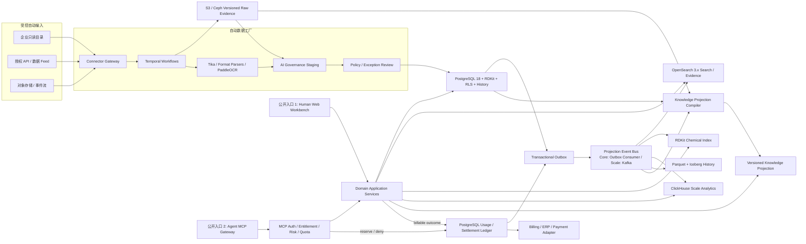

# X-Pharma：项目目标

| 字段 | 内容 |
|---|---|
| 文档 ID | `PIP-GOAL-001` |
| 版本 | `1.11.18` |
| 状态 | 开源开发基线；商业生产条件仍按第 19 节逐项验收 |
| 适用范围 | 产品、数据、AI、Web、Agent、安全、部署与工程交付 |

本文件保留产品规范。历史机器快照、私人数据和验收附件留在原私有开发环境，不作为当前公开版本的验证结果。源代码采用 Apache-2.0；数据、模型和外部服务许可独立管理。

上表及历史章节的 v1.x 表示目标文档修订序号，不是软件发布号；X-Pharma 软件发布号的唯一权威为 [`pyproject.toml`](pyproject.toml)，按[贡献规范](CONTRIBUTING.md#product-version-counter)中的 PR 合并计数递增，不在目标文档中冻结软件版本。前端视觉方向以用户后续明确的 OpenAI 简洁方向为准，旧 Claude 方向不再构成并行设计权威。

## 1. 文档权威性

本文件定义项目最终要成为的产品、不可降低的边界和可验收的完成标准，是全仓库的产品目标权威来源。

- `GOAL.md` 回答“为什么做、最终必须具备什么能力”。
- `README.md` 回答“当前版本是什么、如何安装、启动和验证”。
- `docs/architecture.md` 回答“当前架构如何实现目标”。
- `docs/adr/` 记录重要技术决策及取舍。
- `docs/mcp-contract.md` 与 OpenAPI 文档定义机器接口契约。
- `docs/commercial-readiness.md` 记录目标与当前实现之间的差距、证据和发布门禁。
- `docs/completion-gap-checklist.md` 是全部剩余缺口的勾选入口；只有完成判据和证据同时成立才可将项目改为 `[x]`。
- `runbooks/` 记录可执行的部署、恢复、接入和故障处理步骤。

本文件描述的是目标状态，不代表当前版本已经达到这些指标。任何发布说明都必须把“代码已实现”“真实环境已验证”“商业 SLA 已批准”分开陈述。

### 1.1 v1.11.0 三角色持续体验与修复目标

本版本不再以继续堆叠菜单、展示页面、筛选项或 MCP 工具作为主要进度。执行 Agent 必须轮流扮演外部医药小白、内部平台管理员和第三方 MCP Agent，对每个模块先进行无源码偏见的真实使用，再把发现的产品、视觉、数据、性能、可访问性和安全问题修到根因并用同一任务复验。七条商业主线继续作为不可降级边界；任何主线缺少真实证据，只能保持 `partial` 或 `blocked`，不得用其他模块的通过结果抵销。

| 商业主线 | 当前基线 | 本版本必须闭合的工作 | 关闭判据 |
|---|---|---|---|
| `ACC-EXT` 外部用户工作台 | 12 个外部领域中约 10 个已达到代码级实现 | 完成正式数据对标、密集结果表、分页/排序/比较/受控导出、个人与团队研究连续性及专业用户 UAT；不新增内部痕迹，不降低医药魔方级查询深度 | 12/12 领域 P0/P1 能力矩阵达到 `implemented`；真实数据查询、统计、详情、证据、跨域返回、保存/订阅/导出和异常恢复均有 Chrome/Playwright 与 UAT 证据 |
| `ACC-A11Y-PERF` 可访问性与性能 | 自动化键盘、重排和本地 Web 指标已具备 | 完成屏幕阅读器、真实浏览器辅助技术、Windows/macOS 系统 200%/400% 缩放、目标设备矩阵、生产 RUM P75、批准负载、长稳和背压测试 | WCAG 人工验收通过；目标环境 LCP/INP/CLS/TTFB P75 达到批准 SLO；长稳、峰值和故障注入报告通过 |
| `ACC-DATA` 真实数据与授权 | 已有 ClinicalTrials.gov/PubMed 真实试点，仍有待审、冲突和拒绝事实 | 完成文献、专利、药物、靶点、结构、活性、管线、临床、公司、交易、监管等正式来源授权、字段许可、覆盖率、freshness、撤回和质量报告 | 每个领域有获批来源合同、可追溯版本、覆盖/缺失/冲突率、时效 SLA 和责任人；待审事实不得伪装成已发布 |
| `ACC-INGEST` 自动入库生产链 | folder/HTTP/S3/SFTP/SMB 连接器与 Temporal/Parser/AI 治理代码已具备 | 在非本地目标环境完成来源注册、增量游标、快照、恶意扫描、解析/OCR、AI 抽取、审核、发布、投影、通知、幂等重试、失败回放和回滚 | 管理员只用内部工作台即可完成全流程；断源、重复、恶意文件、模型失败、索引失败和恢复均有真实报告，不能靠命令行补步骤 |
| `ACC-LLM` 远程 AI 治理 | 仅允许第三方 HTTPS API，当前有单供应商真实试点 | 使用获批付费文档验证 strict schema、引用定位、prompt injection、usage/request ID、费用、限流、超时和恢复；增加第二供应商；完成远程 embedding 医药金标排序和容量验收 | 至少两个兼容供应商通过同一 provider contract；无本地模型、权重或静默 fallback；成本/令牌/失败/版本审计可对账 |
| `ACC-OPS` 内部数据运营工作台 | 内部工作台和十个运营域代码基础已具备 | 管理员通过 UI 完成来源许可、自动入库、失败处置、AI 审核、主数据消歧、发布/撤回、投影重建、质量告警、审计、备份和回放；完成越权、并发、恢复演练 | 十个运营域从 `partial` 提升为生产可证明；不进入数据库、容器或命令行即可完成标准运营流程，所有高风险操作具备确认、幂等、并发控制和审计 |
| `ACC-MCP` 远程商业 Agent 入口 | 本地 Streamable HTTP、计量、防搬运和官方客户端基线已具备 | 部署真实 TLS 多副本 Gateway；联调企业 OAuth/PKCE/DPoP、租户/套餐/字段许可、计量/账单/告警；完成五类 Agent、至少两家供应商互操作并正式发布 Python/TypeScript SDK | 非开发机网络完成发现、鉴权、消歧、跨域查询、证据读取、分页、异步任务、取消、重连和错误恢复；远程入口、配额、计费和防搬运全部有审计证据 |

#### 与三角色循环的关系

本表只定义商业完成边界，不再决定施工顺序。实际任务选择、缺陷插队、修复和复验完全遵循前述 `HUX-EXT → HUX-INT → HUX-MCP` 循环；每个真人任务可同时暴露并推进多个商业主线，但不得用一个主线的本地通过抵销另一个主线的生产缺口。

每条商业主线继续分别记录 `code_implemented`、`cross_layer_integrated`、`automated_verified`、`external_or_uat_approved` 和 `production_approved`。授权、目标服务器、企业 IdP、付费模型、账单系统、专业用户或安全审批未提供时，先完成所有可执行的体验和工程修复，并明确记录外部阻塞；不得用虚拟数据、旧截图、静态数字、mock 或其他模块的通过结果假报完成。

## 2. 产品北极星

将企业合法授权的内外部医药研发信息持续、自动地转化为可追溯、可审计、可按时间回放的结构化知识，使人员通过 Web 完成检索、分析和竞争情报工作，并使 Agent 通过 MCP 获取同一口径的结构化数据、原始证据和质量元数据。

目标产品不是文件聊天工具，也不是单纯 RAG 系统。外部人员工作台必须全面对齐经批准的医药魔方参考版本：不是仅对齐菜单、页面数量或视觉印象，而是在公开可观察的业务域覆盖、信息密度、组合查询、结果操作、实体档案、跨域连续研究、统计分析、个人效率、数据交付、性能、状态和可用性上逐项达到等深度能力。对齐范围必须覆盖批准参考版本的完整模块和端到端任务，不得只选基础查询、当前已实现页面或实现成本较低的子集。任何参考 P0/P1 能力在本平台中缺失、不可操作、未连接真实 API、不能访问真实治理数据或没有验收证据，均视为未完成，不得以“简版”“先做搜索框”“后续再补”或修改名称缩小目标。内部工作台必须能独立完成数据接入、治理、发布、运营、安全和商业管理，不依赖开发人员执行日常数据操作。平台在此基础上提供原生、远程、商业受控的 Agent 数据访问能力。界面、数据和实现必须独立建设，不复制第三方受保护品牌、视觉资产、源码或未授权数据。

典型最终体验：用户向 Agent 提出“分析某靶点的最新机制、活性数据、结构、全球竞品、临床、专利和交易”。Agent 解析意图并调用平台；平台负责实体消歧，返回授权范围内的规范数据、原始证据、数据时点、覆盖范围和缺口。Agent 后续如何分析、组合、展示或生成文档，属于 Agent 及其宿主应用的职责，不属于本平台契约。

## 3. 不可协商的产品边界

1. **只有两个公开产品入口**：人员 Web 和 Agent MCP。人员 Web 在同一来源、会话和领域权限下明确分成信息查询工作台与内部运营工作台；这两个空间不是两个独立公网产品入口，不新增后台域名或第三套身份体系。
2. **输入端以自动连接器为主**：管理员配置来源或文件夹后，系统持续发现和治理数据；不得把逐文件人工上传作为主要入库方式。
3. **一个领域事实体系**：Web、MCP 和数据导出必须调用同一领域服务、权限模型和权威数据，不复制业务逻辑或形成两套口径。
4. **结构化主数据是权威层**：RAG、全文索引、图索引、分析库和 Markdown 都是可重建投影，不能成为事实、权限或审计的唯一来源。
5. **原始证据不可变**：每个发布事实必须关联来源、源版本、定位信息、获取时间和内容摘要；来源变化创建新版本，不覆盖历史。
6. **AI 不得直接改写权威事实**：模型输出先进入治理暂存区，经 schema、引用、实体、冲突、置信度和发布策略验证后才可进入权威层。
7. **不伪造成功**：无法真实解析的文件只能登记为资产或失败；不能用空文本、文件名、模型猜测或模拟数据冒充解析、抽取或检索成功。
8. **默认安全和租户隔离**：认证、授权、数据许可、字段限制和审计在可信服务端执行；任何跨租户泄漏均为 P0 事故。
9. **可迁移、可恢复、可升级**：代码、配置模板、迁移、部署、备份和重建流程必须脱离个人电脑状态独立复现。
10. **缺口必须显式呈现**：没有记录只表示当前授权范围和检索时点内未发现，不能被解释成全球不存在。
11. **平台止于可信数据访问**：MCP 负责提供数据、证据和必要元数据，不规定 Agent 的推理流程、内容形式、报告模板或最终用途。
12. **生产 MCP 必须商业受控**：每次调用必须经过客户、订阅、数据权益、预算、配额和滥用策略校验；成功交付的数据访问必须幂等计量，任何付费套餐都不能绕过数据许可和防批量搬运策略。
13. **全面对齐能力不得缩水**：最终商业版必须完成批准参考版本的外部工作台公开 P0/P1 工作流、内部工作台和 Agent Gateway 能力矩阵；缺失模块、缺失筛选维度、空壳页面、演示按钮、静态假数据、不可追溯结果或仅能本机调用均视为未完成，不能通过改名、隐藏入口、合并领域页面或缩小验收口径变成“已交付”。
14. **兼容所有合规 Agent，而非绑定厂商**：任何符合锁定 MCP 规范、OAuth 和 JSON Schema 契约的 Agent 客户端都应能远程发现并调用获权工具；未知或不支持 MCP 的专有 Agent 不作虚假兼容承诺，但必须提供官方客户端 SDK/桥接包，使其在不新增数据入口、不绕过 MCP 的前提下接入。
15. **生成式 LLM 只允许远程 API**：平台不得运行本地生成式/推理模型、下载或缓存其权重、要求业务服务器 GPU、调用 loopback/localhost 模型端点，或在远程 provider 失败时静默回退到本地模型。模型不可用时必须失败关闭或进入可审计的等待/重试状态。
16. **业务运行面最多三条常驻进程线**：Web/API/MCP 必须由统一 gateway 进程承载，全部后台业务角色必须由统一 jobs 进程监督，不可信文档解析保留独立 parser 安全边界。不得按搜索、监控、调度、计费或 MCP 再拆独立业务容器；需要扩容时横向扩容这三类工作负载。数据库、检索、工作流、缓存、遥测、杀毒、对象存储和可选 OCR 是基础设施或受限处理依赖，不构成新增业务入口。

数据连接器是受控输入通道，内部 API 是实现边界，二者都不构成新增产品入口。RAGFlow、OpenSearch、Temporal、数据库、模型网关、Obsidian 和运维界面不得直接暴露为公网产品入口。

## 4. 目标用户与核心任务

| 用户 | 核心任务 |
|---|---|
| 研发与转化团队 | 靶点验证、机制和通路、活性、结构、实验和项目证据调研 |
| 药物化学与计算团队 | 化合物、结构、相似性、子结构、SAR、活性和 assay 对比 |
| 临床与医学团队 | 适应症、试验设计、终点、入组、结果、竞品阶段和事件追踪 |
| 专利与法务团队 | 专利族、权利人、优先权、法律状态、结构/靶点关联和证据追踪 |
| BD 与战略团队 | 公司、管线、交易、合作、竞争格局、时间线和机会识别 |
| 数据管理员 | 来源接入、许可、质量、实体合并、冲突、审核、回放和审计 |
| 企业管理员与审计员 | 身份、租户、角色、配额、日志、策略、留存和合规检查 |
| AI Agent | 通过最小权限的 MCP 工具完成实体消歧、领域数据查询、证据读取和数据质量检查 |

## 5. 两个公开入口

### 5.1 人员入口：医药情报工作台

人员入口是一个面向高频专业工作的 Web 应用，不是营销首页，也不是聊天页面的外壳。目标能力包括：

- **信息查询工作台**：面向客户、研发、临床、专利和 BD 等信息使用者，承载检索、详情、证据、知识、监控、对比和受控导出，不显示数据接入、治理、计费或账号管理导航。
- **内部运营工作台**：面向数据管理员与企业管理员，承载自动来源接入、入库运行、AI 治理、商业运营、账号、角色和审计；Viewer 不得进入，Analyst 与 Admin 继续按最小 scope 区分操作。
- 两个工作台使用稳定深链接、同一 OIDC/会话、同一领域 API 和同一审计体系。任何跨工作台跳转都必须重新执行前端路由权限与服务端 scope 校验，越权页面不得先发起内部 API 再隐藏结果。

- 全局搜索、中文/英文别名联想、实体消歧、条件组合、facet、排序和结果解释。
- 靶点、疾病、药物/分子、公司、管线、临床试验、专利、交易和文献的统一详情页。
- 靶点 360 视图：机制、通路、疾病关联、结构、活性、项目、临床、专利、交易、关键事件和证据。
- 化学工作台：标准结构展示、精确、子结构和相似性检索、指纹、活性分布、单位归一和 SAR 对比。
- 竞争格局：按靶点、适应症、机制、模态、公司、地区和阶段筛选，对比项目状态及变化时间线。
- 临床、专利和交易专题视图，支持字段级过滤、关联跳转、历史版本和来源定位。
- 保存的检索、列表、对比集、监控主题、变更提醒和企业内共享。
- 受许可约束的 CSV、JSON、XLSX 等标准数据导出和可复核引用清单。
- 数据覆盖、更新时间、来源许可、置信度、冲突和缺失信息始终可见。
- 内部运营工作台的数据治理区：来源状态、失败队列、质量问题、实体候选、冲突审核和重放。
- 内部运营工作台的企业管理区：用户、组、角色、租户、配额、审计和策略。
- 内部运营工作台的商业管理区：Agent client、订阅、rate card、额度、用量、导出、发票引用、告警和争议；不得暴露第三方 billing 后台成为第三个产品入口。

体验目标：桌面端优先并支持常用平板视口；中文和英文语义一致；键盘导航和辅助技术满足 WCAG 2.2 AA；加载、空、错误、部分可用、无权限和恢复状态均有明确反馈。关键详情页必须支持稳定深链接和分享权限检查。

#### 5.1.0 全平台前端设计语言：OpenAI 简洁方向参考、独立实现

前端按用户后续明确要求采用 OpenAI 产品所体现的简洁白/灰视觉与低负担交互，保持本项目独立品牌、橙色 logo 和设计资产。统一无衬线字体、清晰正文与主操作、轻边框/分隔和克制圆角；低饱和状态色只表达成功、警告、错误等真实语义，不再保留旧暖米色、衬线标题、深蓝侧栏或浅蓝主题。禁止紫色渐变、无意义渐变、发光装饰和营销式大卡片。`apps/web/src/styles/theme/tokens.css` 是唯一 CSS token 权威，覆盖颜色、字体、字号层级、行高、边框、圆角、阴影、焦点环和状态语义；领域模块负责布局，不得自定义第二套色盘。图表使用集中管理并由契约核对的色盘。参考范围、实现边界与验证方法见 `docs/design-system.md`。

外部工作台的视觉和交互以低学习成本为先：首屏突出搜索和专业任务，渐进展示高级条件，结果保持紧凑、可扫描、可比较；内部工作台以管理员高频操作为先：保持密集表格、状态反馈、批量动作、确认和审计上下文。两者共享 token、基础组件和可访问性标准，但不共享内部/外部导航、数据字段或角色文案。所有前端模块必须通过真实任务检查文字是否清楚、控件是否可发现、空/错误/无权限/恢复是否可理解、是否存在遮挡/溢出/跳动，以及结构编辑器、表格、抽屉、弹窗和图表在各视口是否稳定。

本轮循环的覆盖清单固定包含公共入口的总览、全局检索、八个专业查询域、实体档案、证据抽屉、比较/收藏/监控和结构编辑器，以及内部入口的数据工厂、AI 审核、治理审核、质量运营、商业运营、企业管理和审计页。检查时必须同时审阅字体家族与字号层级、文本/背景对比度、边框与分隔线、按钮/输入/选择器、表头/分页、状态徽标、加载/空/失败/恢复态、键盘焦点、抽屉/弹窗层级、图表与大表格密度；发现任何模块使用旧的局部色板、旧圆角/阴影或不一致的交互反馈，必须回收到共享 token/组件并建立回归，而不是在单页追加临时覆盖。

每次样式或交互改动必须同时通过组件回归、真实 Google Chrome/Playwright 的 `1440x900`、`1920x1080`、`1024x768`、`390x844` 视口检查、键盘/焦点和 WCAG 2.2 AA 对比度验证，并记录性能指标与前后截图。视觉方向可以借鉴 OpenAI 的简洁设计，不复制其商标、源码、受保护页面或未经授权的视觉资产；未达到可读性、可访问性、信息密度和研究效率要求的页面保持 `partial`，不得以“风格已统一”宣称完成。

#### 5.1.1 外部信息查询工作台：全面对齐医药魔方且不降级

外部工作台是付费专业数据产品，不是后台页面换皮。商业完成时，以下工作域必须全部有真实数据、可执行查询、连续关联跳转、稳定深链接、权限校验和可复核来源；不得用一个通用详情页永久替代领域专业页面：

| 工作域 | 必须具备的专业能力 |
|---|---|
| 基础查询与全局搜索 | 药物、靶点、疾病、公司、试验、专利、交易、文献的中英文检索、别名联想、消歧、组合条件、facet、排序、保存和可解释结果 |
| 药物与管线 | 药物档案、模态、机制、靶点、适应症、地区阶段、公司、项目状态、首个里程碑、历史变化和证据 |
| 靶点与转化医学 | 靶点 360、机制/通路、表达与疾病关联、遗传/临床验证、结构、活性、项目、竞争格局和关键事件 |
| 化学与活性 | 2D/3D 结构、标准化标识、exact/substructure/similarity、assay 条件、单位归一、活性分布和 SAR 对比 |
| 临床试验与结果 | 试验设计、分期、状态、入组、终点、队列、地区、结果、关键事件、关联药物/靶点/公司和历史版本 |
| 专利情报 | 专利族、优先权、申请/公开、权利人、法律状态、地域、靶点/结构/资产关联、时间线和原文定位 |
| 交易与公司 | 许可、合作、并购、金额与里程碑、地域权益、公司/资产关系、公司管线、交易时间线和竞品对比 |
| 监管与安全 | 申报、受理、审评、批准、指定资格、标签、安全信号、撤回、地区差异和时间线 |
| 流行病学与领域透视 | 疾病负担、患者人群、地区/时间趋势、治疗格局、模态/阶段/公司分布和口径说明 |
| 新闻、会议与事件 | 新闻、文献、会议、Poster、公告与研发事件聚合，关联到规范实体并保留来源、发布时间和事件时间 |
| 知识卡片与研究内容 | 版本化专题、权威事实、引用、变更记录、覆盖与缺口；研究报告是受治理内容类型，不强绑 Agent 下游产物 |
| 个人与团队效率 | 收藏、列表、对比集、保存检索、监控提醒、共享、受控导出、最近访问和权限感知协作 |

全面对齐覆盖每个批准参考模块从入口发现、条件构造、查询执行、结果浏览、统计分析、实体详情、证据追溯、跨域跳转到个人效率操作的完整链路，不以筛选项数量或单页截图代替流程验收。同一查询状态必须一致驱动结果表、统计视图、详情上下文和受控导出，并在刷新、分享、前进后退和跨域返回后可恢复。

交互与视觉验收采用“参考产品逐流程对照 + 本平台独立设计系统”的方式：保持专业数据平台的多层导航、紧凑筛选、密集表格、图表/列表切换、详情分区、上下文抽屉、关联跳转和连续研究路径；布局可以形成独立产品设计，但不能降低用户可完成任务的数量、深度、效率、可解释性或数据密度。不得复制医药魔方商标、品牌视觉、受保护页面像素、源码或数据。每个发布维护版本化 `feature-parity` 矩阵、参考页面/版本清单和同视口视觉回归基线，P0/P1 对标项完成率必须为 `100%`，不存在死入口、不可操作控件或由 mock 数据支撑的通过结论。

目标浏览器至少覆盖 Chrome 与 Edge 当前及前一主要版本；桌面 `1440x900`、`1920x1080` 和平板 `1024x768` 为强制视口，关键查询与详情路径还必须在 `390x844` 完成无内容遮挡、无页面级意外横向滚动的响应式验收。性能、可访问性和状态完整性继续受第 13、15、19 节门禁约束。

##### 5.1.1.1 前端全面对齐验收门禁

“全面对齐”不是页面数量、菜单数量或视觉相似度，而是专业人员能否在同一研究任务中以不低于参考产品的深度和效率完成数据发现、组合筛选、判断、比较、统计和追溯。版本化 `external-workbench-capability-matrix` 除十二个业务域外，维护 8 个正式体验门禁；下表展开为 10 个不可省略的核验面，其中“同查询统计分析”归入密集结果操作门禁，“专业查询订阅”归入个人效率与交付门禁。任何正式门禁或其核验面未达到 `implemented`，均不得宣称外部工作台达到商业同级水平：

| 体验维度 | P0/P1 验收要求 |
|---|---|
| 模块覆盖与可发现性 | 批准参考版本的全部适用 P0/P1 模块、入口和核心任务均进入能力矩阵并可从清晰导航发现；不得只实现基础查询、隐藏未完成模块或用一个通用页面冒充多个专业域 |
| 信息架构与研究连续性 | 全局检索、领域检索、结果、上下文详情和完整档案之间保留查询语境；跨域跳转可返回、可刷新、可分享，不丢失有效筛选 |
| 专业组合查询 | 各领域只展示后端真实支持的条件；支持关键词、枚举、日期、状态、地域、实体关系等适用组合，并提供清除、URL 持久化、facet 数量和无效输入反馈 |
| 密集结果操作 | 表格字段符合领域任务，支持适用的排序、分页、列/行操作、详情抽屉、关联实体跳转、覆盖时点和来源状态；禁止用装饰性卡片永久替代专业结果表 |
| 同查询统计分析 | 列表、统计、回钻和受控导出必须共享同一服务端查询；维度、视图、Top、阶段和适用聚合口径可刷新、分享、前进后退并返回服务端采用的口径元数据；图表和表格必须显示真实分桶与阶段构成，不得在客户端补造事实 |
| 实体详情与跨域档案 | 药物、靶点、公司、试验、专利和交易等详情按领域分区，能从事实跳到相关实体、原始证据和历史版本，并明确覆盖、冲突与缺口 |
| 个人效率与交付 | 保存检索、监控、收藏、对比、团队共享和受控导出具有真实持久化、权限、恢复与审计行为 |
| 专业查询订阅 | 药物与管线等专业查询可在结果上下文直接保存或订阅；保存合同版本化且类型安全，提醒由权威事件与同一领域过滤语义匹配，监控中心可以恢复完整查询，不允许仅保存页面文案或客户端临时状态 |
| 状态、可访问性与响应式 | 加载、空、错误、部分可用、无权限、失效深链和恢复均可验证；键盘、焦点、标签、对比度符合 WCAG 2.2 AA；强制视口无遮挡和意外页面级横向滚动 |
| 性能与视觉回归 | 按第 13 节性能预算验收；参考流程和本平台同视口截图成对留证，并由真实 Chrome/Playwright 测试验证交互，不以截图或 mock 单独证明完成 |

对标证据只用于理解公开可见的工作流、信息密度和交互模式，不得保存或复用第三方会话凭据、未授权数据、受保护源码、商标资源或像素级页面实现。

##### 5.1.1.2 参考工作流强制能力族

经授权登录后公开可观察的参考工作流必须拆成可测试能力，而不是只保存截图。当前基础查询参考至少包含以下能力族；交易、新闻热点、临床结果、流行病学、转化医学、领域透视、CGT、知识卡片和研究内容等批准模块必须按同一方法继续补齐，不能因当前审计页或当前代码范围不同而被排除：

| 能力族 | 全面对齐最低要求 |
|---|---|
| 多实体输入与消歧 | 药物、研发机构、靶点、适应症等独立联想输入，支持中英文、别名、最小输入提示、候选消歧和稳定实体 ID；不能退化为只对所有字段做一个模糊关键词搜索 |
| 分类与标签 | Modality、适应症领域、创新类型、药品类别、药品标签等多维可组合条件，支持全部/多选/更多、facet 数量、已应用条件回显、清除和无效值处理 |
| 地区阶段与双时间轴 | 全球与中国等适用地域的最高阶段、阶段开始日期、当前状态和历史变化可独立筛选；相对时间与自定义日期范围具有一致、可验证的边界语义 |
| 事件与研发属性 | 里程碑事件、递送系统、剂型、临床结果情况与最优评价、审评审批类型等领域条件必须连接规范字段和真实查询，不得仅显示静态选项 |
| 专利与权益 | 化合物/序列专利到期、机构所在地、原研/合作方、权益地区、商业化权益及地域关系可组合查询，并能进入相关专利、公司、药物和交易证据 |
| 机构与赛道 | 研发机构评分/类型、全球研发状态、赛道排名等条件必须有口径、时点和来源说明；排名和评分不得由前端临时计算或模型猜测 |
| 交易与金额 | 有无交易、交易方向/类型、参与方角色、权益范围、总金额/首付款/里程碑及自定义金额范围可查询、比较并追溯到交易事件和来源 |
| 结果与统计 | 查询结果提供领域密集表格、排序、分页、列与密度管理、关联跳转和受控导出；统计区域由同一查询状态驱动，支持适用的图示/列表切换、指标口径、更新时间和来源说明 |
| 连续研究路径 | 从检索条件到结果、详情、证据、相关实体、跨域专题、收藏/监控/对比再返回时保留上下文；刷新、分享深链接和浏览器前进后退不丢失有效状态 |
| 用户复杂度控制 | 默认视图服务普通专业用户，常用条件优先、复杂条件渐进展开；高级能力可以分层呈现，但不能被删除、藏成不可发现功能或暴露内部治理术语 |

每个能力族只有同时满足以下链路才可标为 `implemented`：权威数据模型与治理规则存在；Domain API/MCP 使用同一字段语义；Web 控件真实发起查询；服务端返回版本化 `applied_filters`、结果和覆盖说明；URL 可重复表达有效状态；加载、空、错误、无权限与恢复状态齐全；组件/API/数据库/真实 Chrome 测试通过；参考与本平台同视口对照无阻塞性差异；产品/业务 UAT 签字。只完成其中一部分必须标为 `partial`。

##### 5.1.1.3 对标治理与进度报告

- `GOAL.md` 保持文件名和文档 ID 不变；参考版本、能力矩阵、验收证据和 ADR 分文件版本化，避免把大量施工记录写回目标文件。
- 每次审计记录参考 URL、审计日期、公开可观察控件、流程、状态和差异；不得抓取受保护源码、网络私有载荷、凭据或未授权数据。
- 参考产品新增或调整公开 P0/P1 工作流后，先进入差异评审，确认适用性、数据许可和领域模型，再纳入批准矩阵；已纳入的能力不得因实现困难或后续页面变化被静默删除，不得以追逐像素变化破坏本平台稳定性。
- 每完成一批工作必须按同一固定分母报告：`代码已实现`、`跨层已集成`、`自动化已验证`、`业务 UAT 已通过`、`商业发布就绪`，并给出整体完成率、未完成能力和剩余工程时间。分母变化必须说明原因并重新计算历史基线。
- “全面对齐完成”只在所有外部工作台 P0/P1 能力与八项体验门禁均为 `implemented`、真实数据与真实浏览器证据齐全、性能/安全门禁通过、业务 UAT 签字后成立；不得用综合平均分掩盖任一 P0 缺口。

##### 5.1.1.4 后续代码主线与真实查询门禁

自 `v1.9.1` 起，后续主要工程投入锁定在外部信息查询工作台。除 P0 安全缺陷、数据正确性缺陷或阻断外部工作台的契约问题外，内部运营工作台、自动数据工厂、MCP、商业计量和平台控制面进入能力保持与回归模式，不新增菜单、工具或非目标工作流。任何例外必须在能力矩阵中记录阻断项、影响和验收证据；不得用内部功能数量代替外部体验闭环。已实现能力不得删除或降级。

自 `v1.9.6` 起，新的代码批次必须以一个可命名的外部用户研究任务为交付单位，禁止以“增加若干控件”或“补一个 API”作为独立完成口径。每批至少闭合以下同一条真实链路：参考产品真实查询证据、领域合同映射、Web 查询构造、服务端权威执行、结果或统计呈现、详情/证据钻取、浏览器返回与刷新恢复、适用的收藏/订阅/导出，以及加载、空、错误和无权限状态。仅在该链路被安全、数据正确性或公共契约阻塞时，才允许改动内部工作台、数据工厂或 MCP；阻塞解除后立即回到外部前端主线。

外部页面面向医药研发、临床、专利和 BD 用户，不展示 ingestion、projection、schema、tenant、provider、queue、workflow、usage ledger 等内部实现术语。常用条件首屏可见，高级条件渐进展开；结果默认采用专业密集表格或与任务匹配的可视化，不用大面积介绍卡片稀释信息密度。涉及化学结构的查询、结果和档案必须具备可操作的结构编辑器，并将规范化结构、校验错误和查询模式明确回显。

外部工作台的领域专业档案按药物、靶点、公司、疾病、临床试验、专利和交易分别验收。一个领域只有在独立 URL 合约、规范摘要、领域分区、关联实体、证据/覆盖/缺口、前进后退与刷新恢复、强制视口布局及真实数据 Chrome 路径全部通过后，才能从通用实体页迁移并在矩阵中标记为 `implemented`；单个专业档案完成不得带动其他领域或整体体验门禁自动升级。

参考产品审计必须在用户授权会话中执行真实查询，不得只阅读页面文案或截图。每个纳入矩阵的 P0/P1 工作流至少记录：参考 URL 与审计日期、用户研究意图、规范实体选择与消歧行为、实际应用的组合条件、结果总量和字段结构、排序/分页/列/统计/详情/订阅/导出等可观察操作、跨域与返回路径、加载/空/错误状态、与本平台领域契约的映射及仍存在的差异。审计不得保存凭据、批量复制第三方数据、抓取受保护接口载荷或把第三方结果作为本平台测试夹具。

每个外部工作域的完成证据必须包含真实查询组合，而不是只留页面截图。参考产品至少完成典型命中与专业组合两类真实查询；本平台除复现同等研究意图外，还必须完成边界与恢复路径：

1. **典型命中查询**：使用规范实体和该领域高频条件得到非空结果，完成列表、排序或分页、详情和来源追溯。
2. **专业组合查询**：至少组合实体、生命周期/状态、地域/权益、时间或证据条件中的三类，验证已应用条件、facet、URL 恢复和无歧义结果解释。
3. **边界与恢复查询**：覆盖无结果、无效输入、无权限、失效深链或服务错误中的适用状态，并验证清除、重试、返回和刷新恢复。

基础查询的强制基准包括规范靶点及突变/组合候选消歧、药物模态、全球与中国阶段/时间、研发状态、临床结果、专利、权益和交易条件。结果区必须在同一已应用查询上提供领域密集表格与可视化分析；列表至少支持适用的自定义列、服务端排序、分页、订阅/监控和受控导出，可视化至少支持阶段、靶点、适应症、组合靶点、机构和 Modality 等有业务意义的聚合，并明确地区口径、数据来源和更新时间。聚合不得从当前页数据在浏览器临时推算。

实现顺序固定为：查询语义与实体消歧、组合筛选、密集结果操作、同查询统计分析、实体详情与跨域连续性、个人效率与受控交付、状态/可访问性/响应式、性能与视觉回归。任何批次只有在真实 Domain API、数据库、组件测试和真实 Google Chrome/Playwright 路径均通过后才可提高“自动化已验证”完成率；参考产品可用不代表本平台已实现，本平台 mock 通过也不代表完成对齐。Codex 内置浏览器只用于用户授权会话下的参考发现和流程记录，不作为本平台布局、响应式、视觉回归或商业验收证据。

##### 5.1.1.5 真实查询证据分级与前端批次完成定义

自 `v1.9.9` 起，外部用户入口是唯一普通功能开发主线。“前端优化”指用户研究任务的完整产品链路，不等同于改 CSS 或复刻页面外观；为闭合该链路，可以修改领域模型、数据库、Domain API、OpenAPI 客户端和查询投影，但批次成果必须落到外部用户可完成的真实任务，并以用户入口验收。

参考查询证据按以下等级登记，禁止跨级声明：

| 等级 | 可证明内容 | 不可证明内容 |
|---|---|---|
| `observed` | 页面、控件、公开文案和未提交的交互结构可见 | 查询已执行、条件已应用、结果正确或能力已对齐 |
| `authenticated-executed` | 在授权登录会话中选择规范实体、提交查询并取得真实结果或明确空结果 | 本平台已实现或端到端流程已对齐 |
| `reference-workflow-verified` | 同一查询完成结果字段、排序/分页、统计、详情/证据、跨域与返回路径中的适用操作 | 本平台真实数据链路已通过 |
| `platform-verified` | 本平台以同等研究意图通过真实 Domain API、数据库、组件和 Google Chrome/Playwright 验收 | 正式商业数据覆盖、专业用户 UAT 或生产 SLA 已通过 |
| `uat-approved` | 授权专业用户按固定脚本完成盲测并签字，阻塞性差异关闭 | 生产部署、容量、安全和商业数据许可已自动成立 |

登录过期、验证码、权限不足、网络失败、零候选或控件未真正提交时，审计必须停留在实际等级并记录阻塞；不得把页面仍可见、输入框已有文字、旧结果残留或截图成功记为真实查询完成。Codex 内置浏览器中的授权会话只用于合法的可观察交互，不读取凭据、抓取私有接口载荷、批量搬运结果或复制第三方数据。

每个外部工作域进入 `implemented` 前至少维护三条可重复研究案例：一条规范实体驱动的典型命中、一条至少三类条件组合的专业查询、一条边界与恢复查询。基础查询还必须分别覆盖药物、靶点、疾病和机构的规范选择与消歧，并至少验证一次靶点突变或靶点组合；每条案例均记录参考 URL/日期、研究意图、实际条件、结果总量、核心字段、统计口径、详情/证据/跨域操作、返回与刷新行为、本平台契约映射、自动化证据和剩余差异。结果总量只作为该时点的审计记录，不写成长期固定断言。

一个前端批次只有同时满足以下条件才可标记完成：选定案例达到 `reference-workflow-verified` 或明确记录不可控阻塞；本平台对应路径达到 `platform-verified`；没有 mock、静态假数据、空壳按钮或仅客户端推算；能力矩阵、查询审计和差异清单同步更新；桌面 `1440x900`、`1920x1080`、平板 `1024x768` 和移动 `390x844` 的真实 Chrome/Playwright 路径均通过；加载、空、错误、无权限、键盘焦点、刷新、前进后退和 URL 分享状态具有适用证据。未满足任一项时只能报告部分实现，不提高商业就绪完成率。

#### 5.1.2 内部运营工作台：完整数据与企业运营控制面

内部工作台与外部工作台使用不同应用入口、导航图和授权边界；它不是外部页面中附加的“管理员标签”。商业完成时至少覆盖：

| 内部域 | 必须具备的运营能力 |
|---|---|
| 来源与许可 | 文件夹/NAS/SMB/SFTP/S3/API/feed 来源注册、凭据引用、数据所有者、许可、字段/交付限制、freshness、启停和健康检查 |
| 自动入库编排 | 调度/事件策略、增量游标、快照、去重、解析/OCR、AI 抽取、发布与投影的运行图、进度、吞吐、成本和 SLA |
| 文件与解析治理 | 原始对象版本、hash、MIME、页/表/幻灯片定位、恶意文件结果、解析预览、失败原因、隔离、重试和从指定阶段回放 |
| AI 治理 | 模型/提示词/schema 版本、候选实体/关系/claim、引用定位、置信度、冲突、自动发布策略、人工审核和完整决策审计 |
| 主数据治理 | 实体消歧、别名、外部 ID、ontology/字典、merge/split、回滚、来源优先级、历史版本和影响分析 |
| 发布与投影 | 待发布变更、审批、批次发布、撤回、tombstone、OpenSearch/化学/知识投影状态、一致性检查和重建 |
| 数据质量与监控 | 完整性、准确性、重复率、引用覆盖、来源 freshness、漂移、失败趋势、告警、负责人和处置闭环 |
| 企业管理 | 租户、用户、组、角色、dataset、字段/来源授权、会话、API/MCP client、审计、保留、legal hold 和合法删除 |
| 商业运营 | customer、billing account、订阅、权益、rate card、额度、用量、结算、冲正、账单引用、导出审批、风险告警和争议 |
| 平台运营 | 服务健康、队列、worker、工作流、模型预算、SLO、事件、备份/恢复、迁移、版本和发布证据入口 |

所有高风险操作必须有确认、原因、幂等键、乐观并发控制、服务端授权和审计；批量操作必须可预览影响、取消或按策略回滚。数据管理员无需进入数据库、容器或命令行即可完成标准来源接入、失败处置、审核、发布和回放；命令行只保留应急与自动化用途。

### 5.2 Agent 入口：企业 MCP Gateway

Agent 的唯一公开入口采用远程 MCP Streamable HTTP。MCP 负责工具发现、能力协商、结构化调用、资源读取和 Agent 互操作；它比直接向 Agent 暴露大量通用 REST 路由更适合语义工具调用。

MCP 工具按领域数据能力设计，不按“生成报告”“制作 PPT”或某一种 Agent 工作流设计。平台对 Agent 的责任边界止于返回可信、受权、可解释的数据与证据。

平台内部仍必须维护版本化 HTTPS Domain API，并用 OpenAPI 描述，以支持 Web BFF、MCP 适配器、自动化、契约测试和未来客户端。该 API 只在内部信任边界内开放，不是第三个产品入口。MCP 与 Web 不得绕过领域服务直接访问数据库或检索引擎。

生产形态必须是可从获准外部网络远程访问的 MCP Gateway，不能只提供 `localhost`、stdio 或与开发机绑定的会话。唯一 Agent 产品入口使用独立域名（例如 `mcp.<customer-domain>`）和 TLS 1.3，通过 Envoy Gateway/WAF 接入无状态多副本 MCP 服务；OAuth protected-resource metadata、授权服务器发现、健康探测、审计关联和版本信息必须可由标准客户端获取。stdio 仅可作为本地开发桥接器，不能成为商业交付的唯一方式。

协议基线：

- MCP 服务端按一个经兼容性验证并在仓库中锁定的稳定规范版本实现；当前目标基线为 `2025-11-25`。
- MCP 输入和结构化输出采用 JSON Schema 2020-12，并执行服务端校验。
- 内部 HTTP 契约采用 OpenAPI `3.1.2` 或更高兼容版本；升级规范版本前必须完成生成器、客户端和契约测试验证。
- 协议、工具和领域 schema 分别版本化；弃用必须提供公告期、迁移说明和兼容性测试。
- 客户端不能依赖厂商私有 prompt、隐藏 system message 或固定模型；工具名称、描述、输入、结构化输出、资源 URI、错误、分页和异步状态必须足以让任意合规客户端独立调用。
- Gateway 必须支持长连接代理、断线重连、取消、超时、幂等重试、横向扩容和节点切换；会话亲和不是数据正确性的前提。
- OAuth 客户端支持 confidential/public client 的批准模式，按风险启用 PKCE、DPoP 或 mTLS sender constraint；租户、客户、订阅和 scope 只能由服务端绑定派生。
- 提供版本化 Python/TypeScript 客户端 SDK、OpenAPI 生成客户端和薄桥接适配器。对暂不原生支持远程 MCP 的 Agent，桥接器只做协议转换，所有数据读取仍必须经过同一远程 MCP 鉴权、计量、许可和风险链路。

#### 5.2.1 Agent 互操作目标

“各种 Agent 均可调用”的工程定义是：所有通过锁定协议兼容套件的 MCP 客户端均可接入，而不是对未知、封闭或违反规范的任意软件作不可验证承诺。每个商业发布至少验证五类相互独立的真实客户端实现：

1. 桌面/对话型 Agent 客户端。
2. IDE/编码型 Agent 客户端。
3. CLI/自动化 Agent 客户端。
4. 工作流编排或企业 Agent 平台客户端。
5. 使用官方 Python 或 TypeScript SDK 构建的最小独立参考客户端。

兼容矩阵必须记录客户端和协议版本、远程传输、OAuth 流程、工具发现、结构化输出、资源读取、分页、异步任务、取消、错误恢复、计量回执和已知限制。至少两个客户端必须来自不同供应商，至少一个测试必须从非集群、非开发机网络完成。客户端产品尚未实现标准能力时，只能标记该客户端受限，不能通过关闭 OAuth、共享密钥、暴露内部 REST 或复制一套工具接口来伪造兼容。

#### MCP 分层能力

| 层级 | 目的 | 代表能力 |
|---|---|---|
| L0 身份、能力与商业权益 | 确认服务器、版本、权限、数据域和可消费额度 | capability、schema、scope、订阅权益、rate card、额度、数据截止时间 |
| L1 发现与消歧 | 将自然语言映射到稳定实体 | 搜索、别名、外部 ID、ontology、候选消歧 |
| L2 领域查询 | 读取规范化医药数据 | 靶点、活性、结构、管线、试验、专利、交易、公司 |
| L3 证据与质量 | 取得事实依据和覆盖说明 | 原文片段、页码/定位、来源版本、置信度、冲突、freshness |
| L4 批量与异步读取 | 安全处理跨域或大结果集 | 多域查询、游标、批量读取、异步数据任务和标准数据导出 |

工具执行查询动作，资源承载稳定、可寻址、可缓存的只读数据。建议资源 URI 采用 `pharma://entities/{id}`、`pharma://evidence/{id}/versions/{version}` 和 `pharma://queries/{job_id}/results` 形式。Prompt 模板可以帮助客户端理解工具，但不能把特定分析流程或交付物绑定为平台契约，也不能成为业务事实或权限规则的权威来源。

所有事实型 MCP 响应至少包含：

- `schema_version`、`request_id`、调用主体、租户和审计关联 ID。
- `as_of`、各来源的 `data_cutoff`、查询过滤条件和授权覆盖范围。
- 稳定实体 ID、外部 ID、规范字段、单位和分页游标。
- claim 级 citation，包含文档、版本、定位、可核验 quote 和内容摘要。
- `coverage`、`warnings`、`conflicts`、`quality` 和明确的数据缺口。
- 当前结果集的 schema 版本和可重复验证内容摘要，便于 Agent 检查完整性与缓存一致性。
- `usage_record_id`、`rate_card_version`、`units_charged`、`quota_remaining` 和 `policy_limits`；客户合同允许时同时返回币种与金额。

大范围跨域查询和批量数据导出采用有界异步任务：创建任务、查询状态、取消、分页读取结果。不得通过提高同步超时或返回无界数据解决长任务问题。读取工具默认只读；批量导出和治理写操作使用独立 scope、幂等键和审计事件。

平台不提供强制性的 Agent 调研流程，也不把报告、PPT、文章、代码或其他下游产物作为 MCP 完成标准。Agent 如何使用返回数据由 Agent 宿主、用户和其自身权限策略决定。

### 5.3 MCP 商业计量、配额与防数据搬运

生产 MCP 是付费、实名、按权益访问的数据服务。除显式隔离的 Development/Test 环境和经批准的内部服务计划外，不允许匿名、共享密钥、无限免费或绕过计量的调用。一个计费客户可以拥有多个租户和 Agent client，但每个调用主体、租户、client、订阅和 billing account 的映射只能由服务端身份与合同配置派生，调用者不得自行传入或覆盖。

计费采用“订阅/预付额度 + 可审计用量”的混合模型，不以一个 HTTP 请求简单等同一个固定价格。每个成功 MCP 工具调用都产生至少一条幂等使用结算；对授权客户可见、版本化且按生效时间冻结的 rate card 可以组合以下单位：

| 单位 | 计量对象 | 约束 |
|---|---|---|
| Invocation unit | 工具类别和一次有效执行 | 工具必须声明 billing class，不得临时改变价格语义 |
| Result unit | 实际返回的规范实体、claim、证据片段或数据字节 | 只按真实交付量结算，分页累计可对账 |
| Compute unit | 结构相似性、语义 rerank、外部慢源等高成本计算 | 算法/模型版本和倍率进入 rate card |
| Export unit | 经批准的异步批量数据包 | 与交互式查询分开定价、授权和限额 |

MCP 初始化、能力发现、权益/报价查询和异步状态轮询不交付商业数据，默认使用可审计的 zero-rated billing class；它们仍受速率和滥用限制。领域数据、证据、计算和导出调用不得通过包装成控制调用逃避收费。

每个 billable 调用执行统一状态机：

1. **Authenticate/Bind**：校验 OAuth、client、主体、租户和 billing account 绑定。
2. **Authorize/Entitle**：同时校验领域 scope、数据许可、订阅功能和字段/来源权益。
3. **Risk/Limit**：检查边缘速率、并发、调用预算、累计唯一数据覆盖率和异常行为风险。
4. **Estimate/Reserve**：按请求上界、rate card 和 `max_billable_units` 预估并原子预留额度；无法预留则在访问数据前拒绝。
5. **Execute**：只执行有界查询；查询不能自行扩大字段、来源、时间范围或结果数量。
6. **Settle/Release**：按实际成功交付量追加结算并释放余量；异步任务按已完成分片结算，取消只收取已消耗部分。
7. **Emit/Reconcile**：在同一事务写 usage ledger 与 outbox，异步聚合到账单系统并定期对账。

计量权威是 PostgreSQL 中追加式 `UsageEvent`、`UsageReservation`、`UsageSettlement`、`CreditGrant`、`RateCardVersion` 和 `InvoiceReference`。调整、退款和冲正只能追加反向记录，不覆盖历史。Valkey 只保存短期速率和额度缓存，不能作为余额或账单权威。重试使用 client idempotency key 与服务端 request ID 双重去重；同一调用重复执行不得重复扣费。鉴权拒绝、策略拒绝、配额拒绝和平台 `5xx` 不产生收费结算，但仍计入安全与滥用计数。计费/权益服务不可用时生产 MCP 默认 fail closed；合同允许的 grace 模式必须显式、有限、有持久化待结算事件和告警，不能静默免费放行。用量结算在调用路径完成，发票、税务、收款和催收异步接入客户批准的 ERP/支付服务；平台只保存必要引用，不处理或存储银行卡敏感数据。

收费结果数和金额必须由精确结算记录计算，禁止用 HyperLogLog 等近似基数替代财务计量。Valkey/ClickHouse 的近似唯一覆盖可以用于早期风险信号，但采取长期封禁、合同处置或账单动作前必须使用精确事件复核或经过批准的保守阈值与人工复核。

防数据搬运必须独立于计费执行，因为愿意付费的调用方仍可能违反许可或批量复制数据：

- 使用预注册的独立 OAuth client；生产默认关闭不受控动态注册和跨客户共享凭据，支持即时吊销、轮换和可选 sender-constrained token。
- Envoy Gateway 执行本地突发与全局分布式速率/带宽限制；领域服务再按 customer、tenant、subject、client、tool、数据域、来源许可和时间窗口执行配额。
- 交互式工具具有硬性 `limit`、字段、日期范围、查询复杂度、证据长度、响应字节、并发、分页深度和累计唯一实体/claim 覆盖上限。
- 只使用短时、签名、不透明游标；游标绑定主体、租户、client、工具、规范化 query hash、page size 和过期时间，不开放任意 offset、内部 ID 顺序扫描或客户端篡改范围。
- 原始全文、原文件和大结果不通过普通查询无限返回；批量导出使用独立 `data:export` scope、套餐权益、审批策略、异步任务、加密短时下载、签名 manifest 和独立限额。
- 风险引擎检测字母/数字分片枚举、连续 ID、深分页、低选择性轮询、快速扩大时间窗口、异常唯一记录覆盖率、凭据/IP 轮换和多 client 协同模式。
- 处置按风险执行降速、冷却、明确拒绝、step-up auth、人工复核、暂停订阅或吊销 client；不得静默返回伪造、不完整或被篡改的科学事实，任何策略裁剪都必须返回 `policy_limited` 与可审计原因。
- 客户可在人员工作台查看用量、额度、拒绝原因、导出历史和账单明细；运营人员可查看跨 client 风险聚合，但必须遵守最小权限和隐私保留策略。

技术控制只能降低、发现和追责批量搬运风险，不能保证已合法返回到客户设备的数据永远无法复制。商业保护必须同时依赖数据许可、合同、客户身份、最小交付、审计和事故处置。

## 6. 全自动 AI 数据工厂

### 6.1 来源接入

管理员只需注册来源、凭据引用、授权范围、扫描/事件策略和目标数据域，系统随后自动运行。连接器至少覆盖：

- 企业只读目录、NAS/SMB、SFTP 和对象存储。
- 合法授权的供应商 API、开放数据库 API、批量数据包和数据库快照。
- 消息或事件流、受控网页采集和增量变更 feed。
- 企业协作存储等后续连接器；所有采集必须遵守许可、服务条款、速率和导出限制。

每个连接器必须声明来源 ID、所有者、数据分级、许可策略、凭据引用、增量游标、期望 freshness、速率限制、字段映射、健康状态和回放能力。连接器通过稳定 SDK/接口扩展，不把供应商逻辑散落到领域代码中。

逐文件上传不是标准工作流。若保留一次性上传，只能作为管理员异常入口，并且必须进入与自动来源完全相同的快照、治理和审计链路。

### 6.2 端到端状态链

每个对象或事件必须经过可观察、可重试、可回放的确定状态机：

1. **Discover**：轮询或事件发现，保存来源游标和观察时间。
2. **Stabilize**：确认文件/对象已写完，限制大小、类型和路径，拒绝越界与危险内容。
3. **Snapshot**：写入版本化对象存储，计算 SHA-256，记录许可、来源 URI 和采集元数据。
4. **Deduplicate**：区分内容重复、来源重复和新版本；重复执行保持幂等。
5. **Parse/OCR**：使用真实解析器提取页、段、表、图、幻灯片、工作表和定位信息。
6. **Normalize**：字符、语言、日期、单位、阶段、公司名、标识符和受控词表归一。
7. **AI Extract**：按版本化 schema 生成候选实体、关系、事件和 claim，不直接发布。
8. **Resolve**：实体消歧、外部 ID 对齐、去重、可逆 merge/split 和 ontology 映射。
9. **Verify**：验证 quote 可定位、引用存在、结构和单位合法、关系完整、时间合理。
10. **Conflict/Quality**：比较现有事实、来源优先级、时点和许可，生成质量发现。
11. **Review/Policy**：低风险高置信结果按租户白名单自动发布；其余进入异常审核队列。
12. **Publish**：在事务中写入权威事实、历史版本、审计和 outbox 事件。
13. **Project**：异步更新全文、化学、图、分析和证据检索投影。
14. **Compile**：按确定规则生成知识页、关系视图、研究摘要和 Markdown 导出。
15. **Monitor**：记录延迟、失败原因、重试预算、成本、质量、freshness 和来源可用性。

暂时错误采用有上限的指数退避；永久错误进入隔离/死信队列并给出可操作原因。恢复来源或修复解析器后可以从指定阶段重放。来源断开不能删除历史数据或损坏数据库；来源删除、撤回许可和合法删除使用显式 tombstone 与影响分析。

### 6.3 文件和科学格式原则

- PDF、DOCX、PPTX、XLSX、CSV、TXT、Markdown、HTML 和图像扫描件使用真实解析/OCR，并保留页、表、单元格或幻灯片定位。
- CDX、SDF、MOL、PDB、CIF、MOE、MDB 等科学格式只有在具备经过验证的专用解析器时才物化字段；否则只登记资产、类型、路径、hash 和关联主题。
- 压缩包、嵌套对象、宏、超大文件、密码文件和损坏文件必须有资源上限、隔离和安全策略。
- 解析器、OCR、规则和模型版本变化时可批量重处理，但必须保留旧版本和变更原因。

## 7. AI 治理目标

AI 是受控提取与辅助分析组件，不是数据库事务边界。

- 所有生成式/推理 LLM 通过平台 provider adapter 调用获批准的远程 HTTPS API，统一执行租户策略、供应商路由、超时、并发、预算、重试、脱敏和审计；应用、worker 和浏览器不得直接调用供应商。
- 默认协议边界为版本化 OpenAI-compatible Chat Completions/Responses adapter；其他供应商原生协议必须通过独立 adapter 映射到同一平台请求、响应、错误和 usage 契约，不能把供应商 DTO 泄漏进领域层。
- provider registry 至少记录供应商、区域、base URL、认证 secret 引用、模型 ID、协议版本、结构化输出模式、thinking 模式、上下文/输出上限、usage/request ID 能力、并发/RPM/TPM、价格、数据保留和合规状态。
- 供应商和模型按租户、数据分级、地区、许可、任务类型、质量、预算和容量显式路由；跨供应商 failover 必须经过批准、保留原请求指纹并形成审计事件，禁止无提示改用不同模型。
- 本地开发、CI 和预生产也不得启动本地生成式模型或下载模型权重。协议单元测试可使用受控 HTTP test double，但不能把 mock 结果作为真实模型可用性、质量或兼容性证据。
- 小米 MiMo 是首个真实验证 provider，不是架构依赖、默认永久供应商或质量豁免；新增供应商必须通过同一兼容套件和医药金标评测。
- 优先使用确定性解析、规则、ontology 和外部 ID；只有语义不确定任务才调用模型。
- 提示词、模型、参数、输入摘要、输出摘要、schema、验证结果、成本和延迟全部版本化。
- 模型只能返回声明的结构化 schema；自由文本不能直接进入规范字段。
- 抽取 claim 必须携带原文 quote 和 locator，服务端重新定位核验，不信任模型自报引用。
- 对实体、结构、活性单位、阶段、专利号、试验号、日期和公司关系执行领域校验。
- 冲突不被静默覆盖；系统保留并列来源、时点、可信度和决策记录。
- 自动发布由来源、字段、模型评测、置信度和风险组成的策略决定，且可按租户关闭。
- 人工只处理异常、冲突和高风险字段；审核结果进入规则/评测反馈，但不能绕过来源证据。
- 文档内容一律视为不可信数据，隔离其中的提示注入、脚本和外部工具指令。
- 未经客户明确授权，任何客户数据不得用于训练通用模型。
- 每次生产模型或提示词升级必须通过固定金标集、真实数据回放、漂移检查和成本/延迟门禁。
- 供应商密钥只能来自 secret manager/运行环境，禁止进入 Git、镜像、浏览器、日志、提示词、证据包或错误响应；泄露后必须轮换并保留安全事件记录。

## 8. 权威医药数据模型

### 8.1 目标领域

权威模型必须逐步覆盖并关联以下领域，而不是只存文档 chunk：

| 领域 | 关键内容 |
|---|---|
| 靶点与生物学 | gene、protein、complex、通路、机制、组织表达、疾病关联和验证证据 |
| 疾病与适应症 | ontology、分型、标志物、人群、未满足需求和治疗关系 |
| 药物与分子 | 小分子、抗体、蛋白、核酸、细胞/基因治疗、降解剂等模态及别名 |
| 化学结构 | canonical structure、InChI/InChIKey、SMILES、盐型、立体化学、指纹和结构关系 |
| Assay 与活性 | assay 条件、endpoint、关系符、数值、单位、物种、细胞系、置信度和 SAR |
| 项目与管线 | 公司、药物、靶点、机制、适应症、地区、阶段、状态、事件和时间线 |
| 临床试验 | 注册号、设计、终点、队列、地区、招募、结果、事件和关联项目 |
| 专利 | 申请/公开、专利族、优先权、权利人、发明人、法律状态和实体关联 |
| 公司与组织 | 规范公司、历史名称、母子关系、地区、技术平台和资产关系 |
| 交易与合作 | 许可、合作、并购、金额、里程碑、地域权利、资产和事件 |
| 监管与安全 | 批准、申报、指定资格、标签、安全信号、撤回和监管事件 |
| 文献与证据 | 文献、会议、Poster、报告、数据集、claim、quote、locator 和来源版本 |

### 8.2 数据语义

- 每个实体使用平台稳定 ID，并保留 DOI、PMID、NCT、专利族、UniProt、HGNC、Ensembl、ChEMBL、PubChem、PDB 等外部标识符及有效期。
- 别名、多语言名称和历史名称不能覆盖规范名称，必须带来源与时间。
- 关键事实采用 claim/relationship 模型，记录 `valid_time`、`observed_at`、`ingested_at`、`system_time` 和 supersession，支持 `as_of` 查询和历史回放。
- 活性数值保留原值、原单位、归一值、限定符和实验上下文；不得丢失 `<`、`>`、范围或不可比条件。
- 化学结构采用领域库规范化，保留输入结构和标准化策略版本；结构冲突不能仅凭名称自动合并。
- 实体 merge/split、事实更正和来源撤回都必须可逆、可审计并触发投影重建。
- 所有公开字段必须具有数据字典、类型、允许值、单位、空值语义、来源策略和导出许可。

## 9. 数据权威与可替换投影

| 层 | 权威职责 | 目标技术边界 |
|---|---|---|
| Raw Evidence | 不可变原文件/API 响应、hash、许可、来源和时间 | S3 API；自建参考实现为 Ceph RGW |
| Workflow/Staging | 连接器游标、解析、模型运行、候选、冲突和审核 | Temporal + PostgreSQL 暂存/审计 |
| Canonical | 租户、实体、关系、事实、历史、权限、查询审计和治理状态 | PostgreSQL HA + RDKit PostgreSQL cartridge |
| Commercial Ledger | customer/subscription/rate card、权益、额度、使用预留/结算、冲正和账单引用 | PostgreSQL 追加式账本 + transactional outbox；外部计量/账单系统是可替换投影 |
| Search Projection | 多语言全文、联想、facet、排序、混合检索和证据召回 | OpenSearch 3.x，可由 Canonical + Evidence 重建 |
| Analytical Projection | 大规模聚合、趋势和时间序列 | Scale Production 使用 ClickHouse |
| Historical Lakehouse | 长期开放格式历史、回放和批量分析 | Scale Production 使用 Parquet + Apache Iceberg on S3 |
| Knowledge Projection | 专题页、引用、关系视图和确定性 Markdown | 从 Canonical + Evidence 可重建 |
| Delivery | Web、收费 MCP 和标准数据导出 | 同一领域服务、许可、商业权益、计量和风险策略边界 |

Obsidian 只读取受控 Markdown 导出，可保存私人笔记，但不能回写权威数据。LLM-Wiki 的价值被实现为“持续、版本化、带引用的知识编译”能力，不把文件目录当事务数据库。RAGFlow 只作为现有数据和检索能力的迁移期适配器；新架构不依赖 RAGFlow 运行，完成 OpenSearch 证据索引和解析器验收后应移出核心部署。

## 10. 目标架构



架构原则：

- 领域核心默认采用边界清晰的模块化单体，连接器、工作流 worker、MCP gateway 和 Web 可独立进程部署。
- 只有容量、故障隔离、合规或团队所有权的真实证据出现时才拆分服务；拆分必须通过 ADR、契约和迁移计划。
- 跨模块投影采用事务 outbox 和幂等消费者，不允许数据库双写。
- 外部供应商、模型、RAG 和检索引擎均通过端口/适配器隔离，替换时不改变领域模型和两个入口。
- 缓存只能加速读取，不能成为唯一事实来源；缓存 key 必须包含租户、权限、schema 和数据版本。
- MCP 只暴露领域数据与证据能力；任何 Agent 下游分析或内容生成都在平台边界之外完成。
- MCP 商业控制位于数据读取之前，使用账本预留和结算；网关限流、Valkey 计数器或第三方账单聚合均不得取代 PostgreSQL 使用账本权威。
- 防数据搬运同时约束单次请求与跨请求累计覆盖率；付费、提高 QPS 或更换 client 都不能自动获得全库枚举权限。

## 11. 锁定的开源技术与实现基线

### 11.1 决策规则

本节是后续实现的默认技术决策，不是候选清单。未经过 ADR 不得以个人偏好替换核心组件、引入第二套同类技术或绕过既定数据权威边界。

- 锁定的是组件职责、主版本线和协议，不在本文件重复容易过期的补丁版本与镜像 digest。
- Python/Node 依赖的精确版本由 lockfile 固定，基础设施镜像由 digest 固定，生产版本矩阵随发布证据包归档。
- 补丁和安全版本可在兼容测试通过后升级；主版本、数据库、协议、许可证或数据迁移变化必须新增 ADR。
- 可以采购兼容的托管服务，但必须保持 PostgreSQL、S3、OpenSearch、Kafka、Iceberg、CloudEvents、OIDC/OAuth 和 OpenTelemetry 等开放协议；用量、账单和权益数据必须可导出，不得形成供应商锁定。
- 商业核心运行时优先采用 Apache-2.0、MIT、BSD、PostgreSQL License 或经批准的弱 copyleft 项目；AGPL/GPL/SSPL/BSL 组件进入分发或托管方案前必须单独完成法务和隔离评审。

### 11.2 应用与协议栈

| 层 | 锁定选择 | 目标版本线 | 职责与约束 |
|---|---|---|---|
| 后端语言 | Python | `3.13.x` | Domain API、MCP、连接器、治理和 worker；Python 3.14 仅在 RDKit/Temporal/解析栈兼容后升级 |
| 运行进程 | `pharma-gateway` + `pharma-jobs` + `pharma-parser-service` | 最多三条常驻应用进程线 | gateway 统一 Web/API/MCP；jobs 统一全部后台角色并以单 PID 健康检查；parser 仅为不可信文件安全边界。能力扩展优先在模块边界内实现，不新增业务 Deployment |
| 后端框架 | FastAPI + Pydantic v2 | 当前受支持稳定版 | HTTP 边界、schema 和校验；领域逻辑不得写在路由中 |
| 持久化访问 | SQLAlchemy 2 + psycopg 3 + Alembic | 当前稳定版 | repository、事务、连接池和可审查迁移；禁止业务代码拼接 SQL |
| Agent 协议 | 官方 MCP Python SDK | MCP `2025-11-25` 基线 | 唯一公开 Agent 入口，Streamable HTTP + OAuth protected resource |
| 内部 API | HTTPS REST + OpenAPI | OpenAPI `3.1.2+` | Web BFF、MCP adapter 与内部自动化；不作为第三个公网入口 |
| Durable workflow | Temporal Server + Python SDK | `1.x` 稳定兼容线 | 入库、重放、人工审核等待和长任务；不以 Celery/Airflow 替代 |
| 后端依赖管理 | `uv` + `pyproject.toml` + `uv.lock` | 当前稳定版 | 单一可重复依赖图和 hash；现有 requirements 锁迁移后删除重复来源 |
| 前端运行时 | Node.js LTS | `24.x LTS` | 只使用受支持 LTS，不在生产采用 Current/EOL Node |
| Web | React + TypeScript + Vite | React `19.x`、TypeScript `7.x`、Vite `8.x` | 医药工作台 SPA；不需要 SSR/SEO，不引入 Next.js 运行时 |
| Web 数据层 | TanStack Query + 生成的 OpenAPI client | 当前稳定版 | 服务器状态、缓存、取消、重试和类型契约；不得手写重复 DTO |
| Web 复杂表格 | TanStack Table + TanStack Virtual | 当前稳定版 | 大表、固定列、排序、筛选和虚拟滚动；高级能力不依赖闭源 grid |
| Web 组件基础 | Radix UI primitives + design tokens + CSS Modules | 当前稳定版 | 可访问性和统一设计系统；业务页面不直接堆散乱样式 |
| 图表 | Apache ECharts | `6.x` | 活性、管线、时间线和竞争格局可视化 |
| 2D/3D 科学展示 | RDKit.js + Mol* | 与后端结构规范兼容的锁定版 | 2D 结构和 3D 蛋白/配体查看；后端仍负责规范化和检索 |

Python `3.13`、Node `24 LTS` 是目标运行基线。当前仓库仍使用 Python `3.11` 兼容范围时，只能视为迁移状态；生产目标迁移必须以真实解析器、RDKit、Temporal、MCP 和浏览器回归通过为条件。

TypeScript `7.0` 不提供稳定的 programmatic compiler API。目标 Web 工具链使用 `tsc` CLI 做类型检查、Biome `2.x` 做不依赖 TypeScript compiler API 的格式化和静态检查；任何仍需 compiler API 的开发工具必须隔离、锁定并通过兼容测试，不得静默把应用类型检查降回旧主版本。TypeScript `7.x`、Vite `8.x` 与相关生成器、测试框架和编辑器集成必须作为一个版本矩阵验收。

### 11.3 核心数据与平台组件

以下组件是 Commercial Production 的必需组成，不得以 SQLite、文件夹、向量库或 RAG 产品替代：

| 能力 | 锁定开源项目/协议 | 目标版本线 | 权威职责 |
|---|---|---|---|
| 事务主库 | PostgreSQL | `18.x` 当前安全补丁 | 唯一规范实体、事实、关系、租户、权限、治理、历史和审计权威 |
| 化学检索 | RDKit PostgreSQL cartridge + RDKit Python | `2026.03.x` 兼容线 | 结构标准化、exact、substructure、similarity、fingerprint 和索引 |
| 全文/混合检索 | OpenSearch | `3.7.x` 基线，保持受支持 `3.x` | 多语言全文、autocomplete、facet、排序、BM25 + vector 和证据定位 |
| 原始对象 | S3 API；自建参考 Ceph RGW | 兼容 S3 Versioning/Object Lock | 原文件、API 快照、解析物和导出；对象不可变且按 hash 寻址 |
| 工作流 | Temporal | `1.x` | 可恢复状态机、限次重试、计时器、取消、回放和人工审核等待 |
| 商业计量权威 | 平台 Metering/Entitlement domain + PostgreSQL append-only ledger + transactional outbox | 与应用 schema 同步版本化 | 订阅映射、rate card、预留、结算、额度、冲正和账单引用；任何外部计量系统只能做投影 |
| 缓存/限流 | Valkey | `9.x` | 短期 session、local/global rate limit、额度缓存和风险窗口；不得保存唯一余额、权益或账单事实 |
| 身份参考实现 | Keycloak | 当前受支持稳定版 | 自建 OIDC/OAuth 参考；客户生产可接兼容企业 IdP |
| 密钥管理 | OpenBao + External Secrets Operator | OpenBao `2.x` | 动态凭据、轮换、审计和 Kubernetes secret 投递；明文不进 Git |
| 边缘入口 | Kubernetes Gateway API + Envoy Gateway | 当前受支持稳定版 | 仅发布 Web 与 MCP 两个 hostname，统一 TLS、WAF、带宽及本地/全局限流和观测；不替代领域配额 |
| 容器编排 | Kubernetes + Kustomize + Argo CD | 上游受支持版本，生产使用 `N-1/N-2` | 多副本、HPA、PDB、NetworkPolicy、GitOps 和可回滚发布 |
| 可观测性 | OpenTelemetry + Prometheus + Grafana + Loki + Tempo + Alertmanager | 兼容锁定版 | trace、metric、log、dashboard、告警和 SLO 证据 |
| 自建 PostgreSQL HA | CloudNativePG | 当前稳定版 | 仅用于自建环境；优先选择满足同等开放备份/恢复能力的托管 PostgreSQL |

PostgreSQL `18` 是目标主库版本。若 RDKit cartridge 或客户托管环境暂未通过 PostgreSQL 18 兼容验收，只能经 ADR 临时使用 PostgreSQL 17；当前 PostgreSQL 16 不是最终商业基线。

### 11.4 自动入库与文档理解栈

| 能力 | 锁定选择 | 规则 |
|---|---|---|
| 通用类型识别与文本兜底 | Apache Tika `3.x` + libmagic | 负责 MIME、元数据和广格式兜底，不替代精确页/表定位解析器 |
| Office/PDF 精确解析 | pypdf、python-docx、python-pptx、openpyxl 及格式专用 adapter | 保留页、段落、表、单元格和幻灯片 locator；每个 parser 独立版本化 |
| OCR/版面/表格 | PaddleOCR `3.x`，生产模型单独锁定 | 中文/英文扫描件和复杂版面；模型升级必须跑真实金标回归 |
| 恶意文件检查 | ClamAV + 沙箱化解析进程 | 文件先隔离、限资源，再解析；不在 API 进程执行不可信转换 |
| 化学文件 | RDKit | SDF/MOL/SMILES 等经真实 parser 与结构校验后物化 |
| PDB/mmCIF | Gemmi | 原子、链、配体和结构元数据；无法验证的格式只登记资产 |
| 数据 schema/质量 | Pydantic v2 + Pandera + 领域规则 | schema、单位、受控值、引用和跨字段规则；质量结果进入治理表 |

CDX、MOE、MDB 等缺少成熟、许可证可接受且经真实样本验证的 parser 时继续执行“资产登记而非伪解析”。任何第三方解析器必须在隔离 worker 中运行，并通过恶意样本、超大文件和资源限制测试。

### 11.5 AI 与语义检索基线

- 模型调用统一通过平台 `ModelGateway` provider adapter 访问获批准的第三方 HTTPS API；首选 OpenAI-compatible 契约，供应商原生协议通过独立 adapter 归一化；禁止本地推理、loopback 模型端点和隐式本地回退。
- embedding/reranker 同样只能调用获批准的第三方 HTTPS API；仓库不预设本地模型、权重或隐式回退。生产模型别名、向量维度和 rerank 策略由真实医药金标、数据外发许可、SLA 与成本评测共同决定。
- OpenSearch 同时承担 BM25、vector、hybrid 和 rerank 前候选检索，不再引入独立向量数据库。
- AI 抽取使用 Pydantic/JSON Schema、确定性引用复核和领域校验；不把 LangChain、LlamaIndex 或 Dify 作为核心运行依赖。
- Prompt、模型、schema、输入/输出 hash、延迟、token、成本和评测结果进入统一审计；模型不能直接写 Canonical。
- 远程 provider 可以多家共存，但每次路由必须受数据分级、脱敏、地区、许可、质量、预算和供应商审批约束；无法合法外发的数据不得因没有本地模型而绕过政策，只能进入确定性处理、人工治理或明确阻断状态。
- 生产 provider 必须支持平台要求的 TLS、认证、结构化输出、请求 ID、usage、超时/限流错误和成本核算；不满足能力的模型只能停留在隔离评估环境。

### 11.6 Scale Production 数据栈

以下组件不是 Development/Pilot 的前置依赖，但在进入本文件定义的 1 亿事实、1,000 万文档和高并发 Scale Production 包络前必须完成部署、回放和压测：

| 能力 | 锁定选择 | 数据路径 |
|---|---|---|
| 事件分发 | Apache Kafka `4.x` + Debezium `3.x` | PostgreSQL transactional outbox/CDC -> versioned events -> projection consumers |
| 高并发分析 | ClickHouse 当前受支持稳定版 | Kafka/批量投影 -> 活性、临床、管线、交易和趋势聚合；不承接事务写入 |
| 长期开放历史 | Parquet + Apache Iceberg format v2 on S3 | 原始/规范历史、schema evolution、time travel 和大批量回放 |
| 事件 schema | JSON Schema 2020-12 + 兼容性门禁 | 事件名、版本、tenant、entity、time 和 trace metadata 固定；破坏性变化使用新主版本 |
| 计量/订阅聚合 | OpenMeter `v1 GA+`，通过生产资格评审后启用 | 幂等 CloudEvents -> Kafka/ClickHouse 聚合 -> subscription/entitlement/invoice adapter；不得改写平台 usage ledger |

Core Commercial Production 在规模较小时可以由幂等 outbox consumer 直接更新投影；Scale Production 切换 Kafka 时不能改变领域事件语义或 Web/MCP 契约。ClickHouse 和 Iceberg 是派生/历史层，不得反向成为在线事务事实权威。

截至本基线日期，OpenMeter 官方仓库仍为 `v1.0.0-beta` 发布线。它只能用于评估或非权威投影；进入生产关键链路前必须达到稳定 `v1 GA+`，完成许可证、升级、HA、事件去重、账单对账和故障隔离验收并补充 ADR。Core Commercial Production 的 MCP 计费不能等待或依赖 OpenMeter 可用性。OpenMeter 或支付/ERP 的管理与客户 Portal 只允许内网运维使用或嵌入人员工作台，不构成第三个公开产品入口。

### 11.7 明确不进入核心栈的项目

| 项目/类别 | 决策 |
|---|---|
| RAGFlow | 仅保留现有数据迁移和短期证据检索 adapter；新部署不依赖，OpenSearch/解析器验收后移出核心仓库与运行拓扑 |
| Obsidian | 仅为 Markdown 可选阅读/个人笔记客户端，不参与运行、权限、审核或回写 |
| LLM-Wiki | 只采用持续知识编译思想，不引入其代码或“文件即数据库”模式 |
| Dify | 不进入核心数据、Web 或 MCP 链路；未来业务工作流需要时只能作为外部 Agent 客户端 |
| LangChain/LlamaIndex | 不进入领域核心和模型网关；避免把业务契约绑定到快速变化的 Agent 抽象 |
| 独立向量库 | 不采用 Milvus、Qdrant、Weaviate 等第二检索权威；由 OpenSearch 统一混合检索 |
| 图数据库 | 当前不采用 Neo4j/JanusGraph；关系权威在 PostgreSQL，只有真实图查询基准证明必要时再以投影加入 |
| Elasticsearch | 不作为目标搜索栈；统一 OpenSearch，避免同时维护两套索引协议和许可边界 |
| Airflow/Celery | 不承担入库状态机；Temporal 是唯一 durable workflow 系统 |
| MinIO | 不作为生产参考对象存储；现有第三方开发依赖可隔离保留，生产使用 S3 服务或 Ceph RGW |
| GraphQL | 当前不公开；Web 与 MCP 使用同一 OpenAPI/domain use cases，避免第二套授权和查询契约 |
| 微服务拆分 | 不以“企业级”为理由提前拆分；默认最多 `gateway/jobs/parser` 三条常驻应用进程线。任何新增业务 Deployment 必须由不可合并的安全/故障边界和容量证据证明，并经 ADR 批准 |

### 11.8 开发、测试与供应链工具

| 领域 | 锁定工具 |
|---|---|
| Python 质量 | Ruff、mypy strict、pytest、pytest-asyncio、Hypothesis、Testcontainers |
| API/MCP 契约 | OpenAPI schema diff、Schemathesis、MCP 官方 client 互操作测试 |
| Web 质量 | TypeScript `tsc`、Biome `2.x`、Vitest、Testing Library、Playwright、axe 可访问性检查 |
| 性能 | k6 或等价已批准负载 runner；场景和数据集必须版本化 |
| 安全 | Trivy、Syft、Grype、Cosign、Gitleaks、OWASP ZAP |
| CI/CD | GitHub Actions + branch protection + required checks；Argo CD 负责生产 GitOps |
| 依赖更新 | Renovate；自动 PR 必须通过兼容、迁移和真实集成测试，不自动合并主版本 |

## 12. 安全、隐私与数据许可

- 人员入口使用企业 OIDC Authorization Code + PKCE；本地密码模式仅限显式开发环境。
- MCP 作为 OAuth protected resource，校验 issuer、audience、resource、scope、主体、租户和 token 生命周期。
- 商业 MCP client 必须预注册并绑定 customer/billing account；动态 client 注册默认关闭，共享生产凭据和调用方声明 billing identity 一律拒绝。
- 采用 RBAC + ABAC + 数据许可策略 + PostgreSQL RLS 的纵深授权；服务账户、人员和 Agent 身份分离。
- 权限检查作用于实体、字段、来源、原文和数据导出，不能只隐藏前端控件。
- 外部通信使用 TLS；数据库、对象、备份和敏感日志加密；密钥由企业 Secret Manager/KMS 管理并可轮换。
- 原始 token、密钥、完整敏感载荷和不必要的个人信息不得进入日志、提示词、异常或分析事件。
- 建立数据分级、保留、合法删除、legal hold、跨境和字段级许可规则；派生结果继承最严格的来源限制。
- 每次登录、查询、工具调用、导出、审核、权限和策略变更产生不可抵赖的结构化审计事件。
- 每个 MCP 请求记录规范化 query fingerprint、结果数量/字节、唯一实体与 claim 覆盖、游标链、计量预留/结算和策略决定；安全日志与财务账本分权保存。
- 交互式读取、原始证据和批量导出使用不同 scope、权益和配额；禁止通过增加分页、并行 client 或支付超额费用绕过来源许可。
- 风险检测关联 subject、client、tenant、网络和调用行为，但只保留实现安全目的所需的数据，并按隐私与合同策略到期删除。
- 对上传/抓取内容执行恶意文件、路径遍历、解压炸弹、XSS、SSRF、提示注入和资源耗尽防护。
- CI 生成 SBOM，执行源码、依赖、密钥、IaC 和镜像扫描；生产镜像签名并按 digest 部署。
- 商业上线前必须完成独立渗透测试、威胁模型、权限矩阵、数据影响和供应商风险评审。

如果未来处理患者级、临床受试者或受监管电子记录，必须启用独立的 regulated profile，并在现有生产门禁之上增加相应隐私、验证、电子签名、审计和变更控制；不得默认宣称合规。

## 13. 可靠性、性能与规模目标

以下是商业生产目标和初始设计包络，不是当前实测结论。正式承诺必须依据经批准的真实数据量、查询 mix、租户数和基础设施完成负载、长稳、故障注入和恢复测试。

### 13.1 初始设计包络

| 指标 | 目标包络 |
|---|---|
| 权威事实/关系 | 1 亿条，可在不改变外部契约的情况下继续水平扩展投影 |
| 原始/证据文档 | 1,000 万个版本化对象，原始存储按至少 100 TB 规划 |
| 人员并发 | 1,000 个已认证并发会话 |
| Agent 并发 | 200 个并发数据查询/导出任务；短查询与长任务隔离配额 |
| 查询吞吐 | 持续 100 RPS，60 秒峰值 300 RPS，按批准 query mix 验证 |
| 自动变更 | 每日 100 万个来源对象/事件，支持背压和水平扩展 worker |

### 13.2 初始 SLO

| SLI | 目标 |
|---|---|
| 工作台与 MCP 月可用性 | `>= 99.9%`，计划维护按合同定义 |
| 结构化查询 P95 | `< 800 ms` |
| 全文/facet 查询 P95 | `< 1.5 s` |
| MCP 单个短工具 P95 | `< 2 s`，不含明确标记的外部慢来源 |
| 证据检索 P95 | `< 5 s` |
| 文件发现延迟 | 正常可用来源 `< 5 min` |
| Web 真实用户 P75 | LCP `<= 2.5 s`、INP `<= 200 ms`、CLS `<= 0.1` |
| RPO / RTO | `<= 5 min` / `<= 30 min` |
| 发布 claim 来源完整率 | `100%` |
| AI claim quote 可定位率 | `100%`，否则不得自动发布 |
| 跨租户泄漏 | `0`，任何一次即 P0 |
| MCP 事实型响应中缺少来源的记录 | `0` |
| MCP 成功交付但缺少 usage settlement | `0` |
| 幂等重试重复扣费 | `0`，任何一次即财务 P0 |
| usage ledger 与账单聚合未解释差异 | `0`；对账延迟按合同单独定义 |

复杂跨域查询和批量导出采用异步 SLO，按数据范围分级，不用单一同步延迟指标掩盖工作量。每个 customer、租户、主体和 client 具有速率、并发、唯一数据覆盖、导出、存储、模型成本和账单额度；限流或商业拒绝响应必须提供机器可读原因、重试时间和不泄露内部策略的恢复信息。

## 14. 可观测性与运营

- 使用统一 correlation ID 串联 Web/MCP、领域服务、数据库、工作流、模型、检索和数据导出。
- 结构化日志、OpenTelemetry trace、指标和审计分流保存；所有敏感字段按策略脱敏。
- 监控可用性、延迟、错误率、饱和度、队列积压、来源 freshness、解析失败、质量、模型成本和投影延迟。
- 商业 MCP 额外监控调用/结果/计算/导出单位、预留与结算漂移、重复事件、余额拒绝、风险拒绝、游标深度、唯一数据覆盖率、跨 client 关联和账单对账差异。
- 每个 SLO 有 dashboard、告警阈值、责任人、runbook 和 error budget；告警必须可行动并防止风暴。
- 生产采用多可用区托管 PostgreSQL/PITR、版本化对象存储、独立 Temporal、冗余网关和可水平扩展 worker。
- 备份恢复、PITR、对象恢复、区域切换、投影重建和来源断开按计划演练并归档证据。
- 发布使用不可变镜像、数据库迁移门禁、滚动或金丝雀策略、健康检查和经过验证的回滚方案。
- 数据 schema 采用 expand/migrate/contract，公共接口采用向后兼容演进；破坏性变化只能在批准的主版本中发生。
- 生产变更、事故、数据质量事件和模型升级均有审批、审计、复盘和后续行动。

## 15. 工程质量与验证标准

### 15.1 代码质量

- 领域、应用、接口、基础设施、连接器、Web、MCP 和模型调用边界明确，依赖方向可解释。
- 输入在边界校验，公共模型和错误模型显式类型化；业务逻辑不得散落在路由、UI 或脚本中。
- 不保留 TODO 空壳、伪实现、演示数据冒充真实数据、无界重试、静默 fallback 或为测试专设的生产分支。
- 依赖版本锁定并审查许可证、安全和维护状态；禁止重复技术栈和无收益依赖。
- 配置、密钥和数据分离；仓库只提交安全模板，不提交个人路径、真实凭据、客户数据或运行状态。
- 数据迁移可审查、可重复执行并具有兼容/回滚策略；不可逆操作必须单独批准。

### 15.2 必需测试层

每个相关发布必须实际运行并保存结果：

1. 领域和纯逻辑单元测试。
2. 真实 PostgreSQL、RLS、迁移、对象存储和工作流集成测试。
3. Web BFF/Domain API 成功、错误、鉴权、授权、校验、分页和幂等测试。
4. MCP 初始化、能力、schema、工具、资源、OAuth、scope、错误和客户端互操作契约测试。
5. MCP 权益、价格版本、预估/预留/结算/冲正、幂等重试、余额耗尽、并发扣减、故障恢复和账单对账测试。
6. 自动化模拟正常研究、深分页、分片枚举、跨 client 协同、凭据轮换和大导出，验证累计覆盖限制、明确拒绝、告警和不篡改结果。
7. 自动来源到权威发布、投影和引用的真实文件/API 端到端测试。
8. 前端状态、组件、可访问性和真实桌面/移动浏览器烟测。
9. 真实模型的抽取、引用核验、无效输出、超时、重试、提示注入、成本和回归评测。
10. 全文、化学和领域查询的相关性/正确性金标评测。
11. SAST、依赖、镜像、IaC、渗透和租户隔离安全测试。
12. 负载、峰值、长稳、背压、故障注入、备份恢复和迁移演练。

Mock 只用于隔离边界，不能作为核心链路可用的唯一证据。因凭据、授权、成本或外部环境未执行的测试必须明确标为未验证，不能以 mock 结果替代。

### 15.3 CI/CD 门禁

合并到主分支前至少通过格式、lint、类型检查、单元/集成、契约、前端构建、浏览器烟测、安全扫描、迁移检查、容器构建和部署清单渲染。商业 release 额外需要真实数据/模型、MCP 计费对账、防枚举、负载、恢复、渗透和数据许可证据包。

## 16. 统一项目与文件管理

### 16.1 单一仓库

平台代码、schema、迁移、测试、部署模板、文档和 runbook 统一保存在一个版本化 Git 仓库。仓库之外只保留真实密钥、客户数据、托管数据库、对象存储、备份和运行时状态。任何构建都不得依赖未提交的个人机器文件。

目标目录契约：

```text
/
|-- GOAL.md                         # 唯一产品目标基线
|-- README.md                       # 当前状态、安装、运行与验证入口
|-- LICENSE
|-- apps/
|   `-- web/                        # 人员工作台
|-- src/pharma_intel/
|   |-- domain/                     # 实体、值对象、规则、领域服务
|   |-- application/                # 用例、事务、策略与端口
|   |-- interfaces/                 # HTTP、MCP、CLI 和事件适配入口
|   |-- infrastructure/             # PostgreSQL、对象、检索、模型等适配器
|   `-- workers/                    # 自动入库、投影和异步数据任务 worker
|-- migrations/                     # 权威数据库迁移
|-- tests/
|   |-- unit/
|   |-- integration/
|   |-- contract/
|   |-- e2e/
|   |-- evaluation/
|   |-- load/
|   `-- security/
|-- deploy/                         # Compose、Kubernetes、IaC 与环境 overlays
|-- docs/
|   |-- architecture.md
|   |-- commercial-readiness.md
|   |-- mcp-contract.md
|   |-- api/
|   |-- data/
|   |-- security/
|   `-- adr/
|-- runbooks/                       # 可执行运维手册
|-- scripts/                        # 可复用、受测试的工程脚本
|-- third_party/                    # 锁定版本的第三方源或部署定义，不含领域代码
`-- .github/workflows/              # CI/CD
```

这是目标目录边界，不要求用一次不可审查的大重命名完成迁移。现有结构通过小步变更、导入兼容检查和 ADR 对齐；首个商业发布前必须消除永久性的重复目录和历史例外。

### 16.2 文件卫生规则

- 根目录只保留仓库入口、构建/依赖/部署入口文件和明确的第三方边界，禁止散落一次性脚本、导出、日志和测试截图。
- 同一配置只有一个权威模板；环境差异通过显式 overlay 或环境变量表达，不复制整套文件。
- 生成物、缓存、虚拟环境、模型缓存、运行数据库、索引、原始资料、备份和导出均被 `.gitignore`/`.dockerignore` 排除。
- 第三方代码放入 `third_party/` 并记录版本、来源、许可证和本地补丁；不得与平台领域代码混合。
- 文档不得复制同一事实：目标写在本文件，当前状态写在 README，差距写在 commercial readiness，决策写 ADR，步骤写 runbook。
- 每个顶层目录有明确 owner；公共契约、迁移和安全策略变更需要代码所有者审批。
- Git tag、镜像 digest、schema 版本、迁移 head 和部署版本可双向追溯。

### 16.3 运行数据布局

- 原始来源可以位于企业盘、对象存储或外部 API，系统以只读或最小权限访问，不搬动或重命名客户原文件。
- 入库快照、解析物、权威数据库、索引、备份和导出使用独立托管存储，不写入代码仓库。
- 本地 `Y:`、`Z:` 等盘符只能出现在环境配置或接入清单中，不能硬编码到业务代码、测试或部署模板。
- 来源盘断开只改变来源健康状态；权威数据库、历史快照和已发布结果继续可用。

## 17. 可迁移性与供应商独立性

- 全部环境通过版本化配置/IaC 重建，容器镜像可在标准 Kubernetes 或批准的等价环境运行。
- PostgreSQL 使用标准备份、WAL/PITR 和经过演练的迁移；对象使用开放 S3 接口和可校验 manifest。
- 权威数据、证据登记、权限、审计、usage ledger、rate card、结算/冲正和查询结果提供版本化标准导出，不依赖 RAGFlow、Obsidian 或外部 billing 产品私有格式。
- 检索、模型、对象存储、身份和工作流通过适配器替换；迁移不得改变稳定领域 ID 或丢失 claim 级来源。
- 每个商业大版本至少完成一次干净环境部署和恢复演练；重大供应商替换前执行双读/回放和一致性验证。
- 迁移包必须包含 Git tag、镜像 digest、SBOM、配置模板、schema/migration、数据库备份、usage/billing 对账点、对象 manifest、索引重建步骤、密钥引用清单和验证报告，不包含明文密钥。

## 18. 能力里程碑

里程碑按证据完成，不按日期或页面数量宣称完成。

| 阶段 | 必须形成的能力 |
|---|---|
| A 工程与权威层 | 单一仓库、两入口；Python `3.13`/`uv`、PostgreSQL `18`/RLS、Alembic、OpenAPI/MCP 契约、不可变证据、CI 和本地真实链路 |
| B 自动数据工厂 | 连接器 SDK、目录/API 增量、S3 快照、Temporal 状态机、Tika/格式专用解析器/PaddleOCR、AI 治理、异常审核、回放和质量指标 |
| C 医药数据产品 | 目标领域模型、OpenSearch `3.x`、RDKit、ontology、核心详情页、全局检索、比较、监控和导出；完成 RAGFlow 核心依赖退出 |
| D Agent 数据服务 | 官方 MCP SDK、可公网/专网远程部署的 Streamable HTTP/OAuth Gateway、证据资源、跨域查询、用量账本、权益/额度预留结算、防枚举、批量异步读取、版本化 SDK/桥接器和五类 Agent 客户端互操作评测 |
| E 商业生产 | Keycloak/OpenBao/Envoy Gateway/Kubernetes/OpenTelemetry 生产化，完成 rate card/订阅/账单适配、授权数据覆盖、HA、容量/SLO、安全/许可/恢复、运营体系和客户 UAT |
| F 规模化与受监管扩展 | Kafka/Debezium、ClickHouse、Parquet/Iceberg、经资格评审的 OpenMeter、多区域和生态连接器通过真实回放、计量对账与压测；按需增加 regulated profile |

阶段之间允许并行研发，但不得跳过下层数据、权限和证据门禁来展示上层 AI 能力。

### 18.1 当前里程碑：代码交付

当前实施先完成阶段 A 至 D 及阶段 E 中可在仓库内交付的代码、配置、迁移、IaC、测试和文档。该里程碑用于收束研发范围，不改变第 19 节最终商业生产标准。

2026-07-30 本地真实来源基线已完成 ClinicalTrials.gov 官方 API 的 100 条 EGFR 记录试点：100 条唯一快照、100 条恶意扫描与解析成功、100 条第三方 `mimo-v2.5` AI 治理成功；最新治理事实仍有 89 条待审、7 条冲突和 4 条引用拒绝，因此该证据只关闭真实来源单源试点，不关闭数据授权、多源覆盖、自动发布或 Commercial Production 门禁。机器证据见 `manifests/real-source-pilot/clinicaltrials-gov-egfr-20260730.json`。

只有同时满足以下条件，才能标记为 `Code Complete`：

- 两个人员工作台、自动数据工厂、权威领域服务、Web/API/MCP 契约及安全边界均为真实实现，无空壳、演示数据或关键 TODO。
- 从干净克隆可完成依赖安装、静态检查、类型检查、单元/集成/API/MCP 测试、生产构建和本地容器化部署。
- 核心人员与 Agent 路径在可控本地真实服务上通过端到端验证；受外部凭据、授权数据或目标基础设施阻塞的验证必须显式登记。
- 目标服务器所需的 Kubernetes/IaC、配置模板、密钥引用、迁移、升级、回滚、备份恢复和发布证据工具已随仓库交付，不依赖个人机器文件。
- 仓库、依赖锁、OpenAPI/MCP schema、数据库迁移、测试、文档和 runbook 一致，且通过源码安全审计和仓库卫生检查。

以下内容不计入当前代码完成率，但仍是 `Commercial Production` 的强制后续阶段：目标服务器资源开通与部署、正式域名/TLS/WAF、企业 IdP 和商业系统联调、授权数据装载、生产容量与长稳测试、渗透测试、灾备演练、SLA 审批、值班运营和客户 UAT。完成 `Code Complete` 只能标记为可部署的预生产代码包，不能宣称已商业上线。

## 19. 商业生产完成标准

只有以下条件全部有本次发布的真实证据，才能宣称“达到企业级商业交付目标”或“全面对齐批准的医药魔方参考能力”：

### 产品与数据

- 批准的医药魔方全面对齐能力矩阵覆盖第 5.1.1 节全部 12 个外部工作域、8 个正式体验门禁及其 10 个不可省略核验面；P0/P1 功能、真实数据路径、关联跳转、桌面/平板/移动视口和状态矩阵完成率均为 `100%`，并通过真实专业用户 UAT。任何缺项都不能以“轻量版”进入 Commercial Production。
- 内部工作台覆盖第 5.1.2 节全部 10 个运营域；数据管理员可只通过 UI 完成标准来源接入、自动入库、失败处置、治理审核、发布、回放和质量闭环，企业管理员可完成身份、授权、商业和审计运营。
- 文献、专利、靶点、结构、活性、管线、临床、公司、交易和监管数据具有合法授权、字段许可、freshness 和覆盖报告。
- 新来源对象能在无人逐文件操作下完成发现、快照、解析、治理、发布、投影和通知。
- 任一事实可从 Web、MCP 或标准数据导出追溯到同一权威 ID、源版本和原文位置。

### 人员与 Agent

- 人员工作台关键任务在受支持浏览器通过真实端到端测试，包含加载、空、错误、无权限和恢复状态。
- 外部与内部工作台具有独立应用入口和导航图；外部用户无法加载内部模块或先请求内部数据后再隐藏，内部管理能力不污染外部研究界面。
- MCP Gateway 在真实 TLS 域名、多副本和非开发机网络上可远程访问；不得以本机 Docker、端口转发或 stdio 测试替代生产远程验收。
- MCP 在第 5.2.1 节五类独立真实客户端完成能力发现、OAuth、消歧、跨域查询、证据读取、分页、异步数据任务、取消和错误恢复互操作测试；兼容矩阵无未解释失败。
- 每个生产 MCP 成功结果都能追溯到不可变 usage settlement、rate card、订阅/额度和账单周期；重试、超时、取消、失败、冲正和并发余额消耗均通过财务对账。
- 正常研究工作流可在已购权益内连续完成；分片枚举、深分页、跨 client 协同和未授权批量导出被明确限制并触发可审计告警，不以篡改数据作为处置方式。
- 真实靶点查询能够返回结构化跨域数据、原始证据、数据时点、覆盖范围、授权限制和明确缺口；平台不验收 Agent 后续产物形式。
- Web 与 MCP 对同一主体、租户、时点和过滤条件返回一致领域事实。

### 安全、可靠性与运营

- 真实企业 IdP、托管数据服务、对象存储、模型网关、TLS/WAF、密钥管理和集中可观测性完成联调。
- 生产运行栈和制品扫描证明不存在本地生成式模型服务、模型权重、GPU 运行依赖或 loopback 模型地址；远程 provider 故障时不存在隐式本地回退。
- 至少两个不同供应商或两个独立兼容端点通过同一 provider 契约套件；当前选定主 provider 还须通过真实医药金标、提示注入、结构化输出、usage/request ID、限流、超时、费用和数据区域验收。单一已联通模型不能证明多供应商能力完成。
- 在批准设计包络上通过负载、峰值、长稳、背压和故障注入，SLO 报告获得业务与运维批准。
- 跨租户、越权、注入、导出限制和审计测试通过；独立渗透和供应链安全问题关闭或正式接受。
- 调用限流、累计唯一数据覆盖、计量 fail-closed、额度耗尽、凭据吊销、风险处置和账单争议流程在真实预生产环境完成演练。
- PITR、对象恢复、区域切换和索引重建达到批准 RPO/RTO，并由非开发人员按 runbook 成功执行。
- 告警、值班、支持、升级、事故响应、数据质量 SLA、模型预算和变更审批责任清晰。

### 工程与交付

- Commercial Production 的核心运行拓扑和版本矩阵必须符合第 11 节；PostgreSQL 16 与 RAGFlow 只能存在于有退出计划的迁移 profile，不能位于新部署关键路径。
- 从干净克隆可按文档安装、测试、构建、部署、升级、回滚和恢复，不依赖个人路径或未提交文件。
- 代码、依赖锁、迁移、OpenAPI/MCP schema、IaC、测试、文档和 runbook 一致且无关键占位。
- 发布证据包包含 commit/tag、镜像 digest、SBOM、测试、评测、MCP 用量与账单对账、防枚举演练、负载、安全、恢复、数据许可、已知限制和批准记录。
- 仓库无密钥、客户数据、缓存、构建物、测试残留、重复实现和施工痕迹，适合审查和推送到 GitHub。

任一条件未满足时，版本只能标记为 Development、Pilot 或 Pre-production，并在 `docs/commercial-readiness.md` 记录缺口，不能通过改写文案降低标准。

## 20. 明确非目标

- 不复制第三方商业平台的商标、受保护视觉资产、源码或未授权数据；但外部工作台的功能覆盖、信息密度、专业流程深度、性能和服务等级必须达到或超过批准的医药魔方对标矩阵，本条不得被用作功能降级理由。
- 不把聊天框、向量库、文件夹、Obsidian vault 或 RAGFlow dataset 当作企业主数据库。
- 不允许 Agent 直接查询生产数据库、获得全租户数据或绕过领域授权。
- 不把“已经付费”解释为可抓取全库、绕过来源许可或无限读取原始全文；计费额度和数据授权是两个独立门禁。
- 不通过插入虚假记录、修改科学数值或返回无提示的残缺结果追踪泄漏；使用签名 manifest、审计和合同归因，不污染权威数据。
- 不把 Agent 的报告、PPT、文章、工作流或其他下游产物作为平台职责；平台只对返回数据和证据负责。
- 不用模型补齐缺失实验数值、结构、临床状态、专利关系或交易金额。
- 不把人工逐文件整理、人工复制粘贴或一次性脚本作为常态数据运营模式。
- 默认不提供诊断、处方或患者级临床决策；若未来进入该领域必须单独立项和合规验证。
- 不因追求微服务、图数据库或新模型而增加无证据的复杂度。

## 21. 主要外部依赖与风险

1. **数据许可与覆盖**是达到商业情报平台水平的首要依赖；软件架构不能替代合法、持续的数据供应。
2. **ontology 与实体治理**决定跨来源打通质量；错误合并比漏合并风险更高，必须可逆。
3. **结构和活性语义**需要专业化学处理和金标评测，不能用普通文本检索替代。
4. **模型漂移与供应商变化**通过远程 provider adapter、能力注册、固定评测、版本化、显式 failover 和回放控制，不能依赖单一模型行为，也不能以本地模型作为应急回退。
5. **商业规模**必须由真实负载和运营能力证明，代码清单或本地 Docker 成功不能替代生产验收。
6. **数据搬运与计费争议**不能靠单一 QPS 限流解决；必须对累计覆盖、client 关联、使用账本、价格版本和账单进行长期可审计治理。
7. **Agent 客户端生态持续变化**；通过标准协议、兼容套件、版本化 SDK 和公开限制管理变化，不通过厂商专用分支破坏统一 Gateway。

## 22. 规范参考

- [Model Context Protocol 2025-11-25 Architecture](https://modelcontextprotocol.io/specification/2025-11-25/architecture)
- [Model Context Protocol 2025-11-25 Base Protocol](https://modelcontextprotocol.io/specification/2025-11-25/basic)
- [Model Context Protocol 2025-11-25 Authorization](https://modelcontextprotocol.io/specification/2025-11-25/basic/authorization)
- [OpenAPI Specification](https://spec.openapis.org/oas/latest.html)
- [Python supported versions](https://devguide.python.org/versions/)
- [Node.js release and LTS schedule](https://nodejs.org/en/about/previous-releases)
- [TypeScript 7.0 release](https://devblogs.microsoft.com/typescript/announcing-typescript-7-0/)
- [Vite 8 release](https://vite.dev/blog/announcing-vite8)
- [Biome 2 release](https://biomejs.dev/blog/biome-v2/)
- [PostgreSQL versioning policy](https://www.postgresql.org/support/versioning/)
- [OpenSearch version history](https://docs.opensearch.org/latest/version-history/)
- [Temporal documentation](https://docs.temporal.io/)
- [Apache Kafka documentation](https://kafka.apache.org/documentation/)
- [RDKit PostgreSQL cartridge](https://www.rdkit.org/docs/Cartridge.html)
- [RDKit releases](https://github.com/rdkit/rdkit/releases)
- [PaddleOCR documentation](https://www.paddleocr.ai/main/en/index.html)
- [Valkey releases](https://valkey.io/download/)
- [OpenBao documentation](https://openbao.org/docs/what-is-openbao/)
- [Apache Iceberg documentation](https://iceberg.apache.org/docs/latest/)
- [ClickHouse documentation](https://clickhouse.com/docs/intro)
- [Ceph Object Gateway S3 API](https://docs.ceph.com/en/latest/radosgw/s3/)
- [Keycloak documentation](https://www.keycloak.org/documentation)
- [Envoy Gateway documentation](https://gateway.envoyproxy.io/docs/)
- [Envoy Gateway rate limiting](https://gateway.envoyproxy.io/docs/concepts/rate-limiting/)
- [OpenMeter repository and license](https://github.com/openmeterio/openmeter)
- [OpenMeter metered entitlements](https://openmeter.io/docs/billing/entitlements/entitlement)
- [OpenMeter metering idempotency guidance](https://openmeter.io/docs/metering/guides/best-practices)
- [Xiaomi MiMo OpenAI-compatible Chat Completions API](https://mimo.mi.com/docs/zh-CN/api/chat/openai-api)
- [Xiaomi MiMo rate limits](https://mimo.mi.com/docs/zh-CN/api/guidance/rate-limit)
- [OWASP API4:2023 Unrestricted Resource Consumption](https://owasp.org/API-Security/editions/2023/en/0xa4-unrestricted-resource-consumption/)
- [OWASP API6:2023 Unrestricted Access to Sensitive Business Flows](https://owasp.org/API-Security/editions/2023/en/0xa6-unrestricted-access-to-sensitive-business-flows/)
- [RAGFlow repository](https://github.com/infiniflow/ragflow)

## 23. 目标变更控制

任何降低两个入口、外部 12 个专业工作域、8 个正式体验门禁及其 10 个不可省略核验面、内部 10 个运营域、远程 MCP、五类 Agent 互操作、自动入库、证据可追溯、AI 治理、租户隔离、MCP 商业计量、防数据搬运、真实测试、可迁移性或商业完成门禁的修改，必须由用户/产品负责人明确批准并记录原因。技术组件可以替换，产品结果、对标完成率和数据可信边界不能静默缩水。
