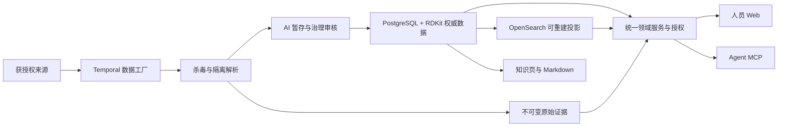

# X-Pharma

[Apache-2.0](LICENSE) · [架构](docs/architecture.md) · [源码导航](docs/codebase-guide.md) · [贡献指南](CONTRIBUTING.md) · [安全](SECURITY.md)

X-Pharma is an open-source pharmaceutical intelligence platform for people and
agents. It combines a research workbench, governed evidence, structured drug and
target data, durable ingestion workflows, and a standard MCP interface.

X-Pharma 是面向人员与 Agent 的医药情报平台：人员通过研究工作台查询药物、靶点、临床、专利、交易和证据；Agent 通过 MCP 使用相同领域服务和权限口径。PostgreSQL 保存权威事实，检索与知识页由这些事实投影产生。

这是开发版本。源码可以独立安装、测试和构建；目标环境的数据许可、自动入库、真实 LLM/OCR、企业身份和商业生产条件需分别验收。完整产品目标见 [GOAL.md](GOAL.md)，商业边界见 [商业就绪说明](docs/commercial-readiness.md)。

## 能力与模块

| 模块 | 能力 | 源码 |
| --- | --- | --- |
| 研究工作台 | 多领域查询、实体档案、结构检索、对比、收藏和受控导出 | `apps/web/src` |
| 数据与证据 | 规范实体、版本、来源定位、审计、租户隔离 | `src/pharma_intel/models.py`、`repository.py` |
| 数据工厂 | 文件夹、HTTP、S3、SFTP、SMB 与公共来源连接器，快照、扫描、解析和 Temporal 工作流 | `src/pharma_intel/ingest` |
| AI 治理 | 批准的 HTTPS 模型接口、严格结构化输出、引用、预算、审核与发布 | `src/pharma_intel/governance` |
| 检索与知识 | OpenSearch 投影、事务 outbox、版本知识页、Markdown 导出 | `search`、`knowledge` |
| Agent MCP | Streamable HTTP、鉴权、许可、配额、计量与异步导出 | `mcp_server.py`、`commercial` |
| 运维与恢复 | Compose、Kubernetes 基线、迁移、RLS 验证、备份与恢复 | `deploy`、`scripts`、`runbooks` |



业务进程保持统一：`pharma-gateway` 提供 Web/API/MCP，`pharma-jobs` 监督后台角色，`pharma-parser-service` 隔离不可信文件。内部 Python 包名 `pharma_intel`、现有 `pharma-*` 管理命令、数据库标识与存储合同保持稳定，方便已有数据升级；公共产品和 Python 发行包名为 X-Pharma / `x-pharma`。

## 安装

支持 Linux x86-64 或 Windows WSL2 的 Linux 环境。需要 Linux Docker Engine/Compose、Python 3.13.14、uv 0.11.28、Node.js 24.14、Corepack/pnpm 11.7。版本由 `pyproject.toml`、`uv.lock`、`apps/web/package.json` 和 `pnpm-lock.yaml` 锁定。

E 盘 WSL 工作区使用以下位置：

| 内容 | 位置 |
| --- | --- |
| 源码 | `/srv/wsl/projects/x-pharma` |
| 环境 | 源码内 `.venv` 或 `/srv/wsl/envs` |
| 运行数据 | `/srv/wsl/data` |
| 缓存与临时文件 | `/srv/wsl/cache`、`/srv/wsl/tmp` |

这些 Linux 路径属于 E 盘的 WSL ext4；Windows 可通过 `\\wsl.localhost\WSL\srv\wsl\projects\x-pharma` 访问。先确认目标发行版的磁盘位置，命令不能保证一个未经核对的 WSL 环境位于 E 盘。

```bash
git clone https://github.com/Victor-Xu-1/x-pharma.git /srv/wsl/projects/x-pharma
cd /srv/wsl/projects/x-pharma
export UV_CACHE_DIR=/srv/wsl/cache/uv
export COREPACK_HOME=/srv/wsl/cache/x-pharma/corepack
export npm_config_cache=/srv/wsl/cache/npm
export TMPDIR=/srv/wsl/tmp
uv sync --locked --dev
corepack pnpm@11.7.0 --dir apps/web install --frozen-lockfile
make configure
```

`make configure` 从 `.env.example` 生成权限为 0600 的私有 `.env`，每个安全边界使用独立随机密钥，数据库身份与连接 URL 一致；已有配置会保留并报错。AI 治理默认关闭，不提供预设账号或密码。其他 Linux 主机可使用自己的 Linux 原生目录和缓存位置。

```bash
make wsl-tools
make wsl-check
make up-observed
make status
```

首次启动会构建或下载锁定的容器镜像，需要网络。源码仓库不包含 Docker 引擎、镜像、模型或业务数据库；已有离线迁移包属于单独交付物，不能用 `git clone` 替代它。

创建自己的开发账号（将密码替换为独立的强密码）：

```bash
docker compose -f compose.yaml -f compose.dev.yaml run --rm api pharma-bootstrap \
  --tenant-slug default --tenant-name "Default Tenant" --skip-api-key \
  --admin-email admin@example.com --admin-password "your-own-unique-long-password"
```

默认入口：

- 研究工作台：http://127.0.0.1:18380/workspace/research
- 内部工作台：http://127.0.0.1:18380/workspace/internal
- MCP：http://127.0.0.1:18390/mcp

内部工作台只向有权限的人员开放。数据库、缓存、搜索和 Temporal 不是公开产品入口。MCP 客户端仍需身份、数据许可与商业合同配置，见 [MCP 契约](docs/mcp-contract.md)。

## 数据接入与 AI

管理员注册来源后，数据经不可变快照、ClamAV、隔离解析、治理审核和投影进入平台。只有实际获授权的数据才能接入或交付。连接器、来源许可与注册操作见 [来源接入](runbooks/source-onboarding.md)，数据工厂调用关系见 [架构说明](docs/architecture.md)。

AI 使用批准的第三方 HTTPS API。启用前在私有配置中设置 `AI_BASE_URL`、`AI_API_KEY`、`AI_MODEL` 与明确的响应模型 allowlist，确认费用、usage、输出 schema 和资料外发权限。模型不能直接写入权威事实。OCR 是独立可选组件，见 [OCR 服务](docs/ocr-service.md)。

## 验证与构建

```bash
make check
uv run pharma-openapi --check
uv build
make container-check
```

`make check` 覆盖格式、静态检查、严格类型、后端测试与覆盖率、生成客户端一致性、前端交互测试、生产构建、运维合同及部署清单。真实数据库、浏览器、安全扫描和协议验收由 CI 与相应脚本完成；完整目录见 [贡献指南](CONTRIBUTING.md)。

修改 API 后从权威 schema 重新生成客户端：

```bash
uv run pharma-openapi
corepack pnpm@11.7.0 --dir apps/web api:generate
corepack pnpm@11.7.0 --dir apps/web api:check
```

不要手工修改生成客户端。后端、前端、数据库、协议和容器采用同一版本的实现与迁移；验收结果必须属于本次实际候选。

## 部署、迁移与故障排查

- [WSL 开发与运维](docs/wsl-development.md)：工具、预检、启动与目录要求。
- [生产部署](docs/deployment.md)：企业 OIDC、TLS、Secrets、托管依赖与安全边界。
- [备份与恢复](runbooks/recovery.md)：权威数据、隔离恢复、校验与回滚。
- [发布证据](docs/release-evidence.md)：候选身份、门禁、分级与签名。
- [交接](docs/project-handoff.md)：当前源码治理与恢复后的运行边界。

启动失败时先检查 `make status`、容器健康和缺失的环境变量；数据库错误先核对迁移 head 与运行身份；查询为空时检查来源许可、已发布数据与搜索投影。不要通过关闭鉴权、校验或删除数据卷来绕过失败。

## 许可证

自有源码和文档使用 [Apache License 2.0](LICENSE)，署名见 [NOTICE](NOTICE)。第三方库、CPython 安全回补、容器、模型和数据保留各自许可证，见 [THIRD_PARTY_NOTICES.md](THIRD_PARTY_NOTICES.md)。Apache-2.0 不授予第三方医药数据、模型权重或在线服务的访问与再分发权。
