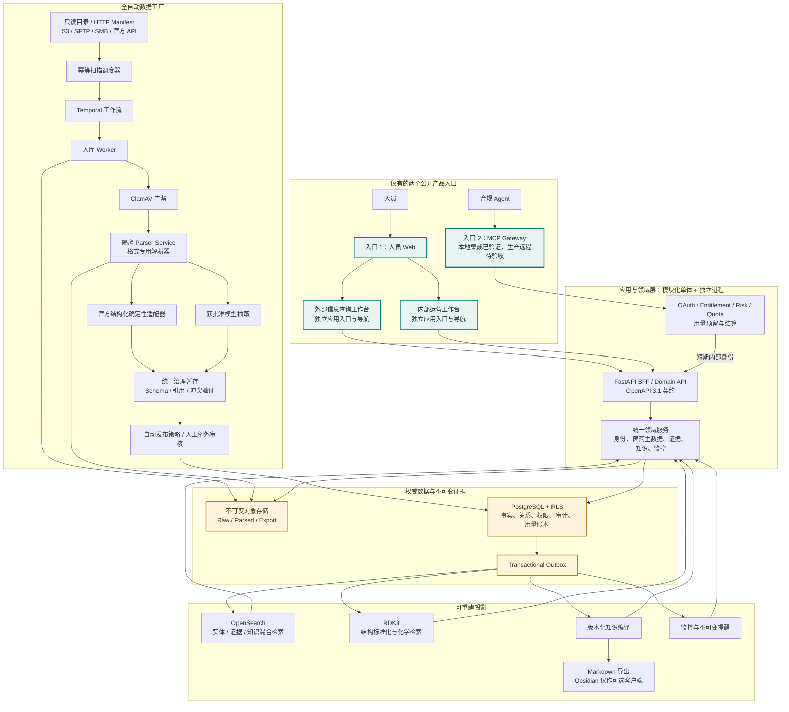
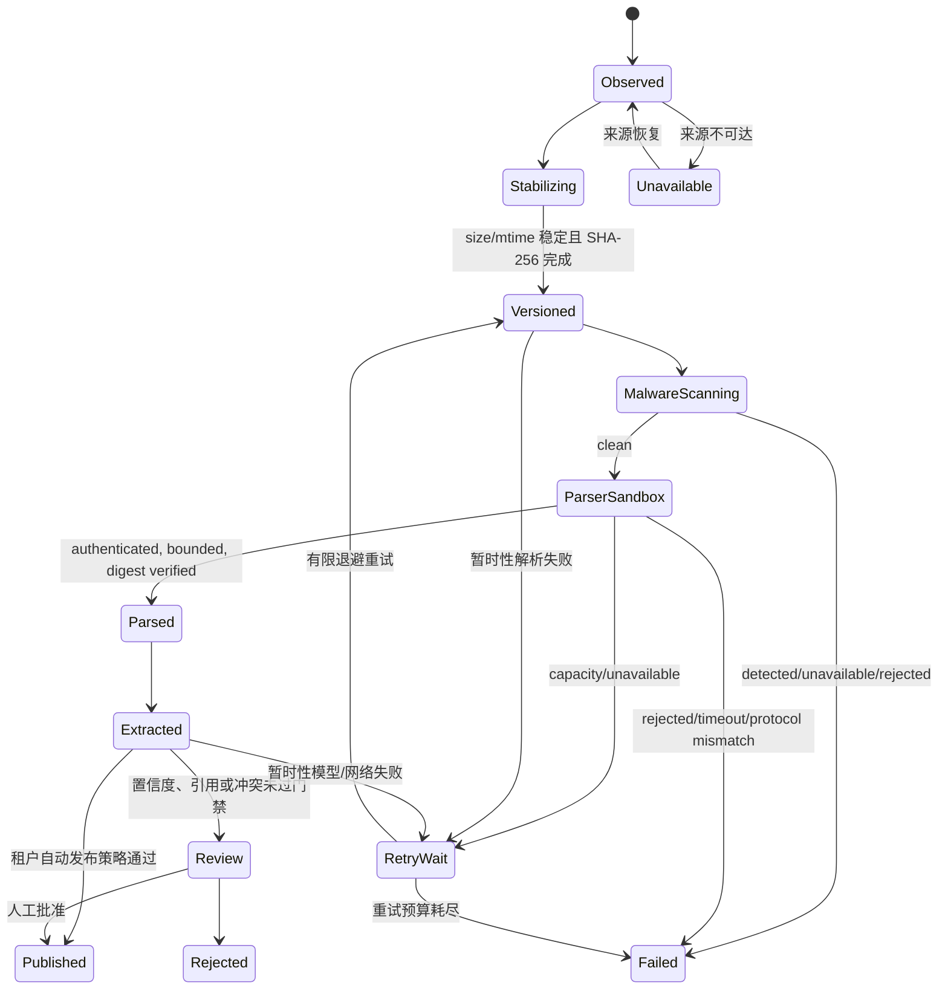
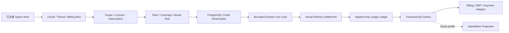
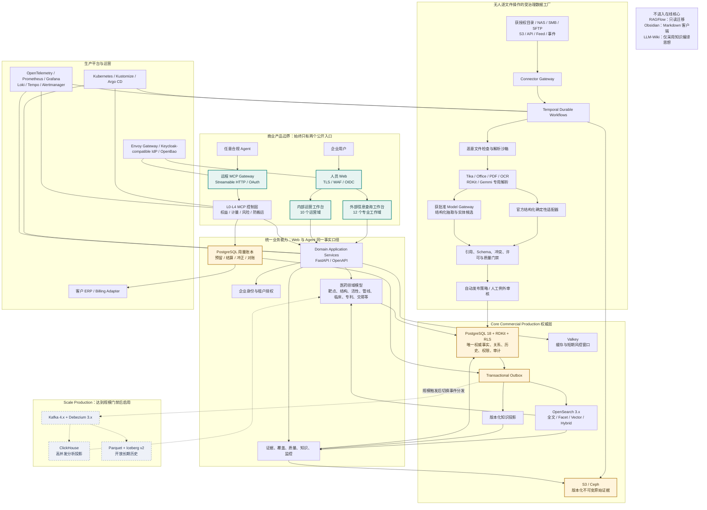

# 企业医药情报平台架构

本文件描述实现架构；最终产品目标和不可降低的边界以根目录 [GOAL.md](../GOAL.md) 为准，信息查询工作台的产品与查询架构见 [研发情报工作台架构](research-workbench-architecture.md)，锁定技术栈及理由见 [ADR 0004](adr/0004-open-source-technology-baseline.md)，MCP 计费与防数据搬运见 [ADR 0005](adr/0005-mcp-commercial-metering-and-anti-extraction.md)，实体身份与本体治理见 [ADR 0009](adr/0009-entity-identity-and-ontology-governance.md)，人员双工作台边界见 [ADR 0010](adr/0010-governed-human-workbench-separation.md)，公开产品基准和开源复用边界见 [ADR 0011](adr/0011-product-benchmark-and-open-source-reuse.md)，当前未完成项以 [商业交付门禁](commercial-readiness.md) 为准。

## 架构契约

平台只有两个公开入口：人员工作台和 Agent MCP。任何数据库、JSON API、检索引擎、模型、工作流后台或管理组件都属于内网实现细节。

人员公开入口是一个同源 Web 产品，但明确交付两套独立工作台：`/workspace/research` 只承载信息查询能力，`/workspace/internal` 只承载数据接入、AI 治理、商业运营与企业管理。两者只共享身份、生成的领域 API client 和审计体系，不共享侧栏导航、默认页面或业务功能；产品内不提供相互切换入口。Viewer 不能进入内部工作台，Analyst/Admin 的每个内部页面继续由服务端 scopes 限制。根路径只保留为统一认证和旧深链接兼容入口，不作为第三套混合工作台。

账号生命周期由 `accounts/` 模块拥有：`User` 是全局身份，`OrganizationMembership` 是组织角色、停用和版本的唯一权威，每次会话选择一个组织。`home_tenant_id` 仅用于默认归属和保留式迁移，不授予权限；同一事务新增组织和账号的 ORM 依赖顺序也显式建模。管理员发放的邮箱绑定、限期、一次性邀请码必须经已有账号本人确认才增加成员资格，不移动或共享原组织的数据。组织停用和降权只撤销该组织会话；改密通过全局版本撤销其他组织的旧会话。

路由只做传输与输入边界；数据库预算跨进程累计请求，注册、登录 peer 和登录 peer/account 使用不同 HMAC 命名空间，不存储原始地址或邮箱。注册仍为每 peer 每10分钟10次；登录为每 peer 240次和每 peer/account 60次，同源检查、16KiB请求体和 no-store 共同保护人员入口。完整规则及迁移/回退限制见 [accounts-and-organizations.md](accounts-and-organizations.md)。独立新账号固定 viewer；内部受邀新成员固定 analyst，不能自授管理员。企业身份模式不回退到密码注册。

核心原则：

1. RAG 是证据检索方法，不是数据库。
2. LLM 输出先进入治理暂存区，不能直接覆盖主数据。
3. 原始资料只读，入库产生不可变版本；来源断开不删除历史。
4. PostgreSQL 是事务、租户、事实、知识版本和审计的权威。
5. OpenSearch、分析库和 Markdown 都是可重建投影；历史 RAGFlow 只允许通过隔离的只读离线工具导出。
6. 人和 Agent 使用同一领域服务与权限模型，不复制两套业务逻辑。
7. 生产 MCP 的 entitlement、计量预留和风险门禁先于数据读取；付费额度不能替代来源许可或批量导出授权。

## 当前已实现拓扑

下图表示仓库当前已经形成的代码和部署边界，不等同于商业生产验收完成。当前主运行形态仍是 WSL/Compose 集成环境；Kubernetes、企业 OIDC、OpenBao、Envoy Gateway、OpenTelemetry 和商业账单适配虽已有实现或清单，但仍受真实客户环境联调和第 19 节发布证据门禁约束。

本地 telemetry profile 的常驻部署单元是 9 个容器：应用面仅 `pharma-gateway`、`pharma-jobs`、`pharma-parser-service` 三条进程线；PostgreSQL、Valkey、OpenSearch、Temporal、ClamAV 与 OTel Collector 是 6 个基础设施或安全依赖。`migrate` 与 `storage-init` 只在启动阶段执行并退出。Web、HTTP API 与远程 MCP 已合入 gateway；调度、Temporal worker、检索投影/维护、监控和可选账单投递已合入 jobs。Parser 因不可信文件、CPU/内存/PID 和网络隔离保持独立，不允许为了减少容器数并回持有业务凭据的进程。生产可用托管/集群共享基础设施替换本地 6 个容器，但不改变三条应用工作负载合同。

FastAPI 当前采用模块化单体：身份、来源控制、治理、主数据、证据、知识和数据访问共享一个事务边界，但模块和独立进程边界清楚。只有出现实测容量或团队所有权压力时才拆微服务；提前拆分会增加跨服务一致性风险。

人员工作台的服务器状态统一经过生成的 OpenAPI client、平台传输适配器、feature contract 和 TanStack Query；认证会话、总览、实体检索、靶点全景、证据、知识、AI 治理、化学、数据工厂、监控中心和对比列表不再直接拼接 API 路径或复制后端 DTO。查询总览只调用实体与知识读取，不读取数据源或治理队列；内部工作台的页面才调用运营 scopes。只读 POST 检索以规范参数作为 Query key，支持取消、有界重试和同条件显式刷新；登录、注销与领域写入使用不自动重试的 Mutation。传输适配器按媒体类型区分 JSON、文本 CSV 与二进制 XLSX，对比列表写入携带精确服务端版本并在完成前禁止同页并发变更。实体检索长列表使用语义化 TanStack Table/Virtual 视口；八个结构化工作域的列显示、列顺序和密度由 `workspace_table_preferences` 以租户/人员/固定领域键、乐观版本与强制 RLS 持有，浏览器只保留未提交交互状态，不使用 `localStorage` 作为事实来源；虚拟渲染仍是瞬时客户端行为。最多五级排序、筛选和分页属于已执行查询，由稳定 URL 与服务端完整授权命中集拥有，不进入展示偏好。核心会话或总览失败会显式阻断页面，非核心运行指标允许降级为空状态；Viewer 不会发起管理员或治理请求。

外部工作台在人员认证完成后按需加载固定版本的 `web-vitals`，采集 CLS、INP、LCP 与 TTFB；内部运营工作台不加载该模块。浏览器只提交固定工作域、设备类别、导航类型、指标名、服务端可复算评级和数值，不提交完整 URL、查询、实体/文档/租户/人员标识或 Web Vitals client ID；每页最多 32 个样本、每批最多 8 个，普通传输复用生成客户端，页面隐藏时使用同源 CSRF keepalive。统一 gateway 将样本写入现有 OTel MeterProvider，duration 与 CLS 使用覆盖正式阈值的显式 histogram buckets，Collector 和运维合同继续复用现有工作负载。高频 RUM 不进入逐请求业务审计账本，但认证、授权和 CSRF 不豁免。目标环境仍须接入中心观测后端并形成足够样本量、版本/地区/设备分层和批准的 P75 基线，才能关闭生产 RUM 门禁。

管线列表与竞争格局共享 `pharma.pipeline.search.v13`。规范药品条件使用同租户 `drug_entity_id` 精确匹配并贯通 URL、保存/监控、导出、HTTP 与收费 MCP 附加条件，不把自由文本药名冒充实体消歧。分析维度、Top 5–200、总体/全球/中国阶段口径和全部/主靶点聚合同时进入 TanStack Query key、生成式 OpenAPI 请求和稳定工作台 URL；PostgreSQL 对完整授权命中集计算分桶与逐桶阶段构成，响应回传实际采用的分析元数据。结果表直接展示并允许服务端排序药物、靶点、适应症、全部当前机构关系、模态、作用机制、总体/全球/中国阶段、项目状态、记录地区和阶段起始日期；每个机构关系保留 originator/collaborator/licensee 等受控角色、机构类型和国家/地区。Web 不从当前页重排、猜测角色或补造事实。未建模地域不会作为可用筛选暴露，新增地域必须先完成权威模型、治理、迁移和真实数据验收。

全局专业查询与管线专业页共享 `pipelineSignals.ts` 的临床结果/交易信号显示及校验合同。结果存在性/评价、交易存在性/币种和潜在总额范围继续由 `pharma.pipeline.search.v13` 的规范试验角色与交易资产关联执行；前端仅使用完整命中集 facet 构造候选、在无结果/无交易时原子清理依赖草稿，并在导航前阻断互斥条件、无币种金额和反向金额范围。该共享模块不拥有数据关联、facet 聚合或查询执行职责。

八个结构化查询域以有序重复 `sort=field:direction` 作为唯一新排序合同，最多五级且字段不可重复；当前版本为实体 v2、管线 v12、临床 v10、专利 v2、交易 v8、监管 v4、流行病学 v3、新闻 v2。稳定 URL、保存/监控、人员导出、HTTP、收费 Agent API、MCP 和计费预留共享同一令牌顺序；响应同时返回结构化排序列表，旧 `sort_by/sort_direction` 仅表示首级兼容值。SQL 空值统一后置并追加稳定标识，OpenSearch 保持相同优先级，交易任一级金额排序必须限定币种。

内部十个运营域的代码状态、证据和明确缺口由 `deploy/release/internal-workbench-capability-matrix.json` 管理，并由 JSON Schema 与仓库路径测试失败关闭。矩阵不创建新入口；来源、入库、解析、AI/主数据治理、发布投影、质量、企业、商业和平台运营继续收敛在 `/workspace/internal`。当前数据工厂还读取真实 OpenSearch 投影状态、别名和投递计数，供人员判断发布链路是否可用；命令行状态脚本不再是该 P0 可见性的唯一入口。失败、部分成功或取消的入库运行可由管理员在工作台填写原因后整次重放；服务端要求租户权限、幂等操作键和原运行期望状态，持久化操作状态并写入审计，重复成功请求返回同一新运行标识，参数冲突或状态漂移失败关闭。每次 Temporal 运行还绑定精确 workflow/run ID，人员工作台按真实源版本聚合展示发现、快照、安全扫描、解析、检索投影和 AI 治理六阶段进度；受控取消必须提交原因、幂等键和期望状态，只发送给绑定的 execution，worker 在阶段检查点读取取消标记，已完成不可变快照保留。该路径已通过 1200 个真实文件的 HTTP、PostgreSQL、Temporal、worker 和对象存储门禁。源对象台账通过租户隔离 API 展示不可变版本、哈希、处理阶段和恶意文件结果；解析文本预览不披露对象存储 URI，受字符/字节上限约束，并对恶意文件命中失败关闭。失败源版本由服务端计算合法恢复点，并通过独立、持久化且受幂等约束的 Temporal 工作流从安全扫描、解析、AI 治理或检索投影阶段恢复。解析恢复只复用已成功的安全扫描；治理和投影恢复要求可核验的解析产物；投影失败允许无源版本错误码，但仍以失败阶段和当前版本状态做乐观并发保护。该路径已使用真实 Markdown、HTTP、PostgreSQL、Temporal、worker、解析器、第三方 LLM API、事务 outbox、OpenSearch 和不可变对象存储通过验收。

恶意文件命中后进入版本化隔离状态机，解析、AI 治理和检索均失败关闭；人员只能留置、永久拒绝或提交仍强制经过 ClamAV 的 Temporal 复扫。每次系统/人员转换写入 append-only 决策历史并受 optimistic version、幂等键、审计和强制 RLS 约束；永久拒绝内容和通用版本重放均不能绕过隔离。该路径已使用真实 EICAR、ClamAV、HTTP、PostgreSQL、Temporal、worker 和四视口 Chrome 验收。AI 审核域还提供租户隔离的治理运行读取模型，把来源版本、模型、schema、policy/prompt/input 指纹、token、成本、状态和校验失败统一呈现，不返回原始模型载荷或凭据。

人员检索条件保存在版本化、类型化注册表中，当前合同包括 `entity_search@1`、`pipeline_search@1`、`clinical_trial_search@1`、`patent_search@1` 和 `deal_search@1`，不接受 SQL 或任意表达式。`pipeline_search@1` 保存完整药物与管线筛选、排序、展示与分析状态；`clinical_trial_search@1` 保存注册平台、状态、分期、研究类型、试验简称、IIT/IST、治疗线次、结果存在性与评价、结果/披露日期、四个规范药物/靶点角色组、同一关联药物项目属性、兼容角色条件、关键结果、发表编号、会议和排序；`patent_search@1` 保存关键词、申请人、法律状态和排序；`deal_search@1` 保存规范药品、靶点、适应症、资产管线模态/项目标签、交易类型、状态、方向、参与方与角色、阶段、权益、日期、金额、币种、排序和统计展示状态。四类专业合同都拒绝无任何有效筛选的全库订阅，但允许当前命中为空的有效查询订阅未来变化。监控消费者分别复用 `pharma.pipeline.search.v13`、`pharma.clinical_trial.search.v10`、`pharma.patent.search.v2` 和 `pharma.deal.search.v8` 的同一服务端过滤构造器，以关系存在性查询重新执行固定查询版本，监控中心再将该版本恢复为完整稳定 URL。个人检索仅所有者可见，企业共享检索对同租户人员可见；每位人员基于当前可见检索创建自己的监控主题。所有者撤回企业共享时，服务在同一事务内暂停其他所有者基于该检索的主题；重新启用主题必须重新验证当前可见性。`monitoring-v1` 消费者还会联接当前保存检索再次检查“主题所有者就是检索所有者，或检索仍为企业共享”，因此固定历史版本不能绕过后来发生的权限撤销。消费者使用与搜索投影相同的 outbox 租约、有限退避、死信与显式重放语义，但拥有独立投递状态，搜索故障不会阻塞提醒。提醒事件在 PostgreSQL 层追加不可变，已读回执独立保存。详见 [ADR 0007](adr/0007-saved-search-monitoring.md)。

人员对比列表保存稳定实体 ID，最多 20 条，并以乐观版本和不可变成员快照处理并发与审计。人工 CSV/JSON/XLSX 导出默认关闭，必须由租户管理员配置字段、格式、条数与授权标注策略；每次导出绑定策略哈希、内容哈希和幂等键。该同步小规模链路只接受人员会话，不与 MCP 收费批量导出共享入口或放宽 Agent 权益。详见 [ADR 0008](adr/0008-comparison-workspace-exports.md)。

管线读模型当前采用 `pharma.pipeline.search.v13`。研发项目仍是管线权威主记录，临床结果和交易只通过规范角色/资产关系作为筛选、分面和结果摘要加入，不把跨域事实复制进项目表。项目机构关系采用只追加、版本化集合：治理发布新集合时递增 `organization_set_version`，查询、分面、关联实体和竞争格局只读取当前集合；PostgreSQL 强制 RLS 与更新/删除拒绝触发器保护租户边界和历史不可变性。遗留单机构字段只用于兼容和当前 originator 投影，不能扩大当前结果。相同条件进入 Web、稳定 URL、保存检索、监控、受控导出、HTTP 和收费 MCP；试验或交易变更通过关系存在性查询回溯受影响项目。

`apps/web/src/lib/trialFilters.ts` 只承担全局专业查询与临床试验专业页共享的受控显示和前端互斥校验，不拥有数据查询、分类目录或领域事实。试验简称、IIT/IST 发起类型、治疗线次和结果评价仍由 `professionalSearchLocation` 写入稳定工作台 URL，再由既有 `pharma.clinical_trial.search.v10`、人员 HTTP、保存/监控、导出和收费 MCP 执行；“未发布结果+结果评价”在草稿和专业页均失败关闭。该收束没有新增后端进程、公共 API、数据表或模型调用。

## 数据权威层级

| 层 | 内容 | 写入规则 |
|---|---|---|
| Raw | 原文件/API 响应、SHA-256、来源和时间 | 不可变；内容变化创建新版本 |
| Parsed | 真实解析文本、页/幻灯片/表定位 | 可由 Raw 重建，失败不得写空文本冒充成功 |
| Staging | 模型运行、结构化候选、冲突、质量发现 | 追加式、完整保留模型和策略审计 |
| Canonical | 靶点、结构、活性、管线、临床、专利、交易和关系 | 事务写入、租户隔离、审核或明确策略批准 |
| Knowledge | 专题页、版本、引用、关系 | 从 Canonical 与已验证 Evidence 确定性编译 |
| Delivery | Web、MCP 响应和标准数据导出 | 有界查询、内容哈希、来源登记和缺口声明 |

## 自动数据工厂

官方结构化来源现由独立确定性治理处理，不依赖 AI 开关或模型凭据；ClinicalTrials.gov 日期分区与 ChEMBL 机制 keyset 通过受查询约束的持久检查点持续同步。批次、完整周期、水位、同记录版本推进、异常与真实验收边界见 [公开来源自动入库](automatic-public-source-ingestion.md)。

### 状态链路

来源接入通过 `SourceConnector` 协议和类型注册表进入数据工厂。连接器声明稳定 ID、增量、回放、凭据和不可变快照能力；领域服务只消费统一 discovery object，不包含供应商分支。当前正式实现 `folder-v1`、`http-manifest-v1`、`s3-snapshot-v1`、`sftp-snapshot-v1` 和 `smb-snapshot-v1`。目录连接器用禁止跟随符号链接的文件描述符做有界复制与前后 inode/大小/修改时间校验；HTTP Manifest 使用环境凭据与精确 Origin 白名单、禁重定向和声明摘要；S3 使用完整分页、固定 endpoint/region/bucket、ETag 条件读取；SFTP 使用公钥优先认证、显式 `known_hosts`、无 agent/default key、禁止跟随链接，并逐次重算内容摘要；SMB 使用精确 origin、隔离会话缓存、强制签名/加密、显式端口、禁止跟随 reparse point，并逐次重算内容摘要。任一对象失败时整批不推进 cursor 或成功时间，以便下次完整重放；五种连接器都不移动、重命名或写回来源。

注册 API、readiness、调度器和 worker 都使用同一来源治理契约：具名 owner、数据分级、授权范围、目标数据集许可、freshness、速率预算和凭据引用。扫描器只访问配置允许根目录下的真实路径，空白名单 fail closed，并拒绝路径逃逸和符号链接越界。稳定性门禁防止读取仍在复制的文件。每个来源只有一个活动 Temporal workflow ID；每次运行有独立关联 ID，因此多调度周期不会形成任务风暴。

每个发现对象先写入按 SHA-256 寻址的不可变快照并重新物化校验，再通过 ClamAV INSTREAM 扫描。只有 `malware_scan_status=SUCCEEDED` 才允许进入格式解析或科学资产登记；恶意内容、clamd 不可用、协议异常和文件超限都持久化失败原因并停止该版本。开发环境可以显式禁用并记录 `SKIPPED`，生产配置校验强制启用。Kubernetes 使用双副本起步的 StatefulSet，每个副本持有独立 RWO 病毒库卷；初始化容器只为卷中缺少的文件种入同一固定摘要镜像内置签名，主容器再由 freshclam 增量更新，避免首次启动完全依赖外部完整库下载。readiness 同时要求 clamd 响应和 36 小时内存在更新的签名文件，并配置滚动更新、HPA、PDB、拓扑分散及专用签名更新出口；目标环境仍须执行真实镜像源、容量和故障切换验收。

干净文档通过独立 parser 服务解析，不在 Data Factory 进程加载第三方格式库。请求绑定认证、Content-Length、扩展名和 SHA-256；parser 每文件启动清空业务环境的 Python isolated-mode 子进程，限制 CPU、内存、输出、文件描述符和墙钟时间。SDF/MOL 由 RDKit 严格解析并输出可复核的 canonical SMILES、InChIKey、分子式和质量字段；PDB/mmCIF 由 Gemmi 输出模型、链、残基、原子和配体元数据。解析文本进入相同的证据检索与 AI 治理链，结构发布仍受高风险人工审核，不因解析器确定性而绕过治理。worker 对响应 schema、源摘要和文本摘要再次验证。生产强制双向 TLS 和独立 token：parser 只持有服务端私钥与客户端 CA，worker 只持有客户端私钥与服务端 CA。Kubernetes parser 无平台 `envFrom`、无主动 egress，只接受 worker 入站。详细契约见 [隔离文档解析服务](parser-sandbox.md)。

生产将执行角色分离：

- `pharma-api`：统一 ASGI 网关，同一进程承载 Web、HTTP API 和 MCP，两个公开 host 路由到同一个 Service。
- `pharma-jobs`：统一后台任务进程；每个副本监督 Temporal worker/scheduler、检索投影/维护、监控和可选 billing delivery。Temporal 固定 workflow ID、数据库租约和幂等 outbox 负责跨副本去重与接管。
- `pharma-parser`：独立的不可信文件解析边界，不持有平台业务凭据；OCR 和 ClamAV 是该数据处理边界的受限依赖。
- `pharma-parser`：3 到 50 副本，只执行不可信文档解析；每 Pod 默认一个解析子进程，不持有业务凭据。

## 统一入库治理

已识别且获授权的官方结构化数据经确定性适配器进入同一暂存与发布服务，不依赖模型开关。需要自然语言模型抽取的材料受下列独立网关门禁约束；官方确定性入库不伪造模型 token、费用或 provider 证据。

模型调用只允许版本化 JSON Schema 输出。schema 2.12 将模型网关视为不可信外部边界，发布前检查：

- 文档字符数、分段数、单响应字节、单段输出令牌、文档输入/输出令牌和文档费用均有配置上限；超限不截断、不发布。
- OpenAI-compatible service root 只拼接一次 `/v1`；生产仅允许无 URL 凭据、query 或 fragment 的 HTTPS 根地址，客户端禁用环境代理和重定向。
- 超时、429/5xx 和网络错误使用有上限退避；provider `Retry-After` 受全局上限约束。同一逻辑调用的重试保持一个 client request ID。
- 只接受一个 `finish_reason=stop` 的 choice；实际响应模型必须命中生产批准 allowlist，拒答、截断、缺少 usage、缺少 provider request ID、超大响应或不符合 schema 的结果全部失败关闭。
- 事实类型、受控字段、单位和阶段规范化。
- quote 必须出现在生成该事实的精确输入分段中；跨分段“借用”原文不能通过引用门禁。
- 实体引用、来源文档和源版本必须存在。
- 当前事实冲突、置信度、来源策略和租户自动发布白名单。
- 配置模型、响应模型、system fingerprint、provider/client request ID、分段输入/响应哈希、token、估算费用、验证结果和审核人。
- 化学结构由 RDKit 2026.03.3 独立解析和标准化；模型原始载荷与平台规范化载荷分别保留，模型声称的 InChI、InChIKey 或分子式不一致时进入冲突审核。
- 人员 Web 工作台通过同一领域 API 执行 exact、子结构和相似性检索；浏览器 RDKit 只将服务端权威 SMILES 绘制为 2D 图，不参与标准化、检索、持久化或 Agent 契约，具体边界见 [ADR 0006](adr/0006-browser-rdkit-display-boundary.md)。

当前可物化：target profile、compound structure、assay/activity、development program、clinical trial、patent family、deal、regulatory event、epidemiology observation、evidence claim 和关系。监管事件在同一权威表内保存认定资格、标签变更/版本/生效时间、批准人群、给药信息、黑框警告、安全信号/严重程度/状态/时间窗、影响人群、风险措施和来源更新时间，不创建第二套监管事实真相。结构标识由有效 SMILES 确定性生成，无效结构直接拒绝；已存在 InChIKey 的跨实体绑定冲突不能覆盖权威记录，失败审批在同一事务中整体回滚。无法识别阶段、流行病学口径或观察区间等情况产生质量发现，不会伪造值。

AI 治理统一访问获批准的第三方 OpenAI-compatible HTTPS API，不提供本地推理镜像、模型权重缓存、GPU profile 或 loopback 回退。Pilot 入库证据只有在自然调度发现新版本、全部可治理版本使用批准模型成功抽取、usage/provider request ID/响应哈希/逐段 token 完整、存在 staged fact 且 quote locator 由服务端从原文字符位置计算时才通过。每个 ExtractionRun 以不可变 `policy_sha256` 绑定 provider 端点哈希、模型、提示词、事实 schema、输入输出、成本预算及自动发布策略；同一源内容和策略幂等复用，策略变化保留旧运行并创建新运行，防止模型升级静默复用旧治理结果。

### 实体身份与术语治理

实体身份不依赖名称唯一性。受信命名空间标识经过确定性规范化并保存来源、审核状态和信任级别；未知命名空间可以登记，但不能单独触发自动合并。AI 入库遇到无冲突的受信标识可复用规范实体；同一源文档内类型与规范名称完全相同且不存在受信标识冲突的重复引用会复用同一治理实体，防止一份提取结果内部的关系断裂。跨文档名称相同仍保留独立实体并创建风险分级的 resolution case，名称不能触发跨来源自动合并。

人工批准只建立可逆 canonical link，拒绝与回退均追加不可变决策记录；跨实体类型和循环链接失败关闭。本体术语按名称、精确版本和 term ID 不可变登记，实体映射强制类型一致并保留置信度、证据和来源。Web 与 MCP 从同一领域读取 `canonical_entity_id` 和治理标识，Agent 不拥有身份合并写权限。操作流程见 [实体身份与本体治理手册](../runbooks/entity-identity-governance.md)。

## 知识编译与 Obsidian

知识页在 PostgreSQL 中拥有稳定 page key、不可变版本、内容哈希、claim 级引用和 typed links。版本、引用和链接在 PostgreSQL 层由 append-only trigger 禁止更新或删除；当前版本指针仍可原子推进。人员工作台通过有界 API 读取当前版本的事实数、有效引用数、独立来源数、关联实体数和 predicate 覆盖，并查看最多 50 个版本的相邻差异；差异项保留事实 ID、关系、值、来源文档和原文定位，每类最多返回 100 项并显式标记截断。Markdown 是当前版本的原子导出。

因此 LLM-Wiki 与 Obsidian 不冲突：

- LLM-Wiki 的价值是持续综合，本平台由编译器实现。
- Obsidian 是 Markdown 客户端，可以增加私有人工笔记。
- 两者都不拥有主数据、用户权限、审核或并发写入。

## 身份、授权与租户

- 企业管理仍位于唯一内部人员工作台内，不新增公开入口。只有人员管理员可调用；Agent 和 API key 即使持有通配 scope 也会被拒绝。人员 JWT 必须包含租户和持久化会话 `sid`；服务端在设置签名租户上下文后查询强制 RLS 的 `user_sessions`，逐请求验证未撤销、未过期且用户仍活跃。单个会话可远程撤销，用户角色或状态变更会在同一事务撤销该用户全部会话；租户行锁、用户乐观版本、禁止修改自身角色/状态和最后一个活跃管理员保护仍同时生效。
- 用户组及成员关系使用包含 `tenant_id` 的复合外键，数据库层不能建立跨租户成员关系；新表启用 `FORCE ROW LEVEL SECURITY` 并调用签名租户上下文。管理写入生成语义化审计事件，审计分页游标绑定租户、人员、过滤条件和过期时间。
- 数据集目录是租户隔离、乐观版本控制的企业权威记录；状态变化必须携带期望版本，并校验许可编号、渠道、有效期和用途约束。企业页同时管理 API/MCP 客户端、保留策略、legal hold 和删除生命周期，不把数据库管理能力暴露到研究工作台。
- 平台运营读模型由三类来源组成：租户数据库中的真实入库/outbox/投影/治理队列和模型费用，仓库内版本化 SLO/告警/责任人合同，以及运维只读挂载目录中的有界机器 JSON。API 只接受人员管理员会话，拒绝 Agent/API key；证据文件按固定相对路径、schema、大小上限和状态枚举解析，不执行 shell、不挂载 Docker socket，也不把缺失外部探针解释为健康。生产存活、告警送达和拓扑仍必须由目标环境证据证明。
- 环境管理在内部工作台统一承载网关依赖、主机观察、受控安装计划及上述平台运行证据。Web 只生成计划并审计，主机 CLI 在 `/srv/wsl` 的 E 盘边界重新校验干净源码、版本、锁文件摘要和完整允许 argv 后执行；默认离线、缓存缺失失败、串行互斥、有界日志和超时。不提供任意 shell、Docker socket、全局服务重启或系统安装权限。完整职责与操作见 [环境管理](environment-management.md)。

- 人员生产登录：OIDC Authorization Code、S256 PKCE、state、nonce、RS256/ES256 JWKS、issuer/audience/azp 检查；HttpOnly/Secure/SameSite 应用会话和 CSRF token。
- 工作台路由：同源 URL 只承载白名单视图、受限检索条件和规范实体 UUID，不包含凭据或内部索引；刷新、前进后退和靶点深链接均重新经过会话、角色与服务端数据授权，未知视图回到总览，非法实体 ID 失败关闭。
- Agent 生产登录：MCP 作为 OAuth protected resource，校验 OIDC access token、audience、tenant claim 和 `mcp:connect` scope。
- 本地开发：服务 API key 只交给 MCP verifier；验证后换成短期内部 JWT，原始 key 不能调用内部 API。
- 数据库：服务层 tenant filter 加 PostgreSQL 强制 RLS；签名 tenant context 防止伪造 `set_config`。
- OpenSearch：调用者不能传 index/alias/routing；服务端固定 index family，强制 tenant filter 与 routing，返回实体后再从 PostgreSQL 权威记录补水。API 只持有 query role，projector 单独持有 template/pipeline/alias/write role；MCP、worker、scheduler 和 parser 不持有 OpenSearch 凭据。
- 历史 RAGFlow：不连接 API、Web、MCP 或入库 worker；运维人员只能使用独立只读导出命令，并将审核后的资料经注册来源重新入库。

## Agent 数据访问

人员本地关联检索与公开调研是两个读边界：前者复用已发布关系与OpenSearch分页/分面，不伪造别名；后者只返回官方著录元数据，不写事实、不标记verified、不向Agent/API key开放。名称、干预角色、覆盖、隐私与回退见 [公开来源检索与调研](public-research.md)。

结构化查询覆盖实体、靶点、活性、结构、管线、临床、专利和交易；实体与证据全文查询通过 OpenSearch 投影，权威字段仍从 PostgreSQL 读取。每个核心响应返回稳定实体 ID、数据时点、分页、coverage、warnings、来源、quote 和 locator。Agent 可自行选择和组合这些工具，平台不规定其分析流程或最终产物。

OpenSearch 使用三组版本化 index family：`entities`、`evidence` 和 `knowledge`。v2 mapping 为三类投影保存受版本约束的向量和模型 ID；证据检索通过 OpenSearch 原生 `hybrid` 查询与版本化 normalization pipeline 融合 BM25/k-NN 分数。固定 `pagination_depth` 保证分页候选集合一致，超过服务端候选上限失败关闭。读写只使用逻辑 alias；projector 以 outbox event ID 建立独立 delivery，先幂等写外部索引，再提交 delivery 状态。失败采用有上限指数退避，耗尽后进入可审计死信，必须显式重放。全量重建写入新物理索引，校验 Canonical/Parsed/Evidence 精确计数后通过单次 alias action 原子切换。

固定研究快照和 PPTX 生成器已从 Web、API、领域模型和数据库 schema 退出。平台边界止于受治理的数据、证据、来源、覆盖范围和授权限制；人员或 Agent 如何组合数据及生成下游产物不属于平台契约。

## MCP 商业计量与防数据搬运

当前代码已实现该调用链中的身份绑定、权益、rate card、额度预留、同步结算、幂等重放、追加账本、客户账户级精确日覆盖、请求窗口/client/脱敏网络/凭据确认键扩散与分片协同策略事件、14 个可分页工具统一签名游标与逐页结算、受审批异步导出、冲正、过期清算、三方对账、签名账期快照和 outbox。计费侧还提供固定目的地 HTTPS adapter 与独立内部 worker：签名账期经客户映射和确定性幂等键投递，响应受 schema/大小/metadata 白名单约束，失败使用持久化租约、有限退避、死信、审计和显式重放，成功引用仍追加到 PostgreSQL。该 worker 使用角色级生产配置、专用动态数据库/签名/provider Secret 和最小 egress，不持有 Web、MCP、对象存储或 AI 凭据。网络信号只从可信代理链取得并按 `/24` 或 `/56` 后 HMAC，OIDC 只接受签名 token 中单一 `cnf.jkt` 或 `x5t#S256`，不保存原始 IP 或确认键。人员工作台内置管理员商业运营视图，可查看合同额度、停用客户端、审批导出并持久化风险处置；这些操作复用同一领域服务，不构成第三个公开入口。Envoy Gateway 限流、OpenBao 动态租约和 OpenTelemetry 应用链路已有生产清单与本地验证；真实 billing/ERP 账户联调、目标代理 CIDR与 DPoP/mTLS 持有证明联调、外部告警和目标云基础设施验收仍未完成，因此仍不能作为收费生产服务对外开放：

- PostgreSQL 使用账本是订阅、rate card、额度、预留、结算、冲正和账单引用的权威；Valkey 只加速短期限流和额度读取。
- 每个 billable 调用提供幂等键和最大可收费单位，先按请求上界预留，再按实际交付量结算；重试不能重复扣费。
- Envoy Gateway 同时执行本地突发和全局分布式限流，领域服务继续执行字段、结果、证据长度、分页深度、并发和累计唯一记录覆盖限制。
- 游标签名并绑定 subject/tenant/client/tool/query/expiry；普通 MCP 工具不提供任意 offset、内部 ID 枚举、原始全文件或无限分页。
- 大批量数据使用独立 `data:export` scope、套餐权益、审批、异步任务、签名 manifest 和下载有效期，不能通过增大交互查询页长替代。
- OpenMeter 当前 pre-GA，只能作为未来 Scale profile 的可替换聚合/账单投影；不能位于 Core Commercial 调用关键路径。
- 技术上无法保证已经交付给合法客户的数据永不被复制，因此还需要来源许可、合同、身份归因、异常检测、告警和吊销流程。

## 生产部署边界

Kubernetes 清单实现 API/MCP 多副本、HPA、PDB、拓扑分散、迁移 Job、只读根文件系统、非 root 和默认拒绝网络策略。MCP 的 startup/readiness/liveness 探针不只检查端口，而是要求未认证 `/mcp` 明确返回 `401`，避免鉴权被误关时仍进入服务。入库 worker/调度器、搜索投影、监控和账单投递进程使用私有原子心跳文件，探针同时校验 schema、服务身份、更新时间和同 PID namespace 中的进程；过期、篡改、共享可写目录或进程消失都会失败关闭。Temporal 主进程监督所有启用角色和心跳任务，任一任务意外正常退出或异常终止都会结束容器并由编排器重启，而不是留下表面 Running 的失效进程。所有 Compose 与 Kubernetes YAML 在渲染前使用安全加载器拒绝重复 mapping key，防止不同工具静默选择不同配置。生产必须外接：

- PostgreSQL 18 + RDKit cartridge 的托管 HA/PITR，或经 ADR 批准的临时 PostgreSQL 17 兼容线。
- 版本化、加密、复制的 S3 对象存储。
- OpenSearch 3.x、独立 Temporal 集群和 Valkey。
- PostgreSQL 追加式 MCP usage ledger、entitlement/额度、日唯一覆盖、分页策略、冲正和对账已进入代码；生产仍需真实账单/ERP provider 联调和目标负载验收。
- 企业 OIDC、OpenBao 动态租约、Envoy Gateway/TLS/WAF 和 OpenTelemetry 清单已实现；客户 IdP、KMS、证书、中心观测后端与真实云集群仍需环境验收。
- 企业共享只读目录的 ROX/RWX 存储。

`compose.yaml` 只用于单机集成，不是高可用部署。

## 锁定目标架构

以下是 [GOAL.md](../GOAL.md) 规定的实施分级，不应误认为当前已实现：

这张图的验收含义是：双工作台和 MCP 只是两种交付表面，底层只能有一个领域事实体系；自动入库先经过不可变证据、解析和确定性／模型统一治理，适配器和模型都不能直接写权威数据；MCP 在读取前完成授权、权益、配额和风险判断，在成功交付后形成可对账结算；Kafka、ClickHouse 与 Iceberg 只在真实规模触发后作为投影加入，不能反向成为事务权威。

| Profile | 必需组件 | 进入门禁 |
|---|---|---|
| Core Commercial Production | Python 3.13、PostgreSQL 18 + RDKit、OpenSearch 3.x、Temporal、S3、Valkey、OIDC、MCP usage ledger/entitlement/risk、OpenBao、Envoy Gateway、Kubernetes、OpenTelemetry 栈 | 商业 Production 前全部完成真实集成、安全、计量对账、防枚举与恢复验收 |
| Scale Production | Core + Kafka/Debezium、ClickHouse、Parquet/Iceberg、经资格评审的 OpenMeter 投影 | 进入 1 亿事实、1,000 万文档和目标高并发包络前完成回放、对账与压测 |
| Migration Only | 离线只读 RAGFlow 导出命令 | 只为历史内容盘点与迁移保留，不进入任何在线服务或新功能依赖 |

所有投影通过 transactional outbox 和版本化事件加入，不改变两个入口、PostgreSQL 主数据权威或 MCP 契约。

## 实现状态

| 能力 | 当前状态 |
|---|---|
| 两个公开入口 | 已实现并有真实浏览器/MCP 测试 |
| PostgreSQL 领域模型与 RLS | 已实现，真实 PostgreSQL 验证 |
| 自动多源入库 | 已实现 `folder-v1`、`http-manifest-v1`、`s3-snapshot-v1`、`sftp-snapshot-v1` 与 `smb-snapshot-v1`；包含目录/Origin/bucket/凭据白名单、SFTP 主机密钥强校验、SMB3 签名/加密、来源 owner/分级/授权/许可/freshness、失败游标回放、条件下载/来源指纹，以及不可变快照后的真实 ClamAV 解析前门禁；已有真实目录、HTTP、S3、OpenSSH SFTP、加密 Samba 与 clamd/Data Factory 协议验证 |
| 官方公开来源持续入库 | ClinicalTrials.gov 显式日期范围分区、ChEMBL 单靶点机制 keyset、查询绑定检查点、分批续跑与周期复核已实现；独立确定性治理和同记录单调版本更新复用统一发布权威；真实环境证据与范围按[自动入库验收](automatic-public-source-ingestion.md)单独核对，不代表全库、商业来源或 Production 验收 |
| AI 治理和十类结构化发布 | 已实现 schema 2.12、分段级引用/请求指纹、token/费用/响应硬预算、原始/规范载荷审计、RDKit 结构权威校验、临床试验设计/队列/终点/结果/状态历史、交易参与方角色/资产阶段/地域权益、结构化监管认定/标签/安全事件、规范患者人群及疾病/靶点关系、流行病学观测、新闻与公告事件、非重试政策失败和冲突审批事务回滚；真实付费模型待环境验收 |
| 版本化知识/Markdown | 已实现；含当前覆盖摘要、版本时间线、可追溯差异和 PostgreSQL append-only 保护 |
| 新闻、会议和研究发布 | 已实现；同一治理事件服务支持新闻列表及服务端限定的论文、摘要、海报、演示时间线 |
| Agent 结构化数据与证据访问 | 17 个核心交互式 MCP 工具和 4 个异步导出工具已实现，包含真实 RDKit exact/substructure/similarity、公司管线/交易统一时间线、记录级授权溯源和九类结构化权威/溯源数据导出 |
| MCP 商业计量、权益与防数据搬运 | usage ledger、client/订阅/权益/rate card、预留/结算/释放、冲正、过期清算、三方对账、签名账期快照、客户级精确覆盖、跨 client/网络/凭据风险、策略事件、14 个可分页工具统一签名游标与逐页结算、审批导出、客户端停用、风险处置和 Envoy 边缘限流已实现；目标网关 DPoP/mTLS 持有证明、全局分布式限流、外部告警和真实账单 provider 仍是 Production 阻断项 |
| OpenBao / Envoy / OpenTelemetry | 固定版本、动态 PostgreSQL 运行时租约、迁移密钥隔离、密钥轮换滚动、双入口 Gateway/限流、3 副本 Collector 和四类进程真实 OTLP 已实现；目标云 HA/KMS/TLS/中心后端故障演练待验收 |
| 固定研究产物 | 已退出核心代码、Web/API 契约和数据库 schema；PPTX 仅作为可解析的输入格式 |
| 生产 OIDC 协议 | 已实现签名和回调测试；客户 IdP 联调待验收 |
| Kubernetes HA 基线 | 已实现清单；多可用区实际部署/压测待验收 |
| Python 3.13 / PostgreSQL 18 目标运行线 | Python 3.13.14、固定 uv、单一依赖锁、Biome 2，以及 PostgreSQL 18.4 + RDKit cartridge、可回切卷迁移、权威结构 schema/query 与收费 MCP 计算量结算已完成真实验证；规模压测、托管 HA/PITR 待完成 |
| OpenSearch 实体/证据检索 | 已实现 OpenSearch 3.7、严格向量 mapping、BM25/k-NN 原生 hybrid、版本化 normalization pipeline、租户 routing/filter、facet、联想、定位引用、投影重试/死信和 alias 原子重建；获批准的远程 embedding API 及其模型仍须完成真实医药金标、容量和故障演练 Production 验收 |
| RDKit exact/子结构/相似性 | 已实现并通过真实 PostgreSQL 18/RDKit、GiST、RLS、人员 API 与收费 MCP 测试；生产数据规模相关性和容量验收待完成 |
| RAGFlow 退出核心运行栈 | 已从 Compose、Kubernetes、API、Temporal 与新数据入库链路退出；仅保留隔离的只读离线导出命令和无损升级所需的可空遗留列 |
| Kafka/ClickHouse/Iceberg Scale profile | 未实现；进入目标规模包络前完成 |
| 全球授权数据连接器 | 未实现，取决于数据许可 |
| SLO、负载、渗透和恢复演练 | 本地权威备份已完成 59 表精确恢复、RLS 和双归档演练；Development/Pilot 发布包强制执行 Web/MCP 持续与峰值混合基线、并发幂等结算和取消/超时恢复；生产长稳、服务端背压、托管依赖故障、PITR/区域切换和渗透仍须完成 |
