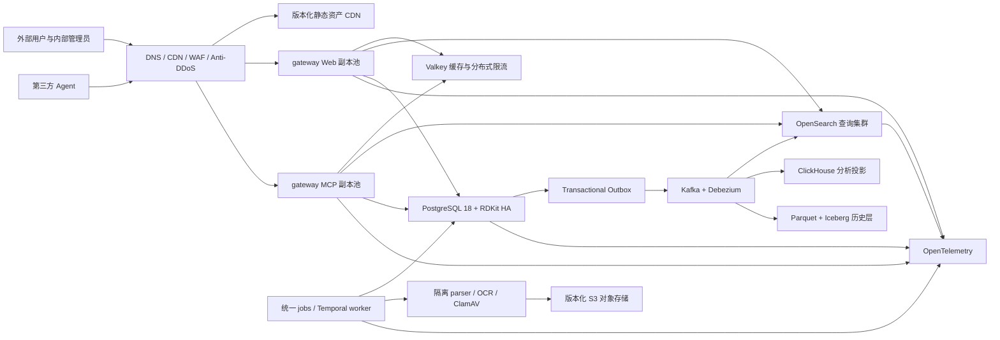
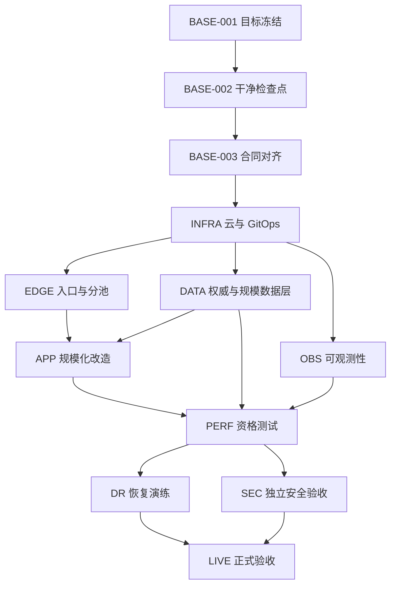

# 10 万并发医药信息平台生产上线执行方案

> 文档状态：`EXECUTION_DRAFT`
>
> 编写日期：2026-08-11
>
> 当前代码快照：`main@d386e416639b5ac370dd468e1bdc9633aee56439`
>
> 当前事实：工作树约有 300 项已修改或未跟踪内容，尚不是可发布提交。
>
> 生产声明：`production_claim=false`

## 1. 文档目的与权威边界

本文件把项目从当前本地候选推进到可承载 10 万在线人员会话的商业生产平台。它供 Controller Agent、平台 Agent、应用 Agent、数据 Agent、安全 Agent、性能 Agent 和人工审批责任人串行或按明确文件边界并行执行。

本文件不是容量通过证明。只有目标基础设施上的真实负载、长稳、故障、恢复、安全和 UAT 证据全部通过后，才能宣称达到目标。

发生冲突时按以下优先级处理：

1. 数据许可、安全、租户隔离、计量和不可变证据规则以 `GOAL.md` 与已批准 ADR 为最高权威。
2. 产品只保留两类公开入口：人员工作台与 MCP。内部工作台和外部工作台是人员入口下的独立应用边界，不新增第三个公开产品入口。
3. 默认不以“企业级”为理由拆分业务微服务。业务进程类型最多为 `gateway`、`jobs`、`document-processing` 三类。
4. 同一进程类型可以水平复制，也可以使用同一镜像建立 Web 与 MCP 两个隔离副本池。副本池不是新的业务微服务。
5. Docker Compose 只用于开发和本地集成。生产使用 OCI 镜像、托管 Kubernetes 和独立高可用数据服务，生产节点不要求 Docker Desktop 或 Docker daemon。
6. 本计划提出的容量值必须由 `BASE-001` 写入正式 ADR 和 GOAL 后才成为发布合同。

## 2. 执行默认容量合同（待 `BASE-001` 正式固化）

“10 万人浏览检索”在本计划中定义为：

| 指标 | 目标合同 |
|---|---:|
| 已认证在线人员会话 | 100,000 |
| 正常平均思考时间 | 10 秒/次请求 |
| 持续 Web/API/Search 吞吐 | 10,000 RPS |
| 60 秒突发吞吐 | 20,000 RPS |
| 同步搜索最大服务时间 | 10 秒，超出转异步或明确失败 |
| MCP 短查询并发 | 200，突发 400，与人员流量隔离 |
| MCP 长任务 | 独立队列、租户配额和并发额度，不占用同步查询池 |
| 结构化查询 P95/P99 | `< 800 ms` / `< 2 s` |
| 全文和 facet 查询 P95/P99 | `< 1.5 s` / `< 3 s` |
| 工作台月可用性 | `>= 99.95%`，最终值以商业 SLA 批准为准 |
| Web 错误率 | `< 0.1%`，不含明确的策略拒绝 |
| RPO/RTO | `<= 5 min` / `<= 30 min` |
| 跨租户泄漏 | `0`，任何一次均为 P0 并终止上线 |
| MCP 成功结果缺少 settlement | `0` |

计算口径：`RPS = 活跃用户数 / 平均思考时间`。如果业务实际要求 10 万个请求在同一秒到达，即 100,000 RPS，本计划必须重新做多区域、预计算、缓存命中率和成本设计，不能把当前 20,000 RPS 峰值方案冒充满足。

## 3. 当前基线与真实差距

### 3.1 已具备的代码基础

| 能力 | 当前状态 | 现有基础 | 仍需完成 |
|---|---|---|---|
| 业务架构 | 已具备 | FastAPI 模块化单体、统一领域契约 | 完成 10 万容量 ADR 和性能优化 |
| 进程收束 | 已具备 | 统一 gateway、统一 jobs、隔离 parser/OCR | 在不增加业务类型的前提下建立 Web/MCP 隔离副本池 |
| 两类入口 | 已具备 | workspace host 与 MCP host | 目标 DNS、TLS、WAF、OAuth 实机验收 |
| Kubernetes base | 部分具备 | Deployment、HPA、PDB、NetworkPolicy、探针、只读根目录 | 真实云 overlay、IaC、节点池、存储类、CNI 和多可用区验收 |
| OpenSearch | 部分具备 | 3.x 投影、alias、混合检索、租户过滤 | 大规模 shard 设计、查询节点池、回压、基准和恢复 |
| PostgreSQL/RDKit | 部分具备 | PostgreSQL 18/RDKit 本地合同与结构查询 | 托管兼容性、HA、PITR、连接池和规模压测 |
| Valkey | 部分具备 | 本地缓存/协调依赖 | 托管 HA、授权感知缓存、故障和热键验收 |
| Temporal | 部分具备 | 入库工作流与统一 jobs | 生产 HA、任务队列容量、积压扩容和故障恢复 |
| 证据门禁 | 已具备 | Development/Pilot/Production 分类、签名和离线校验 | 目标环境真实 Production 证据和人工审批 |
| 本地浏览器质量 | 部分具备 | 多视口真实浏览器与组件测试 | 生产 RUM P75、人工辅助技术、系统缩放和客户 UAT |
| MCP 商业控制 | 部分具备 | 协议、计量、settlement、反提取基线 | 真实 IdP、DPoP/mTLS、全局限流、客户账单系统 |
| 自动入库 | 部分具备 | 多连接器、Temporal、隔离解析、治理链 | 正式授权来源、生产吞吐、重放、全局模型并发和 SLA |

### 3.2 当前商业生产阻断项

| 编号 | 阻断项 | 状态 | 影响 |
|---|---|---|---|
| G-01 | 当前 `main` 工作树约 300 项改动，缺少干净、签名、可复现发布提交 | 阻塞 | 不能生成可信生产制品 |
| G-02 | GOAL 当前仍是 1,000 会话、100/300 RPS | 未完成 | 与 10 万目标不一致 |
| G-03 | 没有云厂商、区域、账号、预算和数据驻留批准 | 外部阻塞 | 无法创建目标资源 |
| G-04 | 没有 Terraform/OpenTofu 模块和生产环境 overlay | 未完成 | 目标环境不可重复创建 |
| G-05 | 没有 Argo CD Application 和生产 GitOps 仓库绑定 | 未完成 | 发布依赖人工命令 |
| G-06 | 当前 HPA 仅使用 CPU，API 上限 30 副本 | 未完成 | 无法按 RPS、延迟、连接池和积压扩容 |
| G-07 | Web 和 MCP 当前进入同一个副本池 | 未完成 | Agent 流量可形成 noisy-neighbor 风险 |
| G-08 | 静态 Web 资产未配置企业 CDN/WAF 缓存链 | 未完成 | API Pod 和源站承担不必要流量 |
| G-09 | PostgreSQL 18 + RDKit 托管兼容、HA、PITR 未验收 | 未完成 | 权威事务和化学查询不可上线 |
| G-10 | OpenSearch 大规模相关性、容量、shard、回压和恢复未验收 | 未完成 | 核心检索容量未知 |
| G-11 | Kafka/Debezium 未实现 | 未完成 | 高吞吐投影缺少可靠削峰与回放层 |
| G-12 | ClickHouse 未实现 | 未完成 | 高并发趋势和格局聚合会压迫事务或搜索集群 |
| G-13 | Iceberg/S3 长期历史层未实现 | 未完成 | 百 TB 历史、schema evolution 和大回放未闭合 |
| G-14 | 企业 IdP、OpenBao、Envoy、中心 OTel 后端未实机联调 | 未完成 | 身份、密钥、入口和运营证据缺失 |
| G-15 | 正式数据授权、字段/地域/展示/导出许可未完成 | 外部阻塞 | 商业内容不能合法上线 |
| G-16 | 目标环境 10k/20k RPS、72 小时长稳和故障注入未执行 | 未完成 | 不能声称 10 万容量 |
| G-17 | 生产 PITR、对象恢复、索引重建、区域切换未演练 | 未完成 | RPO/RTO 未证明 |
| G-18 | 独立渗透测试和供应链风险批准未完成 | 外部阻塞 | 安全上线门禁未闭合 |
| G-19 | 专业用户、数据管理员和 Agent 客户 UAT 未完成 | 外部阻塞 | 产品可用性未获业务确认 |
| G-20 | 正式值班、告警路由、支持升级、事故响应未签字 | 外部阻塞 | 无法持续运营 |

## 4. 目标生产架构



### 4.1 公开入口

| 入口 | 对外地址 | 后端 | 约束 |
|---|---|---|---|
| 人员工作台 | `https://workspace.<domain>` | CDN + Web gateway pool | `/workspace/research` 和 `/workspace/internal` 使用独立登录、导航和服务端授权 |
| Agent | `https://mcp.<domain>/mcp` | MCP gateway pool | OAuth protected resource、DPoP 或 mTLS、计量、限流、反提取 |

不得公开 PostgreSQL、OpenSearch、Valkey、Temporal、parser、OCR、ClamAV、对象存储管理端、内部 API 文档或观测后台。

### 4.2 三类应用进程

| 进程类型 | 部署池 | 初始预生产种子 | 扩缩容信号 |
|---|---|---:|---|
| `gateway` | `pharma-web` | 每可用区 4 个，合计 12 | RPS、in-flight、P95、CPU、连接池等待 |
| `gateway` | `pharma-mcp` | 每可用区 2 个，合计 6 | MCP in-flight、P95、settlement 延迟、拒绝率 |
| `jobs` | `pharma-jobs` | 每可用区 2 个，合计 6 | Temporal backlog、outbox lag、projection lag、模型并发 |
| `document-processing` | parser/OCR 安全池 | parser 3、OCR 3 | 待解析页数、任务年龄、CPU/内存、429 饱和率 |

以上副本数只是资格测试起点，不是生产承诺。最终 `requests/limits`、最小/最大副本和节点规格必须由 `PERF-003` 至 `PERF-006` 的实测结果生成。

### 4.3 数据服务种子拓扑

| 服务 | 生产边界 | 初始资格测试拓扑 |
|---|---|---|
| PostgreSQL 18 + RDKit | 唯一事务权威、RLS、PITR | 1 主 + 2 跨区同步/受控异步副本 + 2 只读副本；托管服务优先 |
| PgBouncer/托管 DB Proxy | 连接复用 | 每区至少 1 个；事务级租户上下文必须有回归 |
| OpenSearch 3.x | 全文、facet、向量、读模型 | 3 manager、至少 3 coordinator、至少 6 data 节点；实际 shard 由 Benchmark 决定 |
| Valkey | 非权威缓存、限流、短租约 | 3 主 3 从或等价托管 HA；跨区故障测试 |
| Temporal | durable workflow | 托管服务优先；自建时所有核心服务与数据库跨 3 区 |
| Kafka/Debezium | outbox/CDC、投影削峰 | 托管 3 区或至少 3 broker；事件 schema 兼容门禁 |
| ClickHouse | 趋势、格局和大聚合 | 托管 HA 或 3 keeper + 多 shard/replica；不承接事务写入 |
| S3 + Iceberg v2 | 原始对象、历史、回放 | versioning、object lock、跨区域复制、生命周期与 KMS |

## 5. 关键设计规则

1. PostgreSQL 是权威事实；OpenSearch、ClickHouse、Valkey 和 Iceberg 均为可重建派生层。
2. 所有权威写入与 outbox 在同一事务提交。投影消费者幂等，支持从确定水位回放。
3. API Pod 无本地会话、上传、任务或索引权威状态。Pod 可随时删除和扩缩容。
4. 缓存键必须包含租户、主体权限版本、许可策略版本、查询 schema 版本和索引 alias 版本。跨权限缓存命中为 P0。
5. 静态资产使用内容摘要文件名和长缓存；HTML shell 短缓存并支持快速回滚。RDKit JavaScript/WASM 必须由本项目构建并版本化，不加载未固定第三方运行时资源。
6. Web 和 MCP 共享领域用例，不维护两套事实、授权或过滤语义。
7. 同步搜索有查询复杂度、页大小、深分页和超时上限；大导出、大聚合和长任务进入异步队列。
8. MCP 配额独立于人员配额，不能通过多个 client、网络或凭据绕过累计唯一数据覆盖限制。
9. HPA 不只看 CPU。至少使用请求量、并发、P95、队列深度和依赖饱和度中的适用指标。
10. 不在应用 Kubernetes 节点上运行单实例 PostgreSQL、OpenSearch 或对象存储来冒充生产 HA。

## 6. Agent 执行协议

### 6.1 角色

| 角色 | 职责 | 禁止事项 |
|---|---|---|
| Controller Agent | 任务依赖、文件租约、合并、最终证据与状态更新 | 不覆盖 worker 全文件，不用未验证结果勾选任务 |
| Architecture Agent | ADR、目标容量、接口和拓扑约束 | 不直接创建收费云资源 |
| Platform Agent | OpenTofu、Kubernetes overlay、Argo CD、网关、Secret | 不修改业务逻辑 |
| Application Scale Agent | gateway 分池、缓存、查询预算、异步边界 | 不改数据许可与账单规则 |
| Data Platform Agent | PostgreSQL、OpenSearch、Kafka、ClickHouse、Iceberg | 不改变外部 API/MCP 合同 |
| SRE/Performance Agent | OTel、HPA 指标、负载、长稳、故障和容量报告 | 不在正式环境制造未批准故障 |
| Security Agent | OIDC、DPoP/mTLS、WAF、网络、供应链、渗透测试协调 | 不记录凭据和完整敏感载荷 |
| Product/Data/UAT | 数据许可、正式 query mix、UAT 和业务签字 | 不用 mock 或演示数据关闭生产门禁 |

### 6.2 每个 Agent 开工前必须执行

```bash
git status --short
git rev-parse HEAD
git branch --show-current
git diff --check
find .. -name AGENTS.md -print
```

执行规则：

- 当前共享工作树不得执行 `reset --hard`、`clean`、全局 stash、rebase、分支切换或批量格式化。
- `BASE-002` 完成前，只允许文档审计和不写 canonical 的 staging 工作。
- 每个任务使用独立 branch/worktree，Controller 分配精确文件租约；同一文件的不同 hunk 也要登记。
- 新增依赖必须记录许可证、维护状态、版本、镜像 digest、SBOM 和替代方案。
- 云资源创建、DNS、证书、生产凭据、收费服务、故障注入和数据迁移必须取得明确批准。
- 任何命令失败必须保留原始退出码和日志摘要，不得提高超时、删除校验或用 mock 改成绿色。
- Worker 只提交任务范围；Controller 在集成提交重新运行门禁。候选通过不等于已合并，已合并不等于已部署，已部署不等于已验收。

### 6.3 状态定义

| 状态 | 含义 |
|---|---|
| `TODO` | 尚未开始 |
| `IN_PROGRESS` | 已取得文件租约并执行中 |
| `BLOCKED_EXTERNAL` | 仅受账号、预算、许可、客户或人工审批阻塞 |
| `FAILED` | 本轮验收未通过，保留证据和根因 |
| `VERIFIED_CANDIDATE` | 独立候选通过，但尚未合并/部署 |
| `INTEGRATED` | 已进入签名集成提交并通过集成门禁 |
| `DEPLOYED` | 已部署目标环境但尚未完成生产验收 |
| `ACCEPTED` | 目标环境证据和所需人工签字全部完成 |

只有 Controller 可以把本文件中的复选框改为 `[x]`，并且必须同时给出提交 SHA、镜像 digest、目标环境、命令退出码、证据 URI、SHA-256 和审批引用。

## 7. 执行阶段和任务

### Phase 0: 冻结目标与建立可集成基线

- [ ] `BASE-001` 冻结容量和业务输入
  - 依赖：无。
  - 执行：批准本文件第 2 节；确认主要用户地区、云厂商候选、数据驻留、预算上限、域名、SLA、100k 会话是否包含 100k 同秒请求。
  - 输出：`docs/adr/0013-production-100k-capacity-envelope.md`。
  - 验收：产品、架构、平台和安全四方签字；容量公式和 query mix 不留 TBD。

- [ ] `BASE-002` 建立干净集成检查点
  - 依赖：`BASE-001`。
  - 执行：对当前约 300 项改动按 owner、消费者、来源和风险分类；各 owner 提交或明确保留，不删除不确定文件；从集成提交建立签名 tag 候选。
  - 输出：干净 `main`、变更清单、源文件 SHA 清单。
  - 验收：`git status --porcelain` 为空；`make check`、`make container-check`、`make source-reproducibility-acceptance` 退出 0。
  - 回滚：保留原 owner branch/worktree 和提交，不重写历史。

- [ ] `BASE-003` 对齐 GOAL、ADR 和部署合同
  - 依赖：`BASE-001`、`BASE-002`。
  - 执行：把第 2 节目标写入 `GOAL.md`；新增 Web/MCP 同镜像双副本池 ADR；保留两入口和三进程类型约束；更新 topology probe/schema。
  - 文件：`GOAL.md`、`docs/adr/0012-unified-application-process-topology.md` 或新 ADR、`docs/architecture.md`、相关合同测试。
  - 验收：文档和机器 schema 对入口、进程类型、目标 RPS、证据类别没有冲突。

- [ ] `BASE-004` 建立 Agent 文件租约与状态账本
  - 依赖：`BASE-002`。
  - 执行：Controller 为每个任务登记 branch、worktree、owner、文件和 hunk；工作结果只通过提交 SHA 交接。
  - 输出：项目批准位置中的任务账本，不记录凭据。
  - 验收：并行任务无文件重叠；中断后可从提交和证据恢复。

- [ ] `BASE-005` 建立生产证据工作区
  - 依赖：`BASE-002`。
  - 执行：在仓库外受控对象存储创建不可覆盖证据前缀；配置签名、WORM/retention、访问审计和生命周期；仓库只存 schema、策略和不含敏感数据的 intake。
  - 验收：一次测试报告可签名、离线验签、拒绝覆盖和拒绝篡改；凭据不进入仓库或日志。

Phase 0 Gate：五项全部完成后才允许大规模修改 canonical 和创建目标云资源。

### Phase 1: 云基础设施和 GitOps

- [ ] `INFRA-001` 选择并记录云厂商/区域
  - 依赖：`BASE-001`。
  - 执行：比较三可用区、Kubernetes、WAF/Anti-DDoS、CDN、S3、KMS、托管 PostgreSQL/RDKit、OpenSearch、Valkey、Kafka、ClickHouse、专线和数据驻留能力。
  - 验收：ADR 包含成本区间、退出方案、扩容上限和 RDKit 兼容风险；不得只按单价选择。

- [ ] `INFRA-002` 创建 OpenTofu IaC 根模块
  - 依赖：`INFRA-001`。
  - 文件：`deploy/tofu/modules/*`、`deploy/tofu/environments/{staging,production}`、`.github/workflows/infrastructure.yml`。
  - 执行：网络、Kubernetes、IAM/KMS、DNS、证书、对象存储、日志和托管数据服务全部模块化；状态远端加密、锁定和版本化。
  - 验收：`tofu fmt -check -recursive`、`tofu init -backend=false`、`tofu validate`、IaC 安全扫描退出 0；plan 无明文 secret。

- [ ] `INFRA-003` 建立三可用区网络和 Kubernetes
  - 依赖：`INFRA-002`。
  - 执行：公有入口子网与私有应用/数据子网分离；最小 NAT/egress；建立 gateway、jobs、document-processing 独立节点池和 taint/toleration。
  - 验收：节点跨 3 区；删除任一区节点不使入口失去全部 Ready endpoint；Pod Security `restricted` 和默认拒绝网络策略生效。

- [ ] `INFRA-004` 建立身份、KMS 和 Secret 平面
  - 依赖：`INFRA-003`。
  - 执行：部署/接入 OpenBao HA、KMS 自动解封、External Secrets、短租约数据库凭据、独立 migration/runtime/query/jobs/parser/OCR/model/billing secret。
  - 验收：旧租约撤销后旧连接失败、新 Pod 恢复；日志扫描无明文凭据；每个工作负载只能读取批准路径。

- [ ] `INFRA-005` 建立 Argo CD GitOps
  - 依赖：`INFRA-003`、`INFRA-004`。
  - 文件：`deploy/argocd/*`、`deploy/kubernetes/overlays/{staging,production}/*`。
  - 执行：base 与环境 overlay 分离；镜像只按 digest；生产同步需审批；迁移 Job 为独立同步波次。
  - 验收：从空命名空间可重复部署；配置漂移被检测；回滚到上一 digest 不执行 Alembic downgrade。

- [ ] `INFRA-006` 目标集群清单验收
  - 依赖：`INFRA-005`。
  - 执行：运行 server-side dry-run、策略测试、网络探针、PDB、topology spread、read-only rootfs、non-root 和 secret scope 验证。
  - 验收：`make kubernetes-acceptance` 继续通过；目标集群另生成 `production_topology` 实机证据，不能复用 Kind 报告。

### Phase 2: 边缘、静态资产和流量隔离

- [ ] `EDGE-001` 建立 CDN 静态资产发布
  - 依赖：`INFRA-005`。
  - 执行：Vite 产物按内容摘要上传受控对象存储；`/assets/*` immutable 长缓存；HTML shell 短缓存；CSP/SRI/类型正确；RDKit WASM 随版本发布。
  - 验收：旧版本与新版本可并存；回滚 HTML 后旧资产仍可访问；源站 API Pod 不承载正常静态流量。

- [ ] `EDGE-002` 建立 Web/MCP 同镜像双副本池
  - 依赖：`BASE-003`、`INFRA-005`。
  - 执行：同一 `pharma-gateway` 镜像以 `web` 与 `mcp` profile 启动；Web pool 不接受 MCP 路由，MCP pool 不提供工作台 HTML；领域代码与数据库合同保持一套。
  - 验收：两个公开 host 路由到不同 Service；入口一致性测试通过；仍只有两类公开入口和一个 gateway 进程类型。

- [ ] `EDGE-003` 配置 Envoy Gateway、TLS、WAF 和 Anti-DDoS
  - 依赖：`EDGE-002`。
  - 执行：TLS 1.2+、HSTS、HTTP 到 HTTPS、请求大小/头部/超时限制、机器人和常见注入策略、真实 client IP 重建、源站仅允许 Envoy。
  - 验收：绕过代理、伪造 forwarded header、错误 trusted hops、过大请求和无效 Host 均失败关闭；内部服务无公网地址。

- [ ] `EDGE-004` 建立分层限流
  - 依赖：`EDGE-003`、`DATA-005`。
  - 执行：边缘本地突发、全局分布式、带宽、tenant/subject/client/account 和查询成本限流；Web、MCP、导出、登录分别配置。
  - 验收：多 Pod、多 client、凭据轮换下无法绕过；策略拒绝返回稳定机器码、重试时间并留下审计。

- [ ] `EDGE-005` 建立业务指标 HPA
  - 依赖：`OBS-001`、`EDGE-002`。
  - 执行：通过 Prometheus Adapter 或批准等价组件暴露 RPS、in-flight、P95、连接池等待、Temporal backlog、projection lag；CPU 只作为补充。
  - 验收：每个指标单独施压可触发扩容；指标缺失时告警且不静默缩容；扩容速度不会压垮数据库。

- [ ] `EDGE-006` 配置 PDB、优先级和过载保护
  - 依赖：`EDGE-005`。
  - 执行：Web/MCP/jobs/parser 分别配置 PDB、PriorityClass、preStop、连接排空、最大并发和 admission control。
  - 验收：滚动更新、节点 drain、单区丢失期间持续满足批准错误预算；过载时先拒绝高成本请求而非级联崩溃。

### Phase 3: 权威数据、搜索和规模化投影

- [ ] `DATA-001` PostgreSQL 18 + RDKit 资格验证
  - 依赖：`INFRA-001`。
  - 执行：验证扩展版本、迁移、RLS、exact/substructure/similarity、备份恢复、主从切换、计划升级。托管不支持时提交 CloudNativePG 自建 ADR。
  - 验收：真实结构数据查询一致；故障切换无跨租户或已确认写入丢失；PITR 可到指定时间点。

- [ ] `DATA-002` 连接池和事务租户上下文
  - 依赖：`DATA-001`。
  - 执行：部署 PgBouncer 或托管 Proxy；所有 tenant context 使用事务局部设置并在归还连接前清除；限制每 Pod 和全局连接数。
  - 验收：高并发连接复用、池耗尽、取消和连接重用测试通过；不同租户连续复用同一后端连接仍严格隔离。

- [ ] `DATA-003` 对象存储生产化
  - 依赖：`INFRA-002`。
  - 执行：原始、解析、导出、证据、备份使用独立 bucket/prefix 和 IAM；versioning、object lock、KMS、生命周期、跨区域复制。
  - 验收：覆盖、删除、保留、legal hold、跨区恢复和校验和验证通过；应用无 bucket 管理权限。

- [ ] `DATA-004` OpenSearch 生产拓扑和索引设计
  - 依赖：`INFRA-001`、`PERF-001`。
  - 执行：query/coordinator 与 data/ingest 角色分离；按数据量和查询集设计 shard/replica、routing、refresh、冷热层、alias 切换和 snapshot。
  - 验收：OpenSearch Benchmark 给出每种查询 P50/P95/P99、吞吐、heap、CPU、拒绝和 shard skew；test mode 不作为容量证据。

- [ ] `DATA-005` Valkey HA 和缓存合同
  - 依赖：`INFRA-001`。
  - 执行：启用 TLS、ACL、HA、内存策略、热键监控；缓存不保存权威事实；键包含全部授权和版本维度。
  - 验收：主节点丢失、缓存全失效、热键和网络分区不会返回越权或旧许可结果；服务可降级到权威查询。

- [ ] `DATA-006` Temporal 生产 HA
  - 依赖：`INFRA-001`、`DATA-001`。
  - 执行：建立 namespace、retention、task queue、worker versioning、重试、超时、并发和归档；模型调用与解析队列分离。
  - 验收：worker/节点/区故障后 workflow 接管；无重复发布；积压可观测并驱动扩容。

- [ ] `DATA-007` Kafka/Debezium outbox 事件层
  - 依赖：`DATA-001`、`BASE-003`。
  - 执行：定义 JSON Schema 事件版本；从 transactional outbox 发布；消费者幂等；DLQ、重放、水位和 schema 兼容门禁。
  - 验收：重复、乱序、断网、broker 故障和重放下，OpenSearch/ClickHouse 投影终态一致且无权威重复写入。

- [ ] `DATA-008` ClickHouse 高并发分析层
  - 依赖：`DATA-007`。
  - 执行：为活性、临床、管线、交易、趋势建立投影表和物化视图；租户/许可维度进入查询边界；禁止直接事务写。
  - 验收：批准的大聚合查询不再压迫 PostgreSQL；数据水位、迟到事件、更正和重放可核对。

- [ ] `DATA-009` Iceberg 长期历史层
  - 依赖：`DATA-003`、`DATA-007`。
  - 执行：Parquet + Iceberg v2，定义 partition、schema evolution、快照保留、time travel、compaction 和删除策略。
  - 验收：从指定历史快照重建派生层；许可撤回和合法删除有可审计流程。

- [ ] `DATA-010` 全量投影重建和无停机切换
  - 依赖：`DATA-004`、`DATA-007`、`DATA-008`、`DATA-009`。
  - 执行：从权威快照和事件水位建立新索引/表；做计数、hash、金标查询和授权对账；原子 alias/route 切换。
  - 验收：切换失败可回旧 alias；切换成功无双写漂移；旧投影按保留策略延迟删除。

### Phase 4: 应用规模化改造

- [ ] `APP-001` 验证 gateway 完全无状态
  - 依赖：`EDGE-002`。
  - 执行：移除/隔离进程内权威会话、任务、缓存和锁；请求取消向下游传播；连接和临时文件有界释放。
  - 验收：连续删除 50% Pod、滚动更新和跨区迁移不丢已确认业务状态。

- [ ] `APP-002` 授权感知查询缓存和请求合并
  - 依赖：`DATA-005`。
  - 执行：只缓存允许缓存的查询；相同安全上下文并发 miss 合并；设置 soft/hard TTL、主动失效和 stale 禁止边界。
  - 验收：缓存命中率、延迟和正确性可测；权限/许可/索引版本变化立即隔离；无缓存穿透风暴。

- [ ] `APP-003` 查询成本预算和深分页治理
  - 依赖：`DATA-004`。
  - 执行：限制 clauses、facet 数、时间跨度、结构搜索成本、页大小和游标深度；复杂查询转异步；超时返回稳定错误。
  - 验收：对抗查询不能耗尽 OpenSearch heap/CPU；正常专业查询仍满足 query mix 和 SLO。

- [ ] `APP-004` 大导出和长任务隔离
  - 依赖：`DATA-006`、`DATA-003`。
  - 执行：导出进入 Temporal 队列，按租户/主体/权益限额；结果写对象存储并签名；同步 API 只轮询状态和分页读取 manifest。
  - 验收：取消、超时、重试、额度耗尽和对象写失败均可恢复；不会占满 Web/MCP worker。

- [ ] `APP-005` 自动入库背压和模型全局并发
  - 依赖：`DATA-006`、`DATA-007`。
  - 执行：来源、解析、OCR、模型、发布和投影各自有 queue/concurrency/rate budget；第三方模型 429 使用有限退避，不做本地模型回退。
  - 验收：每日 100 万事件基准下无无界积压；暂停单来源不影响其他来源；失败可从确定 stage 重放。

- [ ] `APP-006` 外部/内部工作台服务端隔离复核
  - 依赖：`EDGE-002`。
  - 执行：路由、chunk、API scope、导航和错误文案双向隔离；外部入口不能先请求内部数据再隐藏。
  - 验收：Viewer 访问内部 API/资源为服务端拒绝；两个工作台独立 HTML/资产标记和真实浏览器路径通过。

- [ ] `APP-007` MCP noisy-neighbor 和计量一致性
  - 依赖：`EDGE-002`、`EDGE-004`。
  - 执行：MCP 使用独立并发池、连接池预算、超时和 circuit breaker；所有成功结果在响应前完成 durable settlement。
  - 验收：MCP 峰值/攻击流量不使 Web SLO 失败；取消/超时/重试无重复扣费或遗留 reservation。

### Phase 5: 身份、安全与供应链

- [ ] `SEC-001` 企业 OIDC 双角色联调
  - 依赖：`INFRA-004`、`EDGE-003`。
  - 执行：Authorization Code + PKCE、state、nonce、JWKS 轮换、受控开户、session revocation、Viewer/Analyst/Admin 和内部管理员矩阵。
  - 验收：正负权限组合、撤销、过期、时钟偏差、issuer/audience/resource 错误全部实机通过。

- [ ] `SEC-002` MCP DPoP/mTLS sender constraint
  - 依赖：`SEC-001`、`EDGE-003`。
  - 执行：在 Envoy/IdP 验证持有证明、nonce/replay、token `cnf`、client 绑定和吊销；普通 bearer 在强制客户上拒绝。
  - 验收：两个独立真实 Agent 客户端通过；共享 token、重放 proof、错误 key、代理绕过失败。

- [ ] `SEC-003` 网络和 egress 最小权限
  - 依赖：`INFRA-003`。
  - 执行：默认拒绝；Web/MCP/jobs/parser/OCR 分别建立入站/出站 allowlist；parser/OCR 无公网 DNS/egress；数据库只允许指定身份。
  - 验收：目标 CNI 实测允许和拒绝矩阵；网络策略删除/漂移触发告警。

- [ ] `SEC-004` 软件供应链生产化
  - 依赖：`BASE-002`、`INFRA-005`。
  - 执行：固定依赖和基础镜像 digest；SBOM、SAST、secret、依赖、IaC、镜像扫描；Cosign keyless/企业 key 签名和 admission verify。
  - 验收：无未批准可修复 High/Critical；集群拒绝未签名、错误 provenance 或漂移 digest 镜像。

- [ ] `SEC-005` 数据许可和隐私控制
  - 依赖：正式合同输入。
  - 执行：字段、来源、地域、展示、MCP、导出、保留、删除、legal hold 和派生继承策略进入服务端授权与审计。
  - 验收：至少每领域一个允许和一个拒绝样本；Web/MCP/导出结果一致；撤回后缓存和投影按 SLA 失效。

- [ ] `SEC-006` 独立渗透测试
  - 依赖：`SEC-001` 至 `SEC-005`、预生产候选。
  - 执行：由独立测试方覆盖跨租户、提权、注入、SSRF、上传、导出、审计、OAuth/MCP、WAF 绕过和供应链。
  - 验收：发现关闭或有正式风险接受；报告由 independent tester 签名。

### Phase 6: 可观测性、SLO 和成本

- [ ] `OBS-001` 中心 OpenTelemetry 管线
  - 依赖：`INFRA-003`。
  - 执行：Collector 至少 3 副本和 PDB；trace、metric、log 分流；低基数标签；敏感字段处理；采样不丢 SLO 分母。
  - 验收：Web、MCP、jobs、PostgreSQL、OpenSearch、Temporal 和网关的 correlation ID 可贯通；Collector 故障不阻塞业务且触发告警。

- [ ] `OBS-002` 服务和依赖仪表盘
  - 依赖：`OBS-001`。
  - 执行：建立流量、错误、P50/P95/P99、饱和度、连接池、cache、OpenSearch heap/backpressure、Temporal backlog、projection lag、settlement 和模型成本面板。
  - 验收：每项图表有 owner、查询、单位、阈值和 runbook 链接；无 tenant/user/query 文本高基数标签。

- [ ] `OBS-003` 告警与错误预算
  - 依赖：`OBS-002`。
  - 执行：把 `operations-contract.yaml` 落到目标告警系统；演练通知失败、确认、升级、静默和快速/慢速燃烧。
  - 验收：值班表和升级路径真实可达；缺失遥测被视为故障而不是健康。

- [ ] `OBS-004` 生产 RUM
  - 依赖：`EDGE-001`、`OBS-001`。
  - 执行：仅外部工作台采集 LCP/INP/CLS/TTFB；按 route/device/navigation 聚合；不发送 URL 查询、实体、租户或人员标识。
  - 验收：批准观察窗和最小样本量内 P75 达标；低样本不宣称通过。

- [ ] `OBS-005` FinOps 和容量成本模型
  - 依赖：`PERF-004`、`OBS-002`。
  - 执行：计算每 1,000 会话、1,000 查询、1,000 MCP 调用、1 GB 导出和 1,000 入库对象的边际成本；含 egress、搜索、数据库、模型和观测成本。
  - 验收：容量增加 2 倍时成本变化可解释；超预算有告警和扩容审批，不通过降低安全/正确性压成本。

### Phase 7: 容量与性能资格测试

- [ ] `PERF-001` 固定真实数据集和 query mix
  - 依赖：`SEC-005`。
  - 执行：使用合法、脱敏、可复现的生产规模快照；固定 100% query mix：30% 全局搜索、20% 领域 facet、15% 详情、10% 排序分页、8% 对比读取、5% 分析聚合、5% 证据、4% 结构检索、2% 异步导出、1% 会话刷新。
  - 验收：每类有真实 ID、预期结果和授权边界；快照、脚本和期望结果有 SHA-256。

- [ ] `PERF-002` OpenSearch Benchmark
  - 依赖：`DATA-004`、`PERF-001`。
  - 执行：从独立负载节点运行完整 Benchmark，不使用 test mode 作为结果；比较 shard、replica、routing、refresh、cache 和节点规格。
  - 验收：选择由数据支持的拓扑；报告含吞吐、分位延迟、heap、GC、CPU、I/O、拒绝、partial result 和成本。

- [ ] `PERF-003` 单组件容量曲线
  - 依赖：`PERF-001`、`OBS-002`。
  - 执行：分别测 Web gateway、MCP gateway、PostgreSQL、Valkey、Temporal、parser/OCR、Kafka/ClickHouse；每次只改变一个变量。
  - 验收：得到单 Pod/节点安全 RPS、饱和点和扩容提前量；结果用于资源/HPA，不手填猜测值。

- [ ] `PERF-004` 分阶段全链路负载
  - 依赖：`PERF-002`、`PERF-003`、`EDGE-005`。
  - 场景：L0 1k 会话/100 RPS；L1 10k/1k；L2 50k/5k；L3 100k/10k；各级再做 2 倍 60 秒突发。
  - 验收：每级至少稳定 60 分钟，L3 至少 4 小时；所有 SLO、租户隔离、settlement 和资源水位通过。

- [ ] `PERF-005` 72 小时长稳
  - 依赖：`PERF-004`。
  - 执行：100k 会话、10k RPS 批准 mix 连续 72 小时；包含正常入库、索引投影、MCP 和发布只读流量。
  - 验收：无内存/连接/文件句柄泄漏、无 backlog 单调增长、无 settlement 漂移、无人工重启；错误预算达标。

- [ ] `PERF-006` 背压和故障注入
  - 依赖：`PERF-004`。
  - 执行：在 50% 和 100% 负载下逐项注入 Pod、节点、可用区、PostgreSQL 主切换、OpenSearch 节点、Valkey、Temporal、Kafka、对象存储、模型 API 和 OTel 故障。
  - 验收：失败局部化、错误可恢复、队列有界、无跨租户/重复写/重复扣费；恢复时间达到批准目标。

- [ ] `PERF-007` MCP 商业和反提取规模测试
  - 依赖：`SEC-002`、`EDGE-004`。
  - 执行：200 并发、400 突发，覆盖正常研究、深分页、分片枚举、跨 client 协同、凭据轮换、导出、取消和额度耗尽。
  - 验收：正常查询满足 SLO；攻击路径明确拒绝并告警；每个成功结果有唯一 settlement。

- [ ] `PERF-008` 真实浏览器和生产 RUM对账
  - 依赖：`PERF-004`、`OBS-004`。
  - 执行：Chrome、Edge 当前/前一版本，1440、1920、1024、390、系统 200%/400% 缩放和人工辅助技术；在负载期间运行关键流程。
  - 验收：浏览器指标与后端 trace 可关联；无横向溢出、焦点/键盘阻塞、console error/warn 或内部信息泄漏。

停止条件：任何跨租户结果、数据损坏、成功缺 settlement、重复扣费、未授权导出、持续 5xx、OpenSearch heap/数据库连接超过批准红线、队列无界增长或观测失明，立即停止测试并按 P0/P1 处置。不得靠提高阈值继续。

### Phase 8: 备份、恢复和业务连续性

- [ ] `DR-001` PostgreSQL 连续备份和 PITR
  - 依赖：`DATA-001`。
  - 验收：每月至少一次恢复到随机时间点；权威事实、RLS、RDKit、ledger、outbox 和账单引用一致。

- [ ] `DR-002` 对象存储恢复
  - 依赖：`DATA-003`。
  - 验收：版本、object lock、跨区副本和删除标记恢复；对象 SHA 与数据库 locator 对账。

- [ ] `DR-003` OpenSearch/ClickHouse 全量重建
  - 依赖：`DATA-010`。
  - 验收：从权威快照/事件重建到新集群，金标查询、facet、计数、权限和水位一致；不把旧索引当权威备份。

- [ ] `DR-004` Temporal/Kafka 恢复和账本对账
  - 依赖：`DATA-006`、`DATA-007`。
  - 验收：运行中 workflow、待投影事件和 settlement 不丢失、不重复；恢复后 backlog 可清空。

- [ ] `DR-005` 区域切换演练
  - 依赖：`DR-001` 至 `DR-004`。
  - 执行：在批准窗口切换 DNS/流量、数据库、对象和派生层；记录自动与人工步骤。
  - 验收：实测 RPO/RTO 达标；原区域恢复不会双主写；回切同样演练。

- [ ] `DR-006` 非开发人员按 runbook 恢复
  - 依赖：`DR-005`。
  - 验收：由值班/业务连续性人员在不依赖开发者口头指导下完成；所有缺口更新 runbook 后重演。

### Phase 9: 正式验收和上线

- [ ] `LIVE-001` 正式数据许可与覆盖签字
  - 依赖：`SEC-005`。
  - 验收：文献、专利、靶点、结构、活性、管线、临床、公司、交易、监管均有合同、字段/渠道/地域权限、freshness 和撤回规则。

- [ ] `LIVE-002` 专业用户和管理员 UAT
  - 依赖：`LIVE-001`、`PERF-008`。
  - 验收：核心正负流程、空/错/无权限/恢复、跨域关联、引用和导出由真实专业用户及数据管理员签字。

- [ ] `LIVE-003` Production 证据包
  - 依赖：所有前序技术任务。
  - 执行：按 `deploy/release/evidence-policy.json` 收集全部 Production 类别；每份报告绑定 commit、tag、镜像 digest、环境、数据快照、命令、结果、工件 SHA 和审批。
  - 验收：`make release-audit`、`make release-assemble`、`make release-verify` 退出 0；外部签名可离线验证。

- [ ] `LIVE-004` 上线评审
  - 依赖：`LIVE-002`、`LIVE-003`、`SEC-006`、`DR-006`。
  - 验收：架构、平台、安全、数据、法务、产品、运维、财务批准；变更单含迁移、监控、回滚、停止条件和沟通计划。

- [ ] `LIVE-005` 金丝雀发布
  - 依赖：`LIVE-004`。
  - 执行：内部员工 -> 1% -> 5% -> 25% -> 50% -> 100%；每阶段至少覆盖批准观察窗和请求数。
  - 验收：SLO、错误预算、业务正确性、账本、风险和 RUM 均通过；任一停止条件触发自动/人工回滚到上一 digest。

- [ ] `LIVE-006` 上线后 7/30 天复核
  - 依赖：`LIVE-005`。
  - 执行：检查容量预测、成本、客户问题、数据 freshness、告警质量、缓存、索引、模型费用和安全事件；清理临时账号/资源/证据 staging。
  - 验收：7 天和 30 天报告签字；未闭合问题有 owner、严重级别和截止时间。

## 8. 任务依赖图



## 9. 统一验证命令

每个候选至少运行适用命令；Controller 在集成提交重新运行，不接受 worker 历史输出。

```bash
make check
make container-check
make operations-contract
make database-acceptance
make entry-consistency-acceptance
make record-consistency-acceptance
make mcp-anti-extraction-acceptance
make mcp-async-task-acceptance
make performance-baseline-acceptance
make parser-sandbox-acceptance
make ocr-acceptance
make ingestion-readiness-acceptance
make backup-restore-acceptance
make kubernetes-acceptance
make security-check
make source-reproducibility-acceptance
git diff --check
```

新 IaC/规模化部分必须新增并固定以下门禁：

```bash
tofu fmt -check -recursive deploy/tofu
tofu -chdir=deploy/tofu/environments/staging init -backend=false
tofu -chdir=deploy/tofu/environments/staging validate
kubectl kustomize deploy/kubernetes/overlays/staging
kubectl kustomize deploy/kubernetes/overlays/production
./scripts/validate-production-platform-charts.sh
./scripts/run-production-opensearch-benchmark.sh
./scripts/run-production-load.sh --profile l3
```

上述新增 wrapper 必须由对应任务实现，并锁定工具版本、参数、数据快照、输出 schema 和清理行为；脚本不存在或内部仍含未解析占位值时门禁失败。

## 10. Production 最终证据矩阵

| 证据类别 | 主要任务 | 必须签字角色 |
|---|---|---|
| `ingestion` | APP-005、DATA-006/007 | data_owner、operations |
| `product_uat` | LIVE-002 | business_owner、product |
| `data_licensing` | SEC-005、LIVE-001 | legal、data_owner |
| `external_services` | INFRA、DATA、OBS | security、platform |
| `infrastructure_ha_pitr` | DATA-001/003/004/005/006、DR | platform、operations |
| `billing_provider` | APP-007、PERF-007 | finance、product |
| `mcp_sender_constraint` | SEC-002 | security、platform |
| `anti_extraction` | EDGE-004、PERF-007 | security、data_owner |
| `performance` | PERF-004/005/006/008 | platform、product |
| `penetration_test` | SEC-006 | security、independent_tester |
| `disaster_recovery` | DR-001 至 DR-006 | operations、business_continuity |
| `operations_approval` | OBS-002/003、LIVE-004 | operations、support |
| `change_approval` | LIVE-004/005 | engineering、security、operations |
| `production_topology` | BASE-003、INFRA、EDGE、DATA | architecture、platform、operations |

## 11. 上线停止条件

以下任一条件存在时，Controller 必须把上线状态设为 `NO_GO`：

1. 工作树不干净或制品无法从签名提交复现。
2. 100k/10k/20k 容量合同未写入 ADR/GOAL，或 query mix 未批准。
3. 任何跨租户、越权、未授权导出、缓存污染或内部工作台泄漏。
4. 任何 MCP 成功结果缺 settlement、重复扣费或账本无法对账。
5. PostgreSQL/RDKit、OpenSearch、对象存储、Temporal、Valkey 任一 HA/PITR 未实测。
6. 72 小时长稳、故障注入、区域切换、非开发人员恢复任一未通过。
7. 生产 IdP、DPoP/mTLS、WAF、Secret、观测、告警或值班任一未联调。
8. 正式数据许可、专业 UAT、独立渗透或必要审批缺失。
9. 有未批准可修复 High/Critical 漏洞。
10. 临时账号、测试数据、候选容器、证据 staging 或明文凭据未清理。

## 12. 当前下一步

Controller 应按以下顺序启动：

1. 执行 `BASE-001`，让业务方正式确认本文件第 2 节的容量含义。
2. 执行 `BASE-002`，处理当前约 300 项脏工作树内容，得到不丢数据的干净集成提交。
3. 执行 `BASE-003`，修正 GOAL 中 1,000 会话/100 RPS 与新目标的冲突。
4. 平行启动 `INFRA-001`、生产数据许可输入和真实 query mix 收集。
5. 在未取得云账号前，Agent 可以完成 ADR、OpenTofu 模块、Kustomize overlay、HPA 合同、负载脚本和自动化测试；不得伪报目标环境已部署。

## 13. Agent 调用合同

Controller 每次只向一个 Agent 分配一个任务 ID。调用提示必须包含以下固定内容：

```text
执行 docs/production-100k-execution-plan.md 中的 <TASK_ID>。
先读取 AGENTS.md、GOAL.md、相关 ADR、架构、部署、运行手册和测试。
只修改该任务登记的文件或精确 hunk，不覆盖其他 owner 的改动。
先建立可失败的回归或合同，再实现根因修复。
运行任务要求的 focused gate 和适用的集成 gate。
核心链路必须使用真实协议、真实数据库/服务或批准的目标环境，mock 只能作为隔离证据。
不要创建收费资源、改 DNS、注入故障、使用生产数据或写入凭据，除非已经取得该动作的明确批准。
完成时输出固定 JSON；未部署、未合并或未验收必须保持对应状态，禁止写 complete。
```

Agent 交接输出必须是以下结构，且不得包含 token、密码、个人数据、完整查询或敏感载荷：

```json
{
  "task_id": "EDGE-002",
  "status": "VERIFIED_CANDIDATE",
  "base_sha": "<40-char git sha>",
  "result_sha": "<40-char git sha or null>",
  "branch": "<branch>",
  "worktree": "<absolute path>",
  "files_changed": ["<repo-relative path>"],
  "commands": [
    {"command": "<exact command>", "exit_code": 0, "duration_seconds": 0}
  ],
  "runtime": {
    "environment": "<candidate or target environment>",
    "image_digests": ["sha256:<digest>"],
    "urls": ["<non-secret URL>"],
    "browser_verified": false
  },
  "evidence": [
    {"uri": "<approved evidence URI>", "sha256": "<64 hex>", "production_claim": false}
  ],
  "acceptance": ["<verified condition>"],
  "blockers": ["<exact blocker>"],
  "rollback": "<tested rollback or not-applicable reason>"
}
```

Controller 收到结果后必须执行：

1. 核对 base SHA、文件租约、diff 和是否混入无关文件。
2. 在集成 worktree 复跑命令，不复用 worker 缓存结果冒充通过。
3. 核对证据 SHA、环境、镜像 digest、数据快照和 `production_claim`。
4. 合并后把状态改为 `INTEGRATED`；目标环境部署后改为 `DEPLOYED`；外部审批和实机门禁都通过后才改为 `ACCEPTED`。
5. 任何失败保留原始输出并返回同一任务修复，不新建绕过任务。

## 14. 并行执行波次

| 波次 | 可并行任务 | 串行门禁 |
|---|---|---|
| W0 | BASE-001、正式数据/云输入收集 | BASE-002 必须由 Controller 串行完成 |
| W1 | INFRA-001、BASE-004、BASE-005 | BASE-003 完成后才能改拓扑合同 |
| W2 | INFRA-002/004、SEC-005、PERF-001 | INFRA-003/005 需基于已批准 provider 和网络 |
| W3 | EDGE、DATA、OBS 分属不同目录可并行 | DATA-007 事件 schema 先于 DATA-008/009 |
| W4 | APP、SEC 的不重叠文件任务 | EDGE-002、DATA 核心服务先完成 |
| W5 | PERF-002/003 可并行 | PERF-004/005/006 必须在同一集成候选串行记录 |
| W6 | DR-001/002 可并行 | DR-005/006 串行，且必须使用批准窗口 |
| W7 | LIVE-001 与证据预审可并行 | LIVE-004/005 严格串行并保留回滚点 |

不同 Agent 不得同时运行会争用同一 Docker、WSL、Kubernetes、数据库、Chrome 或负载环境的重任务。共享资源由 Controller 发放时间窗；无时间窗时只做源码、文档或独立 worktree 工作。

## 15. 官方技术依据

- Kubernetes HPA v2 与多/自定义指标：https://kubernetes.io/docs/concepts/workloads/autoscaling/horizontal-pod-autoscale/
- Kubernetes topology spread：https://kubernetes.io/docs/concepts/scheduling-eviction/topology-spread-constraints/
- Kubernetes disruption/PDB：https://kubernetes.io/docs/concepts/workloads/pods/disruptions/
- OpenSearch Benchmark：https://docs.opensearch.org/latest/benchmark/quickstart/
- OpenSearch search backpressure：https://docs.opensearch.org/docs/latest/tuning-your-cluster/availability-and-recovery/search-backpressure/
- Temporal：https://docs.temporal.io/
- Apache Kafka：https://kafka.apache.org/documentation/
- ClickHouse：https://clickhouse.com/docs/
- Apache Iceberg：https://iceberg.apache.org/docs/latest/
- Envoy Gateway：https://gateway.envoyproxy.io/docs/
- OpenBao：https://openbao.org/docs/

完成本文件全部任务后的正确表述是：“该版本在批准的目标基础设施、正式数据和真实 query mix 上，通过了 10 万在线会话、10k 持续 RPS、20k 峰值及全部商业生产门禁。”在此之前只能报告已完成的具体阶段和证据。
