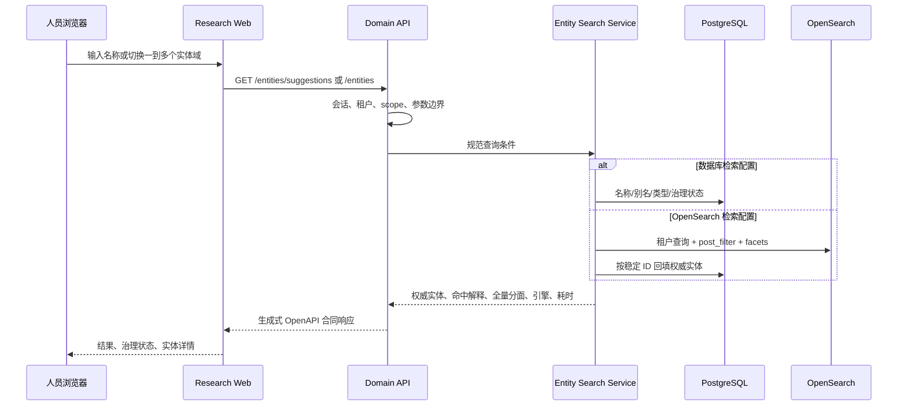

# 研发情报工作台架构

## 目标与边界

信息查询工作台面向研发、临床、专利和 BD 的高频结构化调研。它要达到商业医药情报产品的信息密度和检索效率，但数据、界面与实现独立建设，不复制第三方受保护数据或源码。它不是聊天页、文档目录或内部治理后台。

工作台与内部运营工作台共享身份、领域 API、主数据和审计，不共享导航和业务页面。人员入口与收费 MCP 读取同一规范实体和领域事实；MCP 不调用浏览器页面，Web 也不绕过领域服务读取索引或数据库。

十二个外部工作域的当前实现状态、P0/P1 缺口和源码证据由 `deploy/release/external-workbench-capability-matrix.json` 统一管理，并由 JSON Schema 与测试校验。只有矩阵中全部 P0/P1 能力为 `implemented`，且真实数据和业务 UAT 证据通过，外部工作台才可标记为商业完成；导航入口或静态页面不计入完成率。

## 产品信息架构

| 层级 | 人员任务 | 当前模块 | 数据权威 |
|---|---|---|---|
| 统一入口 | 名称、别名、外部标识检索与消歧 | 基础查询、全局搜索 | 规范实体、身份标识 |
| 领域浏览 | 按药物、靶点、机构、疾病、临床、专利、交易切换 | 基础查询领域切换 | 结构化领域表 |
| 专题分析 | 深入结构、活性、管线、临床、专利、交易和证据 | 多领域实体档案、化学、靶点全景、证据、知识 | 领域事实与不可变证据 |
| 持续跟踪 | 恢复个人最近研究、保存条件、监控变化、组织关注对象 | 最近访问、监控、对比列表 | 审计事件、版本化检索与事件 |
| 数据交付 | 受控查看、对比、引用和导出 | 人员工作台与 MCP | 许可、字段和配额策略 |

左栏只保留五个稳定工作流，不再把检索方法、领域数据和个人工具平铺成十三个同级模块。`lib/workspace/researchNavigation.ts` 是唯一分类权威，侧栏与页面分类栏同时消费它；分类只是呈现层级，专业查询、权限、URL、API 和数据权威不合并或复制。

| 左栏工作流 | 页面内分类（原稳定 view） |
| --- | --- |
| 情报检索 | 实体检索（explorer）、结构检索（chemistry）、证据查证（evidence） |
| 研发数据 | 药物与管线（pipeline）、临床试验（trials）、监管与安全（regulatory）、流行病学（epidemiology） |
| 竞争情报 | 专利情报（patents）、交易与公司（deals） |
| 研究动态 | 新闻、公告与会议（news），单一领域不重复显示分类栏 |
| 我的研究 | 对比列表（collections）、监控与提醒/保存检索（monitoring）、知识专题（knowledge） |

点击工作流进入第一个分类；页面分类切换仍调用唯一导航处理器，已选分类不重复清空草稿。全部原深链接、保存检索和浏览器历史继续恢复原专业页面，所属左栏入口高亮。实体档案优先沿用经过校验的来源工作流，无来源时按其类型归属；档案只保留自己的业务分区与原条件返回，不叠加分类栏。用户中心属于固定底部账号区，不冒充研究总览；最近访问仍在实体检索中由服务端审计读取。内部功能不进入外部导航。

外部“对比与列表”只读取租户导出策略并据此提供格式、字段、数量和授权标注受控的实际导出，不允许任何角色在外部工作台配置租户策略。`workspace:export:manage` 对应的版本、格式、字段、上限和授权标注配置只在内部“商业运营 → 导出策略”呈现，并继续调用同一个受 scope 保护的管理 API；这不是第三入口，也不会复制策略状态。策略读取失败、未配置和保存失败均显式呈现，策略变更后外部工作台通过同一查询缓存/API 读取新版本，历史导出事件保持不可变。

基础查询采用“领域先行、条件紧随、结果连续”的单屏结构。领域切换改变真实 `entity_type` 查询；治理状态改变真实 `review_status` 查询；名称联想调用规范实体建议接口。所有条件进入 URL，以便刷新、深链接和审计复现。结果行先展示规范实体摘要，再进入可深链接的多领域档案；靶点保留更专业的全景页。多领域档案和收费 MCP `get_entity_dossier` 共用 PostgreSQL 权威聚合服务，按领域返回关系、活性、管线、临床、专利、交易、监管、新闻、结构、总量、截断状态、数据时点和明确缺口；全文证据仍通过许可感知的证据/溯源接口读取，不能从档案绕过字段许可。

外部概览的个人“最近访问”由服务端审计读取模型提供。实体详情、通用档案和靶点全景成功读取后只记录规范实体 ID、资源类型和必要请求上下文；列表查询严格绑定当前租户、当前人员和 `entities:read`，在数据库内按实体聚合最新访问，并与当前租户权威实体表连接后排序和限量。它不先截断原始审计事件，因此删除、越权或不存在的历史实体不会返回，也不会挤掉仍有效的较早实体；非人员主体不能调用。前端只消费生成式 OpenAPI 合同并进入既有稳定档案 URL，不使用浏览器本地历史作为企业事实，也不引入第二套权限或实体读取路径。

真实浏览器门禁为四个视口分别创建独立人员身份，而不是共用会话。租户级领域夹具保持共享，人员审计和最近访问按账号隔离；每个 project 在总览验证自己的研究历史，并拒绝其它 project 的实体后缀。临时账号使用受校验的运行前缀统一清理，导出策略在成功和失败路径均恢复，不将邮箱或随机密码写入证据报告。

专业条件查询仍位于同一基础查询入口，但不是第二套搜索后端。人员选择管线、临床、专利、交易、监管、流行病学或资讯后，前端只展示该领域现有 API 已支持的规范实体、枚举、状态、地域和日期条件；日期范围共享全部、近 1 个月、近半年、近 1 年和自定义预设，相对范围先按日历月转换成明确起止日期，集中类型契约再校验并映射为 `WorkspaceLocation`，随后进入对应专业页。管线领域把关键词、规范实体、模态、总体阶段、地区和状态日期作为高频条件常驻，将全球/中国阶段及起始时间、研发/商业化权益地区、项目标签和里程碑放入可展开的高级区；折叠只改变信息层级，不改变查询合同。专业页继续用既有 URL 解析、OpenAPI 客户端、服务端 `applied_filters`、facet 和结果表执行查询，高级管线条件直接复用 `pharma.pipeline.search.v13`，因此全局入口与专业页不会产生条件语义漂移，也不会用跨域自由文本拼接冒充结构化事实查询。

知识专题继续使用 `/workspace/research?view=knowledge` 单一入口，不拆出治理后台。专题正文与“覆盖与版本”在同一详情中切换；覆盖摘要只统计当前不可变版本中能匹配真实来源编号的引用，版本时间线按版本号倒序有界读取，选中版本后按相邻版本返回新增/移除事实及来源定位。版本、引用和 typed link 在 PostgreSQL 层追加不可变，租户 RLS 在读取覆盖、历史和差异时继续生效；OpenAPI 生成客户端和 TanStack Query 分别缓存正文、覆盖、历史和差异，页面切换不会复制领域状态或绕过服务端授权。

临床试验是独立外部工作域，不附属于管线页或通用搜索。人员入口通过 `/workspace/research?view=trials` 查询注册号、试验简称、标题、疾病、干预、申办方和关联规范实体，并按注册平台、招募状态、临床分期、研究类型、IIT/IST 发起类型和治疗线次执行服务端精确筛选；试验药物、联用药物、试验靶点与联用靶点分别使用稳定实体 ID 多选，组内 OR、组间 AND。关联药物研发属性按同一规范药物项目约束 Modality、创新类型、药品类别、项目标签、全球阶段和当前研发机构国家/地区，禁止跨项目拼接。结果保留试验实体、药物、靶点等稳定关联，并直接展示结构化主要终点的首项已报告结果。选中稳定试验 ID 后进入 `/workspace/research?view=trials&trial=<UUID>` 页面级专业档案，概览、设计与入组、终点与结果、时间线与中心由受控 `section` 驱动，刷新和历史返回不依赖列表缓存。Web `GET /api/v1/trials`、`GET /api/v1/trials/{trial_id}` 和收费 MCP `get_clinical_trials`/`get_clinical_trial` 复用同一租户隔离的 PostgreSQL 领域服务；`pharma.clinical_trial.search.v10` 对最近更新、注册号、试验简称、IIT/IST、结果状态/评价、招募状态、入组量和研究类型提供全命中集排序，并支持四个规范实体角色组、关联药物项目属性和兼容的任意/指定角色查询，MCP 继续执行权益、额度预留、签名游标、字段许可、反搬运和结算链路。IIT/IST、治疗线次和核心疗效只来自治理后的结构化来源字段，不按申办方类别、标题或浏览器文本推断。

药物与管线工作域通过 `/workspace/research?view=pipeline` 使用 `pharma.pipeline.search.v13`。关键词、模态、总体阶段和记录地区为快速条件；药品、靶点、靶点组合、适应症和研发机构必须提交规范实体 ID 或由规范 ID 排序形成的组合键。`drug_entity_id` 只与同租户研发项目的规范药品主键精确匹配，不由药名、别名或当前页结果推断；全球/中国阶段及各自起始日期、状态日期、研发/商业化权益地区、项目标签、里程碑类型及日期范围是相互独立的受治理条件。Web `GET /api/v1/pipelines`、受控导出和收费 MCP `get_competitive_pipeline` 复用同一 PostgreSQL 查询，完整命中集产生 facet 与竞争格局；药物、当前版本全部靶点、适应症、机构、模态、全球/中国阶段和状态日期使用受控服务端排序，字段与方向进入 URL、API 合同及 MCP 计费查询身份。MCP 保留签名游标、计量、反搬运和许可边界。人员可在列表和竞争格局之间切换；格局按同一已应用查询返回项目、药物、靶点、疾病与机构总量，以及全球阶段、中国阶段、规范靶点、权威靶点组合、模态、地区和机构分布。图表和排名回钻会更新同一 URL 查询，不能维护第二套隐藏条件。结果行显示完整可回钻靶点集合、区域阶段、权益、最新里程碑和来源状态，并可进入稳定实体档案。

药物实体使用独立 `/workspace/research?view=drug&entity=<UUID>` 专业档案和 `GET /api/v1/drugs/{drug_id}/dossier`，不再以通用档案作为终态。服务端复用权威实体档案查询并额外聚合项目、当前版本全部规范靶点、适应症、机构、模态、最高总体/全球/中国阶段和最新状态日期；前端按受控分区呈现概览、管线、关系、活性、试验、专利、交易、监管、动态与结构。概览中的结构来自标准化 `compound_structures`，二维绘制在浏览器隔离 worker 中按需加载；里程碑只显示实际返回且带日期的记录。旧 `view=entity` 药物深链接保留可映射的业务分区后以 `replaceState` 规范化，不制造重复历史；非药物 ID 在服务端与页面边界均失败关闭。

专利情报同样是独立外部工作域。人员入口通过 `/workspace/research?view=patents` 按专利族号、标题、申请人、发明人、公开文本和关联规范实体检索，并按申请人和法律状态执行服务端精确筛选；结果集中展示最早优先权、申请人、发明人、公开文本、法律状态、预计到期和药物/靶点关联。选中稳定专利族 ID 后进入 `/workspace/research?view=patents&patent=<UUID>` 页面级专业档案，概览、法律与权利要求、关联资产由受控 `section` 驱动并保持来源谱系。Web `GET /api/v1/patent-families`、稳定详情端点和收费 MCP `get_patent_landscape` 复用 `pharma.patent.search.v2`，按最早优先权、专利族号、法律状态和预计到期执行全命中集排序；权威 `patent_links_entity` 关系优先，兼容旧 `linked_entity_ids` 数据但不跨租户回填。族优先权、申请、公开、授权、法律状态和权利要求事件已进入受治理时间线与来源定位；跨地域法律状态覆盖仍取决于合法授权来源，缺失不由前端或模型推断。

交易与公司情报通过 `/workspace/research?view=deals` 提供独立交易查询域，并通过 `/workspace/research?view=deals&deal=<UUID>` 和 `/workspace/research?view=company&entity=<UUID>` 分别提供交易与公司专业档案。交易档案复用稳定详情端点，按受控 `section` 呈现概览、参与方、资产与阶段、地域权益、条款与来源；直接深链不读取完整列表，刷新、返回和跨域进入均以稳定交易 ID 恢复上下文。Web `GET /api/v1/deal-transactions` 与收费 MCP `get_deals` 复用同一租户隔离查询，支持规范药品、靶点和适应症稳定 ID、交易类型、状态、方向与参照地区、稳定参与机构 ID、参与方角色/所在地区/机构类型、初始/终止/来源更新时间、交易时阶段、由权威管线确定的当前最高阶段、权益类型/地域、币种和披露金额区间。靶点与适应症通过权威研发项目反向解析到交易药品，不按显示名或自由文本猜测。结果返回角色化参与方、交易资产阶段、地域权益、稳定交易 ID 和可深链接详情；金额必须在同一披露币种内比较，不进行无来源汇率换算。`GET /api/v1/companies/{company_id}/dossier` 复用权威多领域档案和公司时间线，在服务端聚合项目、资产、规范靶点、适应症、交易、模态、阶段分布和最近活动；九个受控分区共享同一实体、覆盖和数据时点。`GET /api/v1/companies/{company_id}/timeline` 与收费 MCP `get_company_timeline` 继续使用相同领域服务、签名游标、计量和累计覆盖限制。AI 治理 Schema 与物化层将参与方角色、交易资产阶段和权益分别写入受 RLS 保护的结构化关系表，并保留来源文档；旧 `parties` 和 `asset_entity_ids` 仅作为兼容输入，未披露角色映射为 `other`，不猜测许可方向。

监管与安全情报通过 `/workspace/research?view=regulatory` 提供独立人员工作域，按药物、适应症、申办方、申请号、标签和安全术语检索，并按监管机构、辖区、事件类型/状态、认定资格、标签变更、黑框警告、安全信号/严重程度/状态、决定日期和来源更新时间执行服务端精确筛选。Web `GET /api/v1/regulatory-event-timeline`、稳定事件详情端点与收费 MCP `get_regulatory_events` 复用同一租户隔离查询；返回标签版本、批准人群、生物标志物、给药信息、安全时间窗、风险措施和来源身份。人员可选择最多四项真实事件进行并排比较，筛选、详情 ID 和对比 ID 均进入 URL 并可刷新恢复。实体名称通过一次批量查询回填，不产生逐行 N+1。旧 `/api/v1/regulatory-events` 继续服务已有列表客户端。AI 治理 schema 2.11 与物化层在同一权威监管事件表内持久化这些受控字段，并建立适应症和申办方关系，不从自由文本或前端推断监管事实。

流行病学与疾病负担通过 `/workspace/research?view=epidemiology` 提供独立人员工作域，并通过 `/workspace/research?view=disease&entity=<UUID>` 提供疾病专业档案。人员按稳定疾病 ID、规范患者人群 ID、指标、地区、单位、来源人群口径、年龄、性别和观察区间执行服务端查询；Web `GET /api/v1/epidemiology-observations`、精确可比趋势接口和收费 MCP `get_epidemiology_observations` 复用同一租户隔离的 PostgreSQL 查询服务。`GET /api/v1/diseases/{disease_id}/dossier` 同时要求档案、管线与流行病学权限，聚合研发项目、药物、规范靶点、机构、阶段、试验、专利、患者人群和疾病负担观测；疾病页可进入带 `disease_entity_id` 的完整流行病学查询并保持 URL、刷新和历史连续性。趋势继续绑定同一规范患者人群 ID，避免把同名但疾病/靶点定义不同的队列连成伪趋势。`patient_populations` 与疾病/靶点关系由 AI 治理 schema 2.12 物化，保留来源文档和记录级溯源，并由强制租户 RLS 隔离。疾病对应的治疗模态、区域研发阶段和公司竞争格局继续复用管线权威数据，不由疾病页重复推算。

新闻、公告与会议动态通过 `/workspace/research?view=news` 提供独立人员工作域，按标题、摘要、发布方、关联实体、事件类型、语言、会议场景和发布日期执行服务端查询。Web `GET /api/v1/news-events` 与收费 MCP `get_news_events` 复用 `pharma.news.search.v2`，按发布日期、标题、事件类型、发布方和会议场景执行全命中集排序；返回稳定事件标识、摘要、原始发布页、发布方和关联药物、靶点、疾病或机构，并为每条记录提供许可感知的溯源入口。人员可在同页切换动态列表和研究发布时间线；`content_scope=research` 在服务端只允许 `publication`、`conference_abstract`、`poster`、`presentation` 四类治理事件，`display=timeline` 仅控制人员呈现并写入稳定 URL，不改变数据授权。时间线继续使用有界分页、原始发布页、规范实体深链和记录级溯源。AI 治理 Schema 将新闻事实经过原文引句校验、实体规范化、人工复核门禁和版本来源后物化到 `news_events`，不把抓取页面或模型摘要直接当作已发布事实。

## 查询链路

OpenSearch 只负责召回、排序和全量分面。租户过滤进入检索查询本身；用户选择的一到十个实体域以 `terms` OR 语义进入 `post_filter`，治理状态使用独立过滤，使界面仍可显示其它可选分面的全量计数。命中结果只携带稳定实体 ID，最终展示字段从 PostgreSQL 权威层回填；服务端再按规范名称、外部标识、别名、描述和语义的确定性优先级生成命中解释，浏览器不得从高亮或展示文本自行推断。数据库后端保持等价过滤、分面和解释语义，便于开发、降级诊断和合同测试。

## 查询合同

| 条件 | Web URL | HTTP API | MCP | 约束 |
|---|---|---|---|---|
| 关键词 | `q` | `q` | `query` | 500 字符上限；边界去空格 |
| 实体域 | 单类 `type`，多类 `types` | 单类 `entity_type`，多类重复 `entity_types` | 兼容 `entity_type`，多类 `entity_types` | 显式枚举；去重；最多十类；同维度 OR；MCP 规范排序进入计费身份 |
| 治理状态 | `review` | `review_status` | `review_status` | `draft/verified/rejected/superseded` |
| 排序 | 有序重复 `sort=field:direction` | 有序重复 `sort=field:direction` | `sort: string[]` | 最多五级；字段不可重复；未知字段、格式错误或超限失败关闭；旧 `sort_by/sort_direction` 仅兼容首级且冲突时拒绝 |
| 数量 | 页面固定上限 | `limit/offset` | `limit/cursor` | 人员上限 100；MCP 使用签名游标与计费页深 |

八个结构化查询域的当前合同为 `pharma.entity.search.v2`、`pharma.pipeline.search.v13`、`pharma.clinical_trial.search.v10`、`pharma.patent.search.v2`、`pharma.deal.search.v8`、`pharma.regulatory.search.v4`、`pharma.epidemiology.search.v3` 和 `pharma.news.search.v2`。同一有序排序列表贯通表格编辑器、稳定 URL、保存检索与监控重放、受控导出、人员 HTTP、收费 Agent API、MCP、OpenAPI 客户端和计费请求身份。SQL 各级统一空值后置并追加领域稳定标识消除并列；OpenSearch 只在首级为相关度时启用混合语义召回；交易任一级金额排序都要求明确单一币种，禁止跨币种比较。

临床试验合同为 `pharma.clinical_trial.search.v10`，在上述通用边界外增加 `registry`、`status`、`phase`、`study_type`、`acronym`、`initiation_type`、`therapy_line`，以及 `investigational_drug_entity_ids`、`combination_drug_entity_ids`、`investigational_target_entity_ids`、`combination_target_entity_ids` 四个有界角色组。每组最多 20 个去重稳定 ID 并按 OR 匹配，多个非空角色组分别生成存在性条件并按 AND 组合；`linked_drug_modality`、`linked_drug_innovation_type`、`linked_drug_category`、`linked_drug_program_tag`、`linked_drug_global_phase` 和 `linked_drug_organization_country_region` 必须由同一个与试验药物或联用药物相连的研发项目满足，机构地域只读取项目当前版本集合。旧 `role_entity_id/role_entity_ids + role_entity_role` 只保留历史深链和 Agent 客户端兼容。Web 将已执行条件及受控排序写入稳定 URL，`phase` 在路由状态中与药物管线阶段分别建模，避免跨工作域污染；排序空值置后并以注册号和稳定 ID 消除并列不确定性。API 参数上限和 MCP 既有位置参数顺序均受回归测试保护，新增 MCP 参数只追加在既有位置参数之后。试验分面基于完整命中集计算，JSON 分期、治疗线次和项目标签在 PostgreSQL 和 SQLite 测试后端均按单个试验去重计数，关联实体通过批量查询回填，不产生逐行 N+1。

专利合同为 `pharma.patent.search.v2`，增加 `applicant` 和 `legal_status`，并使用独立的路由状态避免与其它领域筛选互相污染。申请人 JSON 分面和法律状态分面基于完整命中集计算；四个受控排序字段统一空值置后，以专利族号和稳定 ID 消除并列不确定性。关联实体通过关系表与兼容字段一次批量回填，不产生逐行 N+1。旧 `/api/v1/patents` 保持兼容，新人员工作台使用有总数和分面的 `/api/v1/patent-families`；MCP 新筛选和排序仅追加到已有参数末尾，保持现有客户端位置参数兼容。

交易查询契约为 `pharma.deal.search.v8`，规范药品、靶点、适应症、资产管线模态/项目标签以及所有角色、方向、状态、阶段、权益、时间和金额条件均由服务端规范化进入 `applied_filters`，对应分面基于完整授权命中集计算。资产模态与项目标签在 Web、HTTP、保存查询和 MCP 中均支持最多 20 个去重值；HTTP 和稳定 URL 使用重复参数表达多值，同维度取 OR、跨维度取 AND。两个资产维度只通过规范交易资产连接同租户研发项目，组合条件必须在同一项目记录上成立，不按名称或摘要猜测，也不允许跨项目拼接命中；旧单值 URL、保存查询和 MCP 参数继续规范化为单元素集合。交易类型、状态、方向、交易地区、币种、资产模态、交易时阶段、当前阶段、参与方地区和权益地区由同一完整授权命中集返回 Top 5/8/20/50 统计；服务端回传总量、占比和独占维度的未披露桶，人员可在图表与语义表格间切换并回钻筛选。`display`、`analysis_dimension`、`analysis_view` 和 `analysis_top` 进入稳定 URL 与保存查询，监控重放、刷新和浏览器历史恢复同一统计上下文。名称、类型、状态、方向、地区、初始披露日期和披露金额支持全命中集稳定排序；状态使用显式生命周期序，金额排序必须先限定单一币种，不能跨币种直接比较。当前最高阶段通过同租户管线按阶段序与数据时点确定，不由前端猜测；参与方、资产、阶段和权益均一次批量读取，不产生逐行 N+1。三个规范实体条件和两个资产研发属性在人员 URL、保存/订阅版本、HTTP、收费 MCP、导出和监控匹配中使用相同语义；疾病或靶点实体变化通过研发项目关联药品后触发相同交易查询。旧 `/api/v1/deals` 保持列表兼容，新人员工作台使用 `/api/v1/deal-transactions` 及按稳定交易 ID 的详情接口；MCP 新筛选追加在旧位置参数之后，保留已有调用兼容性。金额只展示和筛选来源披露值，不推算未披露金额或跨币种等值。

监管查询契约为 `pharma.regulatory.search.v4`，增加 `agency`、`jurisdiction`、`event_type`、`status`、`designation_type`、`label_change_type`、`has_boxed_warning`、`safety_signal_type`、`safety_severity`、`safety_status` 以及决定/来源更新日期范围；十类分面均基于完整授权命中集计算。决定日期、标题、机构、辖区、事件类型、状态、监管主题规范名称和来源更新时间支持全命中集稳定排序，规范主题名称通过同租户相关子查询取得。关键词覆盖标题、事件标识、申请号、标签、安全术语、机构、辖区以及主题、适应症和申办方规范实体名称；SQL 模式通配符作为普通字符处理。新人员工作台使用分页时间线和稳定详情接口，旧列表 API 保持兼容；MCP 新筛选和排序追加到既有位置参数之后，并继续执行签名游标、计量、字段许可和反搬运边界。

管线查询契约为 `pharma.pipeline.search.v13`。区域阶段、阶段日期、权益数组、项目标签、里程碑对象数组和最多 20 个规范靶点由同一治理运行物化；`development_program_targets` 按租户、项目和集合版本只追加保存角色与顺序，项目当前指针和稳定组合键只指向已发布集合。PostgreSQL 与 SQLite 使用方言明确的 JSON 或关系查询，按项目去重计算 facet。八个受控排序字段使用稳定实体 ID 作为最终并列键，阶段按业务阶段序而不是字母顺序排列，空值统一置后；排序字段、方向和组合键进入 HTTP 响应、商业预留指纹与 MCP 查询身份。HTTP 响应还从同一授权、租户隔离、完整命中集计算有界竞争格局，缺失值显式归入“未披露”，不从摘要推断事实。新增 HTTP、导出与 MCP 条件维持兼容边界；MCP 网关将带时区日期统一规范为 UTC ISO 字符串并同时用于商业预约和领域请求，无效或无时区值仍失败关闭，避免等价时间表达产生不同计费查询身份。

流行病学查询契约为 `pharma.epidemiology.search.v3`，增加 `disease_entity_id`、`patient_population_id`、`measure`、`geography`、`unit`、`population_scope`、`age_group`、`sex`、`period_start_from` 和 `period_end_to`；稳定疾病 ID 在人员 URL、生成式 OpenAPI 客户端和服务端查询中保持一致。观察期、疾病、指标、估计值、地区、单位、发布方和样本量支持全命中集稳定排序，疾病与发布方按同租户规范名称排序。关键词覆盖疾病、指标、地区、口径、方法学和来源发布方，SQL 模式通配符作为普通字符处理。规范患者人群选项由完整授权命中集按稳定 ID 统计，读取时只接受当前租户已验证人群；疾病、发布方、患者人群及其疾病/靶点关系一次批量回填。趋势端点要求完整可比维度并保留相同患者人群 ID，按观察期排序返回有界序列。

新闻合同为 `pharma.news.search.v2`，增加 `event_type`、`publisher`、`language`、`venue`、`published_from` 和 `published_to`；关键词覆盖标题、摘要、发布方和关联规范实体名称，SQL 模式通配符作为普通字符处理。发布方排序使用同租户规范机构名称的相关子查询，不按无意义 UUID 排序；其余受控字段统一空值置后，并以事件标识和稳定 ID 消除并列不确定性。事件类型、语言、会议场景和发布方分面基于完整命中集计算，关联实体通过一次批量查询回填。人员入口使用有界 `limit/offset`，MCP 使用计费预留与签名游标，两者共享同一领域查询语义。

保存检索持久化同一版本化条件合同。所有者可以在监控工作台维护名称和业务说明、切换个人/企业共享范围；元数据编辑只调用现有版本化更新契约，不改写查询类型、查询 JSON 或查询版本。重名、权限或服务失败保留在编辑上下文中并允许修正。同租户其他人员只能运行共享检索并建立自己的固定版本主题，不能修改检索。撤回共享会立即暂停其他所有者继承的主题，主题重新启用和后台事件投递都会重新检查当前可见性，历史固定版本不构成永久授权。MCP 的新增可选筛选不改变已有位置参数顺序，避免破坏已发布客户端；调用仍先经过 entitlement、预算预留、速率、反搬运和字段许可，再访问领域数据。

全局专业查询只是既有领域合同的编排入口，不拥有第二套试验筛选语义。`trialFilters.ts` 统一全局入口与临床试验专业页的 IIT/IST、治疗线次和结果评价显示值，并在提交前统一拒绝“未发布结果+结果评价”；选择未发布结果会立即清空并禁用依赖项。试验简称、发起类型、治疗线次和结果评价由 `professionalSearchLocation` 映射到既有 `WorkspaceLocation`，继续通过稳定 URL 和 `pharma.clinical_trial.search.v10` 执行，不新增数据查询或服务端合同。

## 前端状态与交互

保存研究的目录、独立深链接、目标绑定写入、共享历史边界、批量加入恢复和监控原版本重放由 [研发工作流审计与升级](research-workflow-integrity.md) 定义；该文档补充既有领域合同，不建立第二套状态或数据权威。

- React 只保存编辑中的查询、抽屉和弹窗状态；服务器状态由 TanStack Query 管理并支持 `AbortSignal` 取消。
- 联想输入达到 2 个字符后等待 250 ms，请求最多 10 条，失败不会阻断直接检索。
- 共享单实体联想使用每实例唯一的 combobox/listbox/option ID；输入焦点不离开组合框即可用上下方向键循环候选、Home/End 定位、Enter 选择稳定实体 ID、Escape 收起，激活项通过 `aria-activedescendant`/`aria-selected` 同步并滚动到可见区域。鼠标与键盘最终都只提交服务端候选的规范 ID，不提交高亮文本或浏览器推断值。
- 临床试验药物、联用药物、试验靶点和联用靶点使用相同的多实体键盘合同；每次 Enter 只追加当前服务端候选的稳定 ID，已选 ID 被候选过滤且最多 20 项，移除后可重新选择。键盘行为只改变未提交草稿，点击查询后仍由版本化 URL 和 `pharma.clinical_trial.search.v10` 执行组内 OR、组间 AND，不在浏览器合并结果。
- 全局临床试验条件与专业页共用 `trialFilters.ts` 的受控显示和互斥规则；试验简称、IIT/IST、治疗线次和结果评价进入稳定 URL 后由既有领域 API 执行。选择“未发布结果”会清空并禁用结果评价，URL 或草稿直接构造冲突组合时失败关闭，不以静默忽略制造假成功。
- URL 是已执行查询的可分享状态；输入中的未提交文本不污染浏览器历史。
- 靶点全景、药物专业档案、公司专业档案、疾病专业档案、临床试验专业档案、专利族专业档案、交易专业档案和通用实体档案的当前分区都属于已执行研究状态：实体档案使用 `view=target|drug|company|disease|entity&section=...`，试验档案使用 `view=trials&trial=<UUID>&section=...`，专利族档案使用 `view=patents&patent=<UUID>&section=...`，交易档案使用 `view=deals&deal=<UUID>&section=...`；各自只接受受控 `section` 枚举，概览省略参数，未知值失败关闭到概览。公司和疾病档案分别只对组织、疾病实体开放；药物、靶点、组织和疾病旧通用链接保留可映射分区后替换为专用 URL，不能留下重复或不可恢复的无效页面。
- 专业档案共用 ARIA 标签契约，支持左右方向键、Home 和 End 的循环焦点/激活；标签点击、键盘切换、概览回钻、刷新及浏览器前进/后退统一驱动同一个 URL 状态，不在组件内维护第二份分区状态。临床试验和交易直接打开详情时禁用列表查询，避免为页面级档案额外加载完整结果集。
- 每个可达专业档案分区都必须进入同一自动 WCAG 2.2 A/AA 审计，不允许只扫描列表、概览或部分实体类型。产生横向滚动的结构化表格外壳必须是具有业务名称的可聚焦 region，使键盘用户能进入并滚动；普通、悬停和表头背景上的辅助文字统一满足 `4.5:1`。代表性密集分区还必须进入 `320 CSS px` 键盘重排，新增页面族若没有这些证据不得计为已验证。
- 仓库自有视觉清单除空结果和密集结果外，还逐视口固定临床结构化终点、专利时间线和交易地域权益三个代表性专业档案分区。交易权益表使用显式固定列布局和具名可聚焦横向滚动 region，避免不同 Chromium 主版本按内容测量产生列边界漂移；跨浏览器差异不得通过提高像素阈值消除。
- 档案内的交易、监管、专利族和新闻条目通过 `ResearchApp` 的受控导航处理器进入既有专业工作域：分别写入稳定 `deal`、`regulatory_event`、`patent` 与 `news_event`，并清除不属于目标领域的无效详情/对比状态。档案组件只发出规范 ID，不自行加载或拼接专业详情。
- 关闭专业详情后使用浏览器返回，会恢复原 `view=entity|target|drug`、实体 ID 和 `section`；证据来源仍使用独立的谱系抽屉。四类详情均由按稳定 ID、服务端租户隔离的 Domain API 加载，列表缓存不承担详情权威。
- 个人最近访问由服务端审计事实驱动，按租户和人员隔离、规范实体 ID 去重并重新验证当前可见性；前端不缓存或合并其他身份的访问历史。
- 查询区、分面区和结果区使用连续页面带，不采用营销卡片或装饰布局；专业用户可以在常见桌面宽度内连续扫描。
- 全局检索、管线、临床、专利、交易、监管、流行病学和新闻共用虚拟化结果表。每个领域使用独立稳定偏好键，列可见性、列顺序和标准/紧凑密度按租户、人员和领域键写入服务端版本化记录并强制 RLS；浏览器只保留未提交草稿，不把 `localStorage` 当作权威。首个身份列在表内横向滚动时保持可见，并提供一键恢复默认视图。偏好不含查询或记录值，也不进入分享 URL。
- 全局检索、管线、临床、专利、交易、监管、流行病学和资讯八域均提供受控全命中集服务端排序，表头状态由 Domain API、URL、计费指纹和数据库查询共同驱动，刷新后恢复。全局检索默认相关性保留混合检索，字段排序改用完整词法命中集后再排序；共享表不得用客户端当前页重排冒充服务端排序。
- 共享表的行选择是受控展示契约，不在组件内私存业务选择：页面所有者提供稳定行 ID、当前选中 ID、上限和变更处理。通用层提供逐行选择、全选当前页、部分选择、计数、清空、无障碍名称及选择列/身份列双冻结；领域层只在存在真实工作流时接入动作。监管事件用它驱动 URL 中最多四项的既有对比状态和真实详情查询，未具备持久化批量动作的领域不显示空壳命令。
- 全局实体检索将同一选择契约连接到现有版本化对比列表。前端只提交稳定实体 ID、目标列表 ID 和已读取版本；后端在单一事务内重新验证租户可见性、列表所有权、重复成员、20 项容量和乐观版本，按选择顺序写入全部成员并只形成一个版本快照。失败不会部分加入，客户端保留选择与对话框并刷新版本；成功后清空选择，用户可进入“对比与列表”通过同一 Domain API 核对持久化结果。
- 八域结果工具栏共用权限感知导出控件。人员会话只提交当前 URL 中属于该领域版本化查询合同的条件，`view`、展示模式、分页偏移和未知参数不会进入导出；服务端按同一租户领域服务重新查询，并将格式、字段和最多 100 条记录限制在管理员策略内。CSV/JSON/XLSX 由服务端编码并保留公式注入保护、策略版本、查询 schema、内容 SHA-256、幂等键和不可变审计事件；人员导出不借用 Agent 身份，也不改变收费 MCP 的反搬运和异步大导出边界。
- 移动端保留全部真实能力，领域切换压缩为稳定 4 列，查询条件改为单列；表格继续横向滚动，不挤压字段文字。
- 结果为空、联想失败、查询失败、加载、保存部分成功和无扩展属性都有明确状态，不用静默降级。
- 详情连续性以组件、路由往返和真实 Google Chrome 场景共同验收；Chrome 场景必须在 1440、1920、1024 与 390 四个视口验证键盘切换、稳定 URL、刷新恢复、历史返回和无横向溢出。
- 认证后的外部工作台按需加载 Web Vitals 采集；内部工作台不加载。浏览器将 CLS、INP、LCP、TTFB 转换为固定 route、设备类别、导航类型、指标名、评级和数值，每页/每批均有上限，完整 URL、查询、实体/文档/租户/人员标识和 client ID 永不进入载荷。生成客户端与同源 CSRF keepalive 共用 `/api/v1/workspace/web-vitals`，gateway 写入现有 OTel histogram；本地累计计数增量验收不替代生产用户 P75、中心后端或批准观察窗。
- 临床列表和格局由同一次 `GET /api/v1/trials` 响应驱动。`pharma.clinical_trial.search.v10` 的 `landscape.total_trials` 必须等于同一响应 `total`；服务端在租户过滤后的完整命中集上聚合最近结果披露年份 × 分期、分期 × 结果评价两张矩阵，分页只限制 `items`。空分期、空评价和未披露年份保留显式桶，多阶段试验按其受治理阶段分别计数；最近受治理披露时间缺失时才使用 `results_first_posted`。`display=list|landscape` 属于稳定展示 URL，统计下钻回写原分期或评价条件并重新执行权威 API，不能从当前页记录推算。
- 全局专业查询的管线 Modality、创新类型、治疗领域、药品类别与项目标签通过 `loadPipelineFacetCatalog` 读取既有 `/api/v1/pipelines?limit=1&offset=0&sort=status_date:desc` 响应中的完整命中集 facet；`limit=1` 只约束明细，不截断服务端 facet。`ProfessionalQueryBuilder` 只保存选中值并通过 `professionalSearchLocation` 写入重复 URL 参数，领域页继续由 `pharma.pipeline.search.v13` 执行组内 OR、组间 AND。目录加载、空、失败和重试由同一查询状态驱动；空数组不进入已选条件计数，前端不维护静态候选事实或第二套过滤语义。
- 全局专利查询通过 `loadPatentFacetCatalog` 读取 `/api/v1/patent-families?limit=1&offset=0&sort=priority_date:desc` 的完整命中集法律状态 facet，并把规范关联实体 ID、申请人、优先权和预计到期范围写入既有 Workspace URL。专利专业页继续由 `pharma.patent.search.v2` 执行同一查询；关联实体类型不进入事实合同，而是在选取时约束候选、在深链恢复时通过权威实体 API解析，避免把药品、疾病或机构 ID 误判为靶点。目录加载、空、错误与重试显式呈现，两组日期反转在导航前失败关闭。
- 全局交易查询通过 `loadDealFacetCatalog` 读取 `/api/v1/deal-transactions?limit=1&offset=0&sort=announced_at:desc&analysis_top=5` 的完整授权命中集 facet；`limit=1` 只约束返回明细，不截断类型、状态、方向、地域、资产模态/标签、参与方、阶段、权益和币种目录。全局草稿使用规范药品、靶点、适应症与参与机构 ID，连同全部交易条件写入既有 Workspace URL，再由 `pharma.deal.search.v8` 和交易专业页执行；不在浏览器合并命中或维护第二套静态枚举。`validateDealSearchFilters` 同时约束三类日期、两类金额和引进/对外许可参照地区，因此专业页、全局入口和保存查询不会出现不同的失败语义。目录加载、空、错误和重试显式呈现，当前选择暂时不在目录时保留为零计数诊断值。
- 同一目录同时拥有记录地区、研发权益地区、商业化权益地区和里程碑类型四个单值分类。`GovernedFacetSelect` 只呈现目录返回值与完整命中集计数，并在当前选择暂时不在新目录时保留该值为可诊断的零计数选项，避免异步刷新静默改写草稿。所有多选和单选共享一个 React Query 生命周期；顶层只产生一个加载状态或一个错误/重试入口，各字段以非播报占位保持布局，加载完成后再独立显示空状态。
- 项目状态、机构角色、机构类型和机构所在地区也从同一目录读取。项目状态与机构角色的中文标签只映射目录返回的规范值，不构成候选来源；机构类型和地区直接显示服务端值。项目状态位于高频区，三个机构属性位于高级区，并通过 `professionalSearchLocation` 写入既有单值 URL；领域服务继续把机构实体、角色、类型和地区绑定到同一当前版本机构关系，前端不合并结果或猜测关系。
- 临床结果存在性/评价和交易存在性/币种也从同一目录读取，潜在总额范围保持有界数字输入。`pipelineSignals.ts` 是全局查询与管线专业页的共享显示和校验边界：无结果会清空结果评价，无交易会清空币种与金额，金额查询强制币种且下限不得超过上限。六个草稿字段只通过 `professionalSearchLocation` 进入既有稳定 URL 和 `pharma.pipeline.search.v13`，前端不重新实现试验角色或交易资产关联。

## 与商业医药情报平台的差距门禁

基础查询的产品组织和真实交互只解决“如何高效访问数据”，不等于已经具备同级商业数据覆盖。达到大规模商业交付还必须独立完成：

1. 获得并持续维护药物、靶点、适应症、临床、专利、交易、公司和新闻等合法数据源。
2. 为药物模态、研发阶段、地区、里程碑、适应症树、公司类型、专利族和交易金额等建立领域表与可验证筛选合同。
3. 当前已完成药物、公司、疾病、临床试验、专利族、交易专业档案和靶点全景，以及监管和新闻共享的稳定详情基础；临床、专利族、交易、监管、流行病学、新闻与会议具备 P0 独立查询。代码侧页面级核心档案缺口已闭合，后续仍须在合法数据覆盖到位后补齐各领域增量时间线、对比维度和真实客户 UAT，不能把本地代码基础冒充商业终态。
4. 在目标云环境完成 HA、容量、缓存、灾备、SLO、等保/隐私、数据许可和客户隔离验收。
5. 用真实客户查询集评估召回、消歧、字段完整率、更新时间、引用准确率和操作耗时。

差距和证据继续由 [商业交付门禁](commercial-readiness.md) 管理；视觉相似或本地运行不能替代数据、容量和合规证据。
